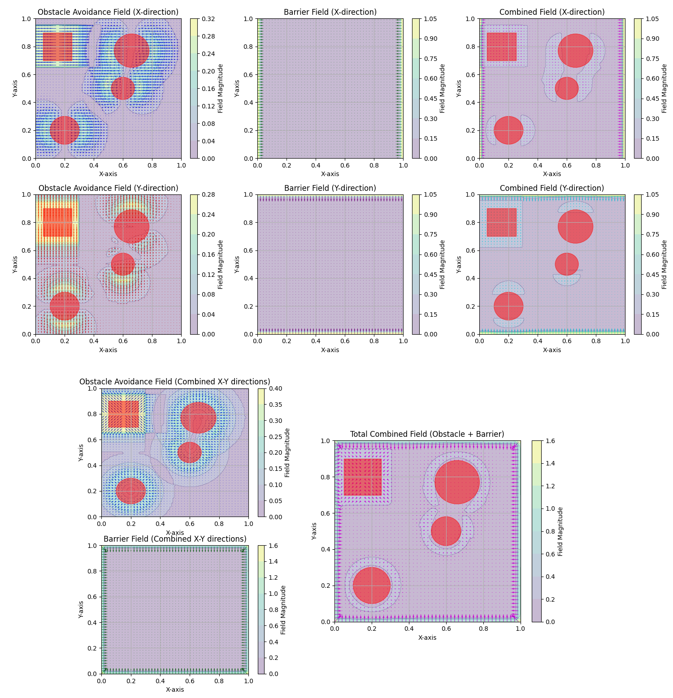

# Ergodic Control Navigation

## Project Overview
This repository contains an implementation of ergodic control algorithms for multi-agent robotic systems. Ergodic control is a control strategy that drives agents to match a specified spatial distribution, making it useful for exploration, surveillance, and monitoring applications.

The core concept is to make the time-averaged statistics of an agent's trajectory match a desired spatial distribution, creating an efficient exploration pattern that focuses more time on high-importance regions while still covering the entire space.


*The animation shows a 12-DoF quadrotor model ergodically exploring a spatial distribution, demonstrating how the algorithm balances between visiting high-density regions while maintaining coverage of the entire domain.*


*The animation shows a simple double integrator model ergodically exploring the given spatial distribution in the presence of obstacles / forbidden regions of space*


*The animation shows a 12-DoF quadrotor model ergodically exploring the given spatial distribution in the presence of obstacles / forbidden regions of space*

## Repository Structure
- `my_erg_lib/`: Custom implementation of the ergodic control library
  - Contains models, controllers, and utility functions for ergodic control
- `images/`: Visualization outputs and animations
  - `gifs/`: Animations of system behavior and distribution convergence
- `more/`: Additional test scripts and experimental features
  - Integration method comparisons
  - Parallel processing implementations
  - Potential field visualization

## Key Components

### Dynamics Models
- `model_dynamics.py`: Implementation of various dynamics models including:
  - `SingleIntegrator`: Simple first-order dynamics
  - `DoubleIntegrator`: Second-order dynamics
  - `Quadcopter`: Full 12-DoF quadrotor model with realistic dynamics including:
    - Position (x, y, z)
    - Orientation (roll, pitch, yaw)
    - Linear and angular velocities
    - Motor command mixing and thrust generation
    - LQR stabilization with customizable gains for obstacle avoidance

### Control
- `ergodic_controllers.py`: Core implementation of ergodic control strategies:
  - `DecentralisedErgodicController`: Novel implementation for decentralized multi-agent settings
  - Receding-horizon implementation with trajectory optimization
  - Adjoint-based gradient descent for ergodic metric optimization
- `basis.py`: Fourier basis functions for spectral decomposition of spatial distributions
  - Integration methods: Gauss quadrature and `nquad`
  - Spectral coefficient caching for performance
  - Distribution reconstruction capabilities
- `barriers.py`: Barrier functions to enforce state and control constraints

### Obstacle Avoidance
- `obstacles.py`: Implementation of obstacle avoidance using potential fields:
  - Support for multiple obstacle types:
    - Circular obstacles with customizable radius
    - Rectangular obstacles with width and height parameters
    - Wall obstacles with normal vector definition
  - Reactive obstacle avoidance through artificial potential fields
  - Customizable repulsive forces and influence regions
  - Boundary enforcement to keep agents within exploration space



### Integration
- `agent.py`: Agent implementation that combines models and controllers
  - Boundary checking and safety mechanisms
  - Integration with obstacle avoidance system
- `replay_buffer.py`: Storage for trajectory samples for reinforcement learning
- `Utilities.py`: Helper functions for the library

### Visualization
- `vis.py`: Visualization tools including:
  - 3D rendering of quadrotor trajectories
  - Distribution visualization and comparison
  - Animation generation for ergodic coverage analysis
  - Potential field visualization for obstacle avoidance
  - Trajectory replay with time-series plotting

### Spectral Distribution Analysis
- `ReconstructedPhi` and `ReconstructedPhiFromCk`: Classes for analyzing and reconstructing spatial distributions
  - Fourier coefficient calculation for arbitrary distributions
  - Distribution reconstruction from trajectory statistics
  - Comparison between target and achieved distributions

## Dependencies
- NumPy: For numerical operations
- Matplotlib: For visualization and animation
- SciPy: For optimization and linear algebra
- PIL: For image processing and saving animations

## Usage
This library is designed for multi-agent robotic control in various scenarios:

```python
# Example usage with a quadrotor model and obstacle avoidance
from my_erg_lib.agent import Agent
from my_erg_lib.model_dynamics import Quadcopter
from my_erg_lib.ergodic_controllers import DecentralisedErgodicController
from my_erg_lib.obstacles import Obstacle, ObstacleAvoidanceControllerGenerator

# Create quadrotor model with specified parameters
model = Quadcopter(dt=0.001, x0=[0.3, 0.5, 2, 0, 0, 0, 0, 0, 0, 0, 0, 0], 
                   z_target=2, motor_limits=[[-2, 2], [-2, 2], [-2, 2], [-2, 2]])

# Create target distribution function
def phi_func(s):
    # Gaussian bump distribution
    x, y = s[0], s[1]
    return 3 * np.exp(-30 * ((x-0.2)**2 + (y-0.3)**2)) + 2

# Set up agent with ergodic controller
agent = Agent(L1=1.0, L2=1.0, Kmax=5, dynamics_model=model, phi=phi_func)
agent.erg_c = DecentralisedErgodicController(agent, uNominal=model.calcLQRcontrol, 
                                            T_sampling=0.1, T_horizon=1.25)

# Add obstacles to the environment
obstacles = [
    Obstacle(pos=[0.2, 0.2], dimensions=0.1, f_max=0.25, min_dist=0.14, 
             eps_meters=0.2, obs_type='circle', obs_name="Obstacle 1")
    Obstacle(pos=[0.6, 0.3], dimensions=[0.2, 0.5], f_max=0.25, min_dist=0.52, 
             eps_meters=0.2, obs_type='circle', obs_name="Obstacle 2")
]
agent.erg_c.uNominal += ObstacleAvoidanceControllerGenerator(agent, obs_list=obstacles, 
                                                            func_name="Obstacles")

# Run simulation
for i in range(1000):
    # Calculate ergodic control action
    us, tau, lamda_dur, erg_cost = agent.erg_c.calcNextActionTriplet(time_list[i])
    
    # Apply control to model
    agent.model.state = agent.model.step(agent.model.state, us)
```

## Key Features
- Spectral decomposition of target distributions using Fourier basis functions
- Receding horizon control for ergodic exploration
- LQR stabilization for complex dynamic models
- Multi-agent coordination through Fourier coefficient exchange
- Advanced integration methods (Runge-Kutta 4) for accurate dynamics simulation
- Obstacle avoidance with customizable potential fields
- Comprehensive visualization tools for analysis and debugging
- Performance profiling for optimization
- Support for complex spatial distribution functions

## References
- Mavrommati, A., Tzorakoleftherakis, E., Abraham, I., and Murphey, T. D. (2017). Real-time area coverage and target localization using receding-horizon ergodic exploration. IEEE Transactions on Robotics, 34(1), 62-80. [arXiv:1708.08416](https://arxiv.org/abs/1708.08416)
- Abraham, I., and Murphey, T. D. (2018). Decentralized ergodic control: distribution-driven sensing and exploration for multiagent systems. IEEE Robotics and Automation Letters, 3(4), 2987-2994. [arXiv:1708.08416](https://arxiv.org/abs/1708.08416)