# Safe Ergodic Exploration for Fixed-Wing UAVs

Diploma thesis & accompanying paper — [Alexios Vavvas](mailto:alexios.vavvas@gmail.com), supervised by Prof. K. J. Kyriakopoulos, NTUA (2025).

> A heterogeneous fleet of vehicles — ground robots, surface vessels, quadrotors, and fixed-wing aircraft — jointly explore an area of interest to locate dispersed targets using **ergodic control**. An **Integral High-Order Control Barrier Function (I-HOCBF)** safety filter wraps the ergodic controller so that a 12-DOF fixed-wing model can maneuver aggressively through cluttered environments while respecting stall limits, actuator bounds, and geofence constraints — all without trajectory planning.

<div align="center">
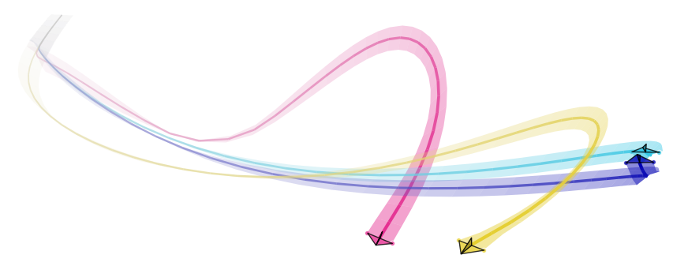
</div>

<p align="center"><em>Fixed-wing UAVs performing collaborative ergodic exploration in a 3D environment with obstacles.</em></p>

---

## What This Repo Contains

| Layer | What | Where |
|-------|------|-------|
| **Paper** (source only) | IEEE-format conference paper on the I-HOCBF safety filter for fixed-wing UAVs (PDF not included — pending review) | `main.tex` |
| **Thesis** | Full diploma thesis covering ergodic theory, multi-agent coordination, target localization, and all vehicle models | `docs/Diplomatiki_Vavvas_Alexios.pdf`, `docs/Diplimatiki_Markdown/` |
| **Library** | Pure-Python ergodic control library (`my_erg_lib`) with dynamics, controllers, obstacles, CBF solver, EKF-based target tracking | `src/ergodic_exploration/my_erg_lib/` |
| **ROS 2 nodes** | Agent, environment, FlightGear bridge, joystick teleop, aircraft data converter | `src/ergodic_exploration/ergodic_exploration/` |
| **Launch configs** | YAML-driven mission definitions (agent params + obstacle layouts) for all paper/thesis scenarios | `src/ergodic_exploration/launch/` |
| **Scripts** | Real-time dashboard, RViz config generator, Ck visualizer, bag replay, FlightGear launcher | `scripts/` |
| **Results** | Figures, gifs, and screenshots from all experiments | `results/` |

---

## Core Ideas

### Ergodic Control

Instead of waypoints, the operator defines a **target spatial distribution** Φ(s) encoding where the vehicle should spend time (e.g., Gaussian peaks over suspected target locations). The **Receding-Horizon Ergodic Exploration (RHEE)** algorithm minimizes the spectral mismatch between Φ and the time-averaged trajectory statistics. Multi-agent coordination emerges by sharing Fourier coefficients — no task allocation needed.

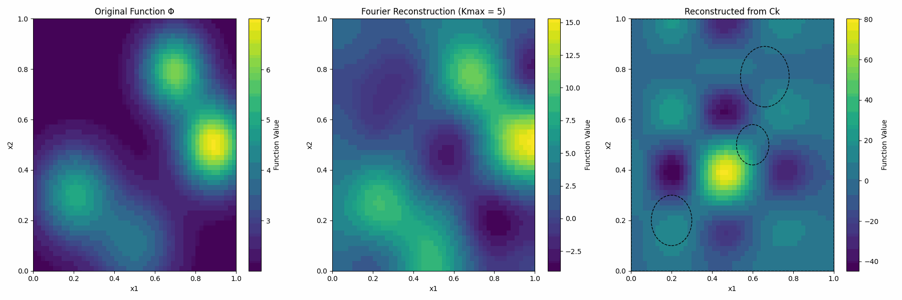

*The animation shows a simple double integrator model ergodically exploring the given spatial distribution in the presence of obstacles / forbidden regions of space.*

### I-HOCBF Safety Filter (Paper Contribution)

The 12-DOF fixed-wing dynamics are **non-control-affine** — CBFs cannot be applied directly. We use **state augmentation**: actuator deflections become states, actuator *rates* become the new control input, and the system becomes control-affine by construction. This yields an augmented 16-state system where obstacle constraints have **relative degree 3**.

A QP-based safety filter runs at each timestep and minimally modifies the ergodic controller's output to enforce:
- **Obstacle avoidance** — spheres, cylinders, planes, rectangles with potential-based barrier functions
- **Stall prevention** — angle-of-attack limit as a soft constraint with slack variable
- **Geofence / altitude limits** — plane primitives with appropriate normals
- **Actuator bounds** — translated to rate constraints via their own CBFs

Aggressive maneuvers emerge naturally: bank-and-yank coordinated turns, reactive wall avoidance near stall, barrel rolls — all without explicit trajectory planning.

### Target Localization

Bearing-only measurements feed an **Extended Kalman Filter** per target. The **Fisher Information Matrix** defines an Expected Information Density (EID) that replaces Φ(s), driving agents toward informative viewpoints. Target lifecycle (spawn / merge / delete) is handled automatically via Mahalanobis and Bhattacharyya distances.

---

## Vehicle Models

All models implement a common `ModelDynamics` interface with `step()`, analytical Jacobians, and optional LQR/trim utilities.

| Model | States | Inputs | Notes |
|-------|--------|--------|-------|
| `SingleIntegrator` | 2 | 2 | Velocity commands |
| `DoubleIntegrator` | 4 | 2 | With optional damping |
| `Quadcopter` | 12 | 4 | Full Newton-Euler, motor mixing, LQR hover |
| `SimpleBoatSecondOrder` | 5 | 2 | Thrust + rudder, nonlinear drag |
| `SimpleCarSecondOrder` | 6 | 2 | Steering actuator dynamics |
| `FixedWing12DOFTrainer` | 12 | 4 | Elevator, aileron, rudder, throttle; stability derivatives; symbolic Jacobians validated against finite differences; RK4 integration; trim solver |

---

## Simulation Results (Paper)

Seven scenarios demonstrate the safety filter on the fixed-wing model:

| Case | Scenario | Key Behavior |
|------|----------|-------------|
| **A** | Minimum altitude barrier | Elevator override arrests dive, filter holds altitude under sustained faulty input |
| **B** | High-speed cornering (30 m/s) | Emergent "bank-and-yank": pre-emptive pitch-down creates vertical margin, then 90° roll turn |
| **C** | Head-on wall + stall prevention | Without AoA limit → stall; tuned → coordinated turn; extreme slack → barrel roll |
| **D** | Dense obstacle corridor | Weaves through cylinders, spheres, and wall gates; h stays positive throughout |
| **E** | Multi-agent collision avoidance | 4–6 agents deconflict into traffic-circle pattern with altitude management |
| **F** | Multi-agent ergodic exploration | Waypoint-free loitering over Gaussian regions of interest with real-time Fourier sharing |
| **G** | Stress test: dense field | Sustained avoidance eventually bleeds energy — reveals reactive filter limitations |

<div align="center">
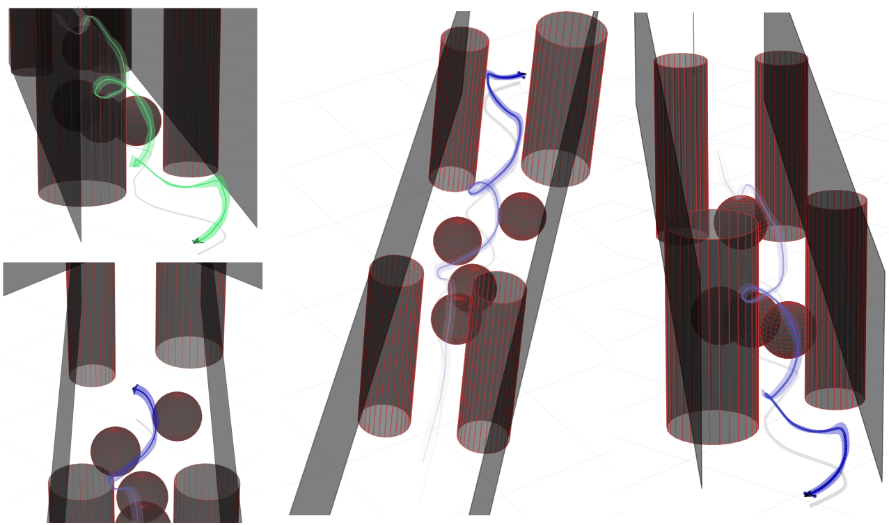
</div>
<p align="center"><em>Case D — Aircraft weaving through cylindrical gates and spherical obstacles.</em></p>

<div align="center">
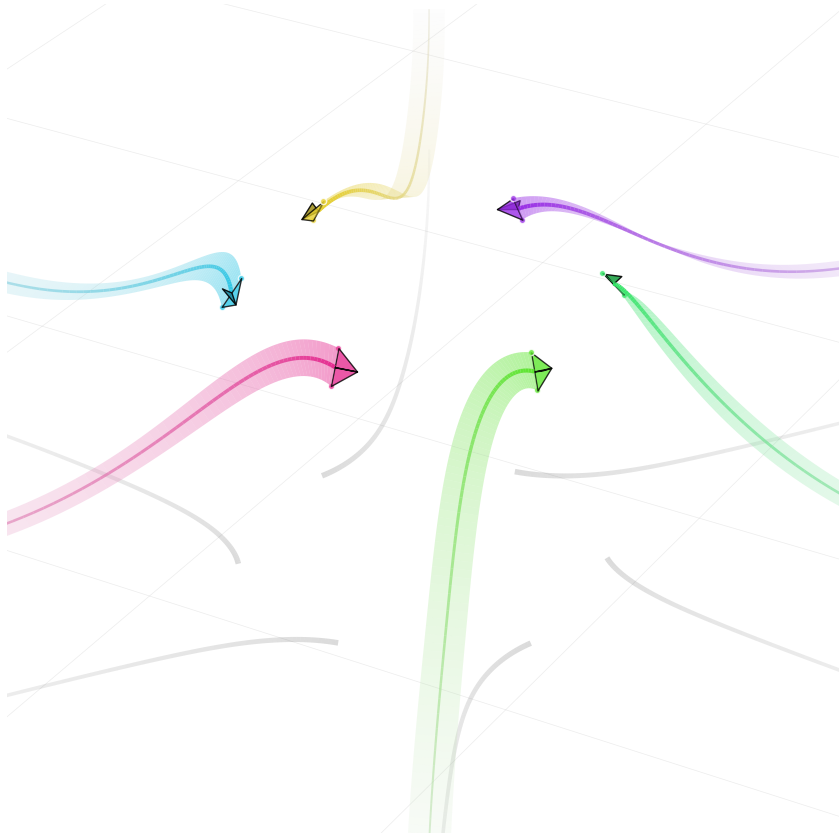
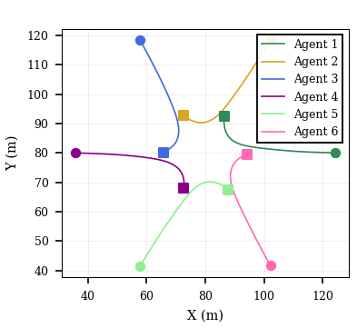
</div>
<p align="center"><em>Case E — Six fixed-wing agents deconflicting into a traffic-circle pattern (3D and top-down views).</em></p>

<div align="center">
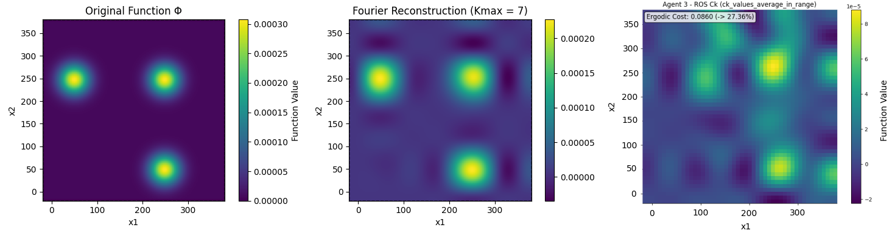
</div>
<p align="center"><em>Case F — Target distribution Φ(s) (left), Fourier reconstruction (middle), and trajectory coverage (right).</em></p>

<div align="center">
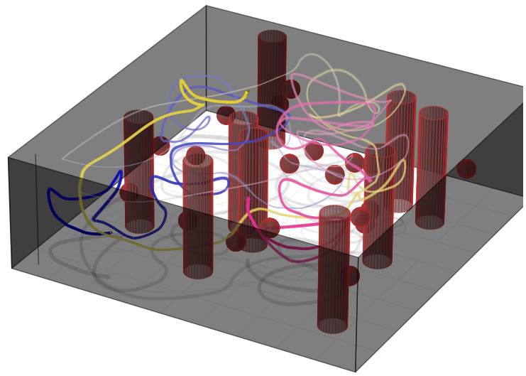
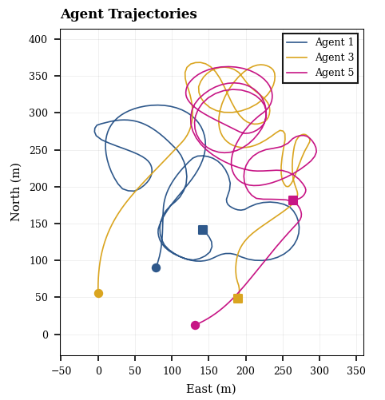
</div>
<p align="center"><em>Case G — Two agents searching a dense obstacle field (cylinders + spheres + walls).</em></p>

---

## Thesis Results (Multi-Agent, Multi-Vehicle)

The full thesis covers ground robots, boats, quadrotors, and cars with CBF and APF obstacle avoidance:

<div align="center">

</div>
<p align="center"><em>Double integrator with CBF obstacle avoidance.</em></p>

<div align="center">
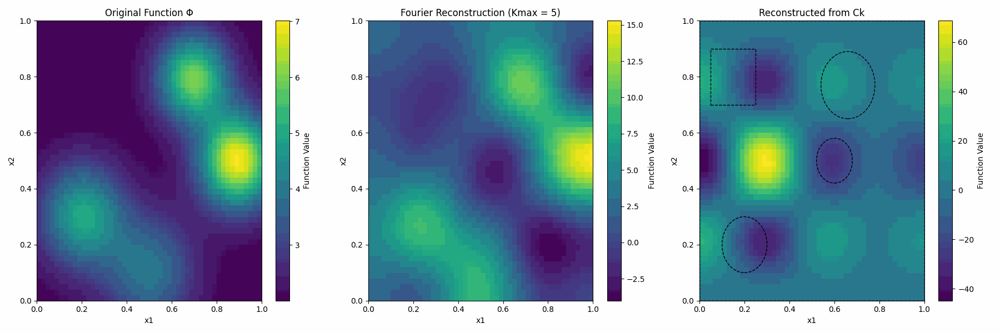
</div>
<p align="center"><em>Quadrotor with CBF obstacle avoidance.</em></p>

<div align="center">
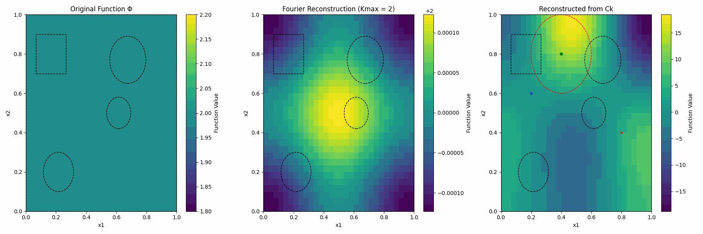
</div>
<p align="center"><em>Quadrotor tracking a target using bearing-only EKF with EID-driven exploration.</em></p>

<div align="center">

</div>
<p align="center"><em>Multi-target localization using bearing-only measurements and EKF. The system spawns new target estimates, associates measurements, and merges or deletes estimates automatically.</em></p>

<div align="center">
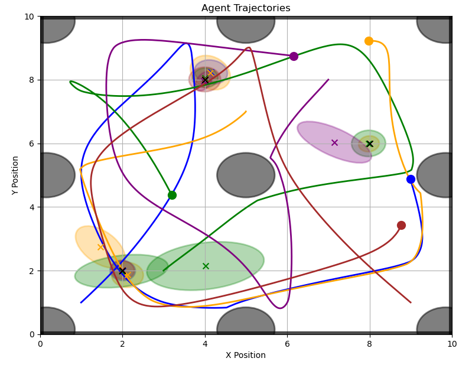

</div>
<p align="center"><em>Real-time dashboard: cooperative space coverage with EKF target estimates (left) and ergodic metric reduction (right).</em></p>

<div align="center">
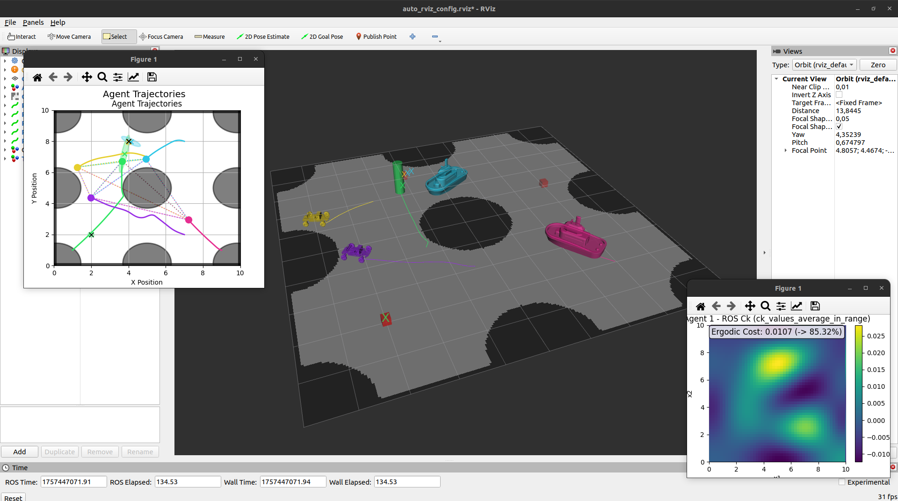
</div>
<p align="center"><em>Heterogeneous fleet (boat, car, quadrotors) in RViz.</em></p>

<div align="center">
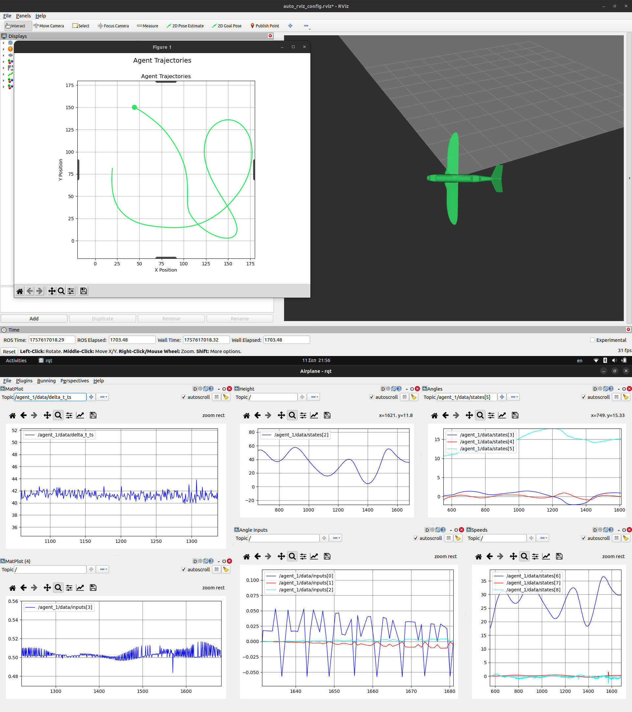
</div>
<p align="center"><em>12-DoF fixed-wing model in RViz.</em></p>

<div align="center">
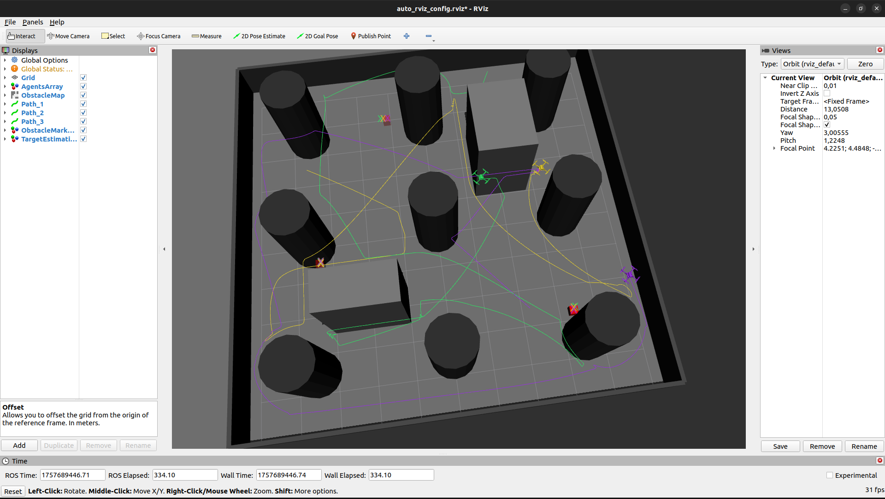
</div>
<p align="center"><em>Quadrotor navigating a tight C-shaped corridor with CBF obstacle avoidance.</em></p>

---

## Architecture

Built on **ROS 2 Humble**. Each agent runs as an independent node; coordination happens via topic-based exchange of Fourier coefficients (`CkTable` messages).

```
src/
├── ergodic_exploration/
│   ├── ergodic_exploration/      # ROS 2 nodes
│   │   ├── agent_node.py         # Main agent (all vehicle types)
│   │   ├── agent_node_airplane_teleop.py  # Fixed-wing teleop node
│   │   ├── environment.py        # RViz marker publisher + system monitor
│   │   ├── fg_visualizer_node.py # FlightGear UDP bridge
│   │   ├── joystick_node.py      # Arduino joystick input
│   │   └── aircraft_data_converter.py
│   ├── my_erg_lib/               # Core library (no ROS dependency)
│   │   ├── model_dynamics.py     # All 6 vehicle models
│   │   ├── ergodic_controllers.py # RHEE algorithm
│   │   ├── obstacles.py          # APF + primitives (sphere, cylinder, plane, rect)
│   │   ├── cbf_qp_solver.py      # I-HOCBF QP (CVXOPT)
│   │   ├── agent.py              # Agent class tying everything together
│   │   ├── eid.py                # EKF, FIM, EID, data association
│   │   ├── basis.py              # Fourier basis with caching
│   │   └── vis.py                # Offline visualization & animation
│   ├── agent_configs/            # Per-model YAML defaults
│   └── launch/                   # Mission configs (B1–B6, C1–C2, fixed-wing scenarios)
├── my_interfaces/
│   └── msg/                      # CkTable, AgentData, AircraftData, JoystickData, ...
scripts/
├── dashboard_ros.py              # Real-time multi-agent dashboard
├── vis_ck_erg.py                 # Ck coefficient & ergodic cost plotter
├── generate_rviz_config.py       # Auto-generate RViz config for N agents
├── bagplay.sh                    # ROS bag replay utility
└── launch_flightgear.sh          # FlightGear visualization setup
```

<div align="center">

</div>
<p align="center"><em>ROS 2 node graph for a multi-agent mission.</em></p>

---

## Quick Start

```bash
# 0. Install dependencies (first time only)
pip3 install --user numpy scipy matplotlib cvxopt

# 1. Build
colcon build
source install/setup.bash   # or: ./b_and_source.sh

# 2. Run a predefined scenario (e.g., 3-drone exploration with obstacles)
ros2 launch ergodic_exploration B2.launch.py

# 3. Dashboard (separate terminal)
source source.sh
python scripts/dashboard_ros.py

# 4. RViz (separate terminal)
bash scripts/launch_rviz.sh
```

### Single agent
```bash
# Simple models (double integrator, quadcopter)
ros2 run ergodic_exploration agent_node --agent_id 1 --init_pos 9 3

# Fixed-wing (requires agent_config with CBF parameters)
ros2 launch ergodic_exploration fixed_wing_free_fly.launch.py
```

### Fixed-wing teleop with FlightGear
```bash
bash scripts/launch_flightgear.sh
ros2 launch ergodic_exploration fixed_wing_teleop_agent.launch.py
```

---

## Configuration

Missions are defined via YAML files:
- **Agent config** (`agent_configs/*.yaml`): model type, control gains, ergodic parameters, CBF tuning
- **Obstacle config** (`launch/*_obs.yaml`): obstacle primitives with positions, dimensions, influence radii
- **Launch file** (`launch/*.launch.py`): wires agents to their configs and sets initial positions

See `docs/README_agent_configs.md` for the full parameter reference.

---

## Dependencies

**System-wide Python packages** (required for ROS 2 nodes):
```bash
pip3 install --user numpy scipy matplotlib cvxopt
```

**ROS 2**:
- ROS 2 Humble

**Optional**:
- FlightGear for 3D fixed-wing visualization

> **Note**: ROS 2 uses the system Python interpreter, not virtual environments. Install all Python dependencies system-wide with `pip3 install --user` or `sudo pip3 install`.

---

## Documentation

| Document | Description |
|----------|-------------|
| `main.tex` | Conference paper: I-HOCBF safety filter for fixed-wing UAVs |
| `docs/Diplimatiki_Markdown/document.md` | Full diploma thesis |
| `docs/ARCHITECTURE.md` | System architecture overview |
| `docs/README_currentApproachMath.md` | Mathematical derivation of the CBF approach |
| `docs/README_stateAugmentation.md` | State augmentation and I-HOCBF derivation |
| `docs/README_mathIntuitionCBF.md` | Intuitive explanation of CBF theory |
| `docs/README_tunningCBF.md` | CBF parameter tuning guide |
| `docs/README_obstacles.md` | Obstacle configuration reference |
| `docs/README_aircraft.md` | Fixed-wing model and FlightGear setup |
| `docs/README_teleop.md` | Teleop and joystick control |
| `docs/README_dashboard.md` | Dashboard usage |

---

## References

- Mavrommati, A., et al. (2018). *Real-time area coverage and target localization using receding-horizon ergodic exploration.* IEEE Trans. Robotics, 34(1), 62–80.
- Abraham, I. & Murphey, T. D. (2018). *Decentralized ergodic control.* IEEE Robot. Autom. Lett., 3(4), 2987–2994.
- Xiao, W., Cassandras, C. G. & Belta, C. (2023). *Safe Autonomy with Control Barrier Functions.* Springer.
- Ames, A. D., et al. (2019). *Control barrier functions: Theory and applications.* Proc. ECC, 3420–3431.
- Molnar, T. G., et al. (2024). *Collision avoidance and geofencing for fixed-wing aircraft with CBFs.* IEEE TCST.