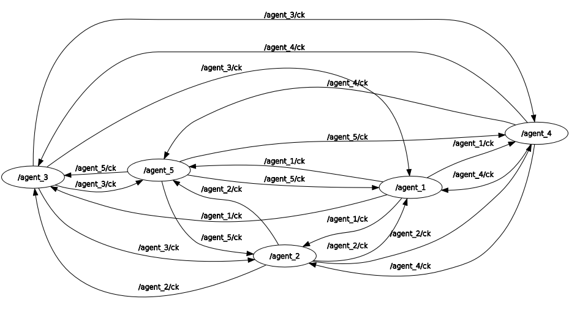
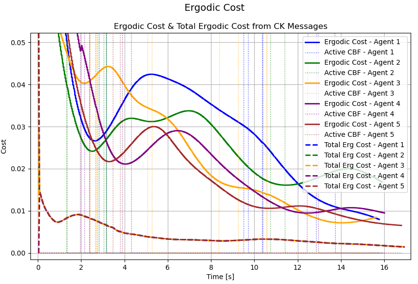
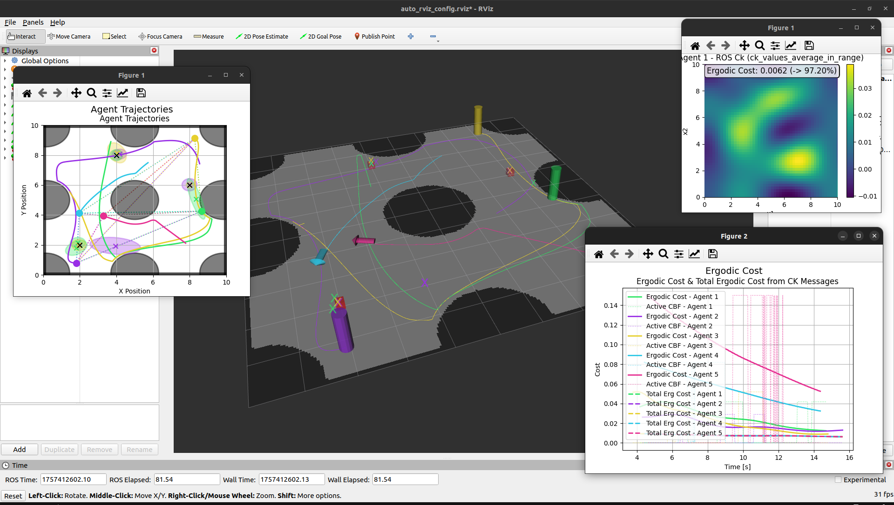
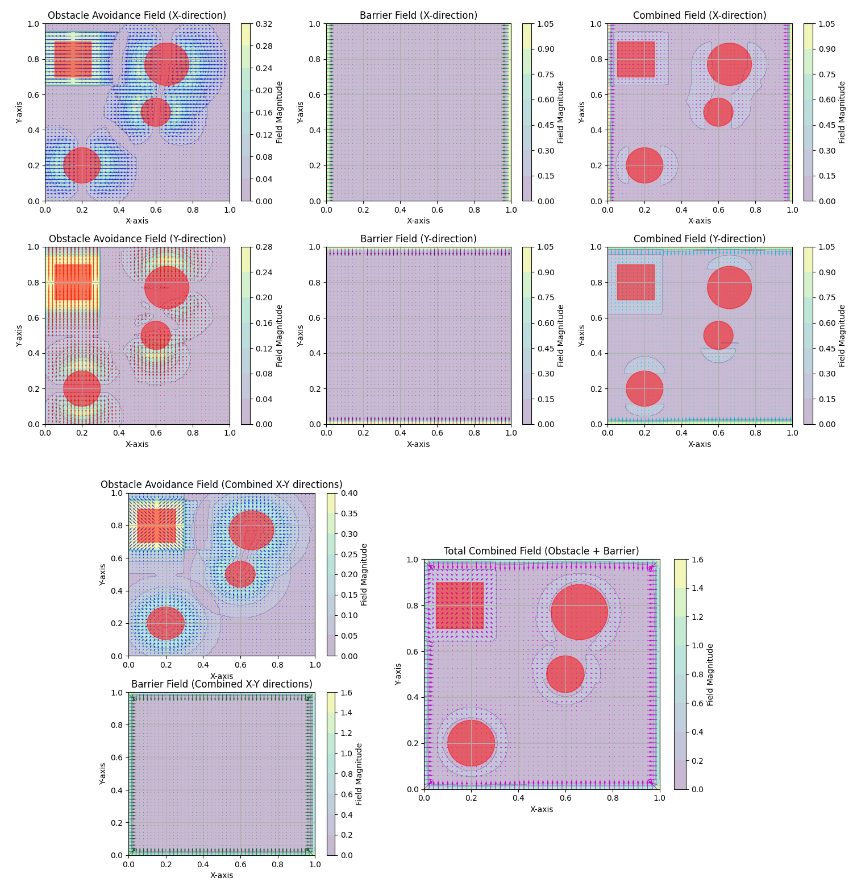

# Ergodic Control Navigation

## Project Overview
This repository contains an implementation of ergodic control algorithms for multi-agent robotic systems with **ROS2 Humble integration**. Ergodic control is a control strategy that drives agents to match a specified spatial distribution, making it useful for exploration, surveillance, and monitoring applications.

The core concept is to make the time-averaged statistics of an agent's trajectory match a desired spatial distribution, creating an efficient exploration pattern that focuses more time on high-importance regions while still covering the entire space. Agents now communicate via ROS2 topics using custom messages for real-time coordination.


*The animation shows a 12-DoF quadrotor model ergodically exploring a spatial distribution, demonstrating how the algorithm balances between visiting high-density regions while maintaining coverage of the entire domain.*


*The animation shows a simple double integrator model ergodically exploring the given spatial distribution in the presence of obstacles / forbidden regions of space*


*The animation shows a 12-DoF quadrotor model ergodically exploring the given spatial distribution in the presence of obstacles / forbidden regions of space*


*The animation shows a 12-DoF quad model searching for a target using bearing only measurements and localising it using an EKF filter. The EID map updates using the Expected Information Matrix in each location.*

## Repository Structure
- `my_erg_lib/`: Custom implementation of the ergodic control library
  - Contains models, controllers, and utility functions for ergodic control
- `src/ergodic_exploration/`: ROS2 package for multi-agent coordination
  - Custom message types for Ck coefficients, obstacles, and target estimates
  - Node-based agent implementation with topic communication
- `dashboard_ros.py`: Real-time Python dashboard for multi-agent visualization
- `images/`: Visualization outputs and animations
  - `gifs/`: Animations of system behavior and distribution convergence
- `more/`: Additional test scripts and experimental features
  - Integration method comparisons
  - Parallel processing implementations
  - Potential field visualization

## ROS2 Integration


The system now leverages **ROS2 Humble** for inter-agent communication and real-time visualization:

### Custom Message Types
- **Ck Coefficients**: For sharing Fourier spectral information between agents
- **Obstacle Positions**: For dynamic obstacle information sharing  
- **Target Estimates**: For coordinated multi-target tracking

### Node Architecture
- Each agent runs as an independent ROS2 node for true parallel execution
- Topic-based communication enables real-time coordination
- Environment node provides RViz visualization markers and system monitoring
- Custom Python dashboard provides live system monitoring
- Real-time Ck coefficient visualization for ergodic performance analysis

<div align="center">

</div>
*ROS2 node topology showing multi-agent communication structure*

<br><br>


<div align="center">

</div>
*Real-time dashboard visualization showing cooperative space coverage with obstacles. Black crosses indicate ground truth target positions, while colored ellipses represent independent target position estimates from each agent's EKF. Each agent performs decentralized target localization using bearing-only measurements but still localises target indipendent of the others.*


<br><br>


<div align="center">

</div>
*Real-time plot of ergodic metric reduction via cooperative area coverage. The line at the bottom is the total ergodic metric*

<br><br>

<div align="center">

</div>
*RViz 3D visualization showing multi-agent trajectories, target positions, and obstacle avoidance in real-time. The environment node publishes visualization markers for comprehensive 3D monitoring of the ergodic exploration system.*

<br><br>

## Key Components

### Dynamics Models
- `model_dynamics.py`: Implementation of various dynamics models including:
  - `SingleIntegrator`: Simple first-order dynamics
  - `DoubleIntegrator`: Second-order dynamics
  - `Quadcopter`: Full 12-DoF quadrotor model with realistic dynamics including:
    - Position (x, y, z)
    - Orientation (roll, pitch, yaw)
    - Linear and angular velocities
    - Motor command mixing and thrust generation
    - LQR stabilization with customizable gains for obstacle avoidance

### Control
- `ergodic_controllers.py`: Core implementation of ergodic control strategies:
  - `DecentralisedErgodicController`: Novel implementation for decentralized multi-agent settings
  - Receding-horizon implementation with trajectory optimization
  - Adjoint-based gradient descent for ergodic metric optimization
- `basis.py`: Fourier basis functions for spectral decomposition of spatial distributions
  - Integration methods: Gauss quadrature and `nquad`
  - Spectral coefficient caching for performance
  - Distribution reconstruction capabilities
- `barriers.py`: Barrier functions to enforce state and control constraints
- **CBF Safety Filter**: Control Barrier Function implementation in `agent.py`:
  - Real-time safety constraint monitoring using `calcH()`, `calcHGradient()`, and `calcHessianH()`
  - Quadratic program formulation for minimal control intervention
  - Second-order CBF implementation with configurable class-K functions

### Advanced Obstacle Avoidance System
The system implements a sophisticated dual-layer obstacle avoidance approach combining traditional Artificial Potential Fields (APF) with modern Control Barrier Functions (CBF):

#### Control Barrier Function (CBF) Safety Filter - **NEW**
- **Smart Safety Layer**: CBF acts as a safety filter on top of the primary controller, only intervening when necessary
- **Danger Quantification**: Uses potential field-based barrier functions `h(x) = 1/(1+U(x)) - δ` to quantify proximity to danger
- **Intelligent Course Correction**: Only alters the control input when the system detects imminent collision risk (PSI < 0)
- **Minimal Interference**: Unlike reactive APF approaches that constantly push away from obstacles, CBF allows natural navigation until safety intervention is required
- **Mathematical Rigor**: Guarantees forward invariance of safe sets through Lie derivatives and barrier constraints

#### Traditional Artificial Potential Fields (APF)
- `obstacles.py`: Implementation of reactive obstacle avoidance using potential fields:
  - Support for multiple obstacle types:
    - Circular obstacles with customizable radius
    - Rectangular obstacles with width and height parameters
    - Wall obstacles with normal vector definition
  - Continuous repulsive forces based on proximity to obstacles
  - Customizable force parameters (`kappa`, `rho0`) and influence regions
  - Boundary enforcement to keep agents within exploration space

#### Mathematical Formulation of CBF Safety Filter

The CBF safety filter implements a second-order control barrier function approach:

**Barrier Function**: `h(x) = 1/(1 + U(x)) - δ` where `U(x)` is the total potential field from all obstacles

**Safety Constraint**: The system maintains safety by ensuring `ψ(x,u) ≥ 0` where:
```
ψ = ḧ + 2α₁ḣ + α₂h ≥ 0
```

**Safety-Critical Control**: When `ψ < 0`, the safety filter computes minimal intervention:
```
u_safe = -β^T/||β||² * ψ
```
where `β = (f^T∇²h + ∇h^T∇f)g` represents the control authority direction.

**Key Parameters**:
- `α₁, α₂`: Class-K function gains (typically α₁=2.0, α₂=1.0)
- `δ`: Safety margin parameter (typically 0.05)
- Control limits and smoothing ensure practical implementation

This approach guarantees that the agent remains in the safe set `{x : h(x) ≥ 0}` while minimally interfering with the primary ergodic exploration objective.

#### Key Differences: CBF vs APF Approach
- **APF (Reactive)**: Continuously generates repulsive forces based on position relative to obstacles
- **CBF (Proactive Safety Filter)**: Monitors safety constraints and only intervenes when violation is imminent
- **CBF Advantages**: 
  - More natural trajectory behavior in obstacle-rich environments
  - Reduced control chattering and oscillations
  - Mathematically guaranteed safety with minimal intervention
  - Better integration with primary control objectives (ergodic exploration)

<div align="center">

</div>

### Target Localization and Tracking
- `eid.py`: Comprehensive multi-target localization system:
  - **Measurement Model**: Vectorized bearing-only sensor model computing azimuth and elevation angles
  - **Extended Kalman Filter (EKF)**: Real-time state estimation with uncertainty quantification
  - **Sensor Class**: Configurable range-limited sensor with realistic noise characteristics
  - **Data Association**: Mahalanobis distance-based measurement-to-target association
  - **Target Lifecycle Management**:
    - *Spawning*: Creates new target estimates from unassociated measurements
    - *Merging*: Combines nearby estimates using Bhattacharyya distance criteria
    - *Deletion*: Removes stale estimates based on age and confidence metrics
  - **Information-Driven Exploration**: EID (Expected Information Density) maps using Fisher Information Matrix
  - **Multi-Target Tracking**: Simultaneous estimation of multiple moving targets with covariance intersection

<div align="center">

</div>

*The animation demonstrates multi-target localization using bearing-only measurements and EKF estimation. The system dynamically spawns new target estimates, associates measurements with existing targets, and merges or deletes estimates as needed.*

### Integration
- `agent.py`: Agent implementation that combines models and controllers
  - Boundary checking and safety mechanisms
  - Integration with obstacle avoidance system
- `replay_buffer.py`: Storage for trajectory samples for reinforcement learning
- `Utilities.py`: Helper functions for the library

### Visualization
- `vis.py`: Visualization tools including:
  - 3D rendering of quadrotor trajectories
  - Distribution visualization and comparison
  - Animation generation for ergodic coverage analysis
  - Potential field visualization for obstacle avoidance
  - Trajectory replay with time-series plotting
- `dashboard_ros.py`: Real-time multi-agent dashboard for ROS2 systems
- `vis_ck_erg.py`: Real-time Ck coefficient visualization and ergodic cost monitoring
- **RViz Integration**: 3D visualization support with environment node for marker publishing

### Spectral Distribution Analysis
- `ReconstructedPhi` and `ReconstructedPhiFromCk`: Classes for analyzing and reconstructing spatial distributions
  - Fourier coefficient calculation for arbitrary distributions
  - Distribution reconstruction from trajectory statistics
  - Comparison between target and achieved distributions

## Dependencies
- NumPy: For numerical operations
- Matplotlib: For visualization and animation
- SciPy: For optimization and linear algebra
- PIL: For image processing and saving animations

## Usage

### Running the System

#### Build and Setup
```bash
# Build the ROS2 workspace
colcon build

# Source the setup (or use ./b_and_source.sh for faster execution)
source install/setup.bash
```

#### Single Agent
```bash
ros2 run ergodic_exploration agent_node --agent_id 1 --init_pos 9 3
```

#### Multiple Agents with Launch File
Create a launch file (e.g., `multi_agent_launch.yaml`):
```yaml
launch:
- arg:
    name: "num_agents"
    default: "3"
    description: "Number of agents to launch"

- node:
    pkg: "ergodic_exploration"
    exec: "agent_node"
    name: "agent_1"
    args: "--agent_id 1 --init_pos 9 3 --ros-args --log-level WARN"
    output: "screen"
    emulate_tty: true

- node:
    pkg: "ergodic_exploration"
    exec: "agent_node"
    name: "agent_2"
    args: "--agent_id 2 --init_pos 5 7 --ros-args --log-level WARN"
    output: "screen"
    emulate_tty: true

- node:
    pkg: "ergodic_exploration"
    exec: "agent_node"
    name: "agent_3"
    args: "--agent_id 3 --init_pos 2 1 --ros-args --log-level WARN"
    output: "screen"
    emulate_tty: true
```

#### Real-time Dashboard
In a separate terminal:
```bash
# Source the environment
. source.sh

# Launch the visualization dashboard
python dashboard_ros.py
```

#### RViz Visualization
For 3D visualization of the multi-agent system in RViz:
```bash
# Launch RViz with the custom configuration
ros2 run rviz2 rviz2 -d rviz_configuration.rviz
```

#### Ck Coefficient Visualization
For real-time visualization of ergodic cost and Ck coefficients:
```bash
# Visualize specific agent's ergodic performance (replace '1' with desired agent ID)
python vis_ck_erg.py --mode realtime --plot-mode ros-only 1
```

### Library Usage
This library is designed for multi-agent robotic control in various scenarios:

```python
# Example usage with quadrotor model, advanced CBF safety filter, and multi-target tracking
import numpy as np
from my_erg_lib.agent import Agent
from my_erg_lib.model_dynamics import Quadcopter
from my_erg_lib.ergodic_controllers import DecentralisedErgodicController
from my_erg_lib.obstacles import Obstacle, saveObstaclesToMemory

# Create quadrotor model with specified parameters
x0 = [0.8, 0.8, 2, 0, 0, 0, 0, 0, 0, 0, 0, 0]
model = Quadcopter(dt=0.001, x0=x0, z_target=2, 
                   motor_limits=[[-2, 2], [-2, 2], [-2, 2], [-2, 2]])

# Create target distribution function
def phi_func(s):
    x, y = s[0], s[1]
    return 3 * np.exp(-30 * ((x-0.2)**2 + (y-0.3)**2)) + 2

# Set up agent with ergodic controller
agent = Agent(L1=1.0, L2=1.0, Kmax=5, dynamics_model=model, phi=phi_func, x0=x0)
agent.erg_c = DecentralisedErgodicController(agent, uNominal=model.calcLQRcontrol, 
                                            T_sampling=0.1, T_horizon=1.25)

# Add obstacles to the environment for both APF and CBF
obstacles = [
    Obstacle(pos=[0.2, 0.2], dimensions=0.1, kappa=10.0, rho0=0.2, 
             obs_type='circle', obs_name="Obstacle 1"),
    Obstacle(pos=[0.6, 0.3], dimensions=[0.2, 0.5], kappa=15.0, rho0=0.25, 
             obs_type='rectangle', obs_name="Obstacle 2")
]
saveObstaclesToMemory(agent, obs_list=obstacles)

# CBF safety filter parameters
ALPHA_HDOT = 2.0    # First derivative gain
ALPHA_H = 1.0       # Function value gain  
DELTA_SAFE = 0.05   # Safety margin
RELAX_FACTOR = 0.7  # Control smoothing factor

# Initialize simulation variables
time_list = [0]
Ts_iter = int(agent.erg_c.Ts / agent.model.dt)  # Iterations per sampling time
u_previous = np.zeros(agent.model.num_of_inputs)

# Main simulation loop with CBF safety filter
for i in range(10000):
    current_time = time_list[i]
    
    # Calculate ergodic control every sampling period
    if i % Ts_iter == 0:
        # Multi-target tracking
        measurements = agent.sensor.getMultipleMeasurements(
            agent.real_target_positions, agent.model.state[:3])
        
        # Data association and EKF updates
        if measurements and agent.num_of_targets == 0:
            # Initialize targets if first measurements
            for measurement in measurements:
                agent.spawnNewTargetEstimate(measurement, current_time)
        
        associated_measurements = agent.associateTargetsWithMahalanobis(
            measurements, agent.model.state[:3])
        
        # Update existing targets
        for j, measurement in enumerate(associated_measurements):
            if measurement is not None:
                agent.ekfs[j].update(agent.model.state[:3], measurement, current_time)
        
        # Spawn new targets for unassociated measurements
        for m in measurements or []:
            if not any(np.array_equal(m, am) for am in associated_measurements if am is not None):
                agent.spawnNewTargetEstimate(measurement=m, current_time=current_time)
        
        # Target management
        agent.mergeTargetsIfNeeded()
        agent.searchAndRemoveOldTargetEstimates(current_time)
        
        # Update exploration distribution periodically
        if i % (Ts_iter * 30) == 0:  # Every 30 ergodic iterations
            agent.updateEIDphiFunction()
        
        # Calculate ergodic control
        us, tau, lamda_dur, erg_cost = agent.erg_c.calcNextActionTriplet(current_time)
        agent.erg_c.updateActionMask(current_time, us, tau, lamda_dur)
    
    # Get current control action
    us_current = agent.erg_c.ustar_mask[i % Ts_iter]
    if not us_current.any():
        us_current = agent.erg_c.uNominal(agent.model.state, current_time)
    
    # **Apply CBF Safety Filter** - This is the key new feature!
    u_safe = agent.calcUsafe(agent.model.state, us_current, 
                            alpha_1=ALPHA_HDOT, alpha_2=ALPHA_H, delta=DELTA_SAFE)
    
    # Combine ergodic control with safety correction
    u_total = us_current + u_safe
    
    # Apply control limits and smoothing
    u_total = np.clip(u_total, agent.erg_c.uLimits[:, 0], agent.erg_c.uLimits[:, 1])
    u_smooth = RELAX_FACTOR * u_total + (1 - RELAX_FACTOR) * u_previous
    u_previous = u_smooth.copy()
    
    # Apply control and step model
    agent.model.state = agent.model.step(agent.model.state, u_smooth)
    agent.erg_c.past_states_buffer.push(agent.model.state[:2])
    
    # Update time
    time_list.append(current_time + agent.model.dt)
```

## Key Features
- **ROS2 Humble Integration**: True parallel multi-agent execution with topic-based communication
- **Custom Message Types**: Specialized messages for Ck coefficients, obstacles, and target estimates
- **Real-time Dashboard**: Python-based visualization for live system monitoring
- **Advanced Safety Architecture**: Novel CBF (Control Barrier Function) safety filter that acts as an intelligent safety layer, only intervening when collision risk is detected
- Spectral decomposition of target distributions using Fourier basis functions
- Receding horizon control for ergodic exploration
- LQR stabilization for complex dynamic models
- Multi-agent coordination through Fourier coefficient exchange
- Advanced integration methods (Runge-Kutta 4) for accurate dynamics simulation
- **Dual-Layer Obstacle Avoidance**: 
  - Traditional APF for continuous repulsive guidance
  - Smart CBF safety filter for minimal-intervention collision avoidance
- Multi-target localization with bearing-only measurements
- Dynamic target management with spawning, merging, and deletion
- Information-driven exploration using Fisher Information Matrix
- Mahalanobis distance-based data association
- Comprehensive visualization tools for analysis and debugging
- Performance profiling for optimization
- Support for complex spatial distribution functions

## References
- Mavrommati, A., Tzorakoleftherakis, E., Abraham, I., and Murphey, T. D. (2017). Real-time area coverage and target localization using receding-horizon ergodic exploration. IEEE Transactions on Robotics, 34(1), 62-80. [arXiv:1708.08416](https://arxiv.org/abs/1708.08416)
- Abraham, I., and Murphey, T. D. (2018). Decentralized ergodic control: distribution-driven sensing and exploration for multiagent systems. IEEE Robotics and Automation Letters, 3(4), 2987-2994. [arXiv:1708.08416](https://arxiv.org/abs/1708.08416)