National Technical University of Athens
School of Mechanical Engineering
Control Systems Laboratory

# Multi-Robot Collaborative Target Localization using Ergodic Control

Diploma Thesis

Alexios Vavvas

Advisor:
Konstantinos J. Kyriakopoulos
Professor, NTUA

Athens, 2025

National Technical University of Athens
School of Mechanical Engineering
Control Systems Laboratory

# Multi-Robot Collaborative Target Localization using Ergodic Control

Diploma Thesis

Alexios Vavvas

Advisor: Konstantinos J. Kyriakopoulos, Professor NTUA

Αθήνα, 2025

# Abstract

This thesis develops a cooperative framework in which a heterogeneous fleet of vehicles—ground robots (UGVs), surface vessels (USVs), and aerial drones (UAVs)—jointly explore an area of interest to locate dispersed targets. These targets may include lost hikers in mountainous terrain, shipwreck survivors in the Aegean Sea, or earthquake victims in urban disaster zones. The key innovation lies in using ergodic control theory, which ensures that robots spend time in different regions proportional to the expected likelihood of finding targets there, while coordinating their efforts to avoid redundant coverage.

The system is implemented as a modular Python framework integrated with ROS 2, supporting various vehicle types from simple wheeled robots to complex aircraft. Rather than requiring robots to share detailed trajectory information, they communicate only essential statistical data about their exploration patterns, making the approach scalable and robust to communication failures. Safety mechanisms ensure collision-free operation while agents adapt their search strategies based on real-time target detection probabilities and evolving mission priorities.

Keywords: Multi-robot systems, Ergodic Control, collaborative search, distributed robotics, Target Localization, ROS 2, Control Barrier Functions, Decentralized coordination

Εθνικό Μετσόβιο Πολυτεχνείο

Σχολή Μηχανολόγων Μηχανικών

Εργαστήριο Αυτομάτου Ελέγχου και Ρυθμίσεως Μηχανών

# Συνεργατική Ανεύρεση Στόχου μέσω Πολυ-ρομποτικών Συστημάτων με χρήση Εργοδικού Ελέγχου

Διπλωματική Εργασία

## Αλέξιος Βάββας

Επιβλέπων: Κωνσταντίνος Ι. Κυριακόπουλος, Καθηγητής Ε.Μ.Π.

Αθήνα, 2025

## Περίληψη

Η παρούσα διπλωματική εργασία αναπτύσσει ένα πλαίσιο στο οποίο ένα ετερογενές σμήνος οχημάτων — επίγεια ρομπότ (UGVs), σκάφη επιφάνειας (USVs) και ιπτάμενα drone (UAVs) — εξερευνούν από κοινού μια περιοχή ενδιαφέροντος με στόχο τον εντοπισμό διάσπαρτων στόχων. Τέτοιοι στόχοι μπορεί να είναι, για παράδειγμα, χαμένοι ορειβάτες σε ορεινό/δασικό ανάγλυφο, επιζώντες από ναυάγιο στο Αιγαίο ή εγκλωβισμένοι μετά από σεισμό σε αστικές περιοχές αναζητώντας άμεση βοήθεια..

Το βασικό πλεονέκτημα της μεθόδου που ακολουθήσαμε είναι η χρήση "εργοδικού ελέγχου", θεωρία με βάση την οποία διασφαλίζεται ότι τα ρομπότ αφιερώνουν χρόνο σε διαφορετικές περιοχές ενδιαφέροντος ανάλογα με την αναμενόμενη πιθανότητα εντοπισμού στόχων σε αυτές, ενώ παράλληλα ανταλλάσουν μόνο ελάχιστη πληροφορία σχετικά με το που έχουν βρεθεί στο παρελθόν, συντονίζουν τις κινήσεις τους και καταμερίζουν φυσικά το φόρτο εργασίας ανάλογα με τις δυνατότητες του καθενός.

Το ολοκληρωμένο σύστημα που αναπτύχθηκε έχει υλοποιηθεί σε γλώσσα Python και ενσωματώνει επικοινωνιακές λειτουργίες μέσω ROS2 (Robot Operating System) για αξιόπιστη διασύνδεση και συνεργασία μεταξύ των οχημάτων. Υποστηρίζονται διάφοροι τύποι πλατφορμών — από επίγεια οχήματα με ρόδες και θαλάσσια σκάφη έως σύνθετα ιπτάμενα συστήματα πολλών βαθμών ελευθερίας. Κατά την ανάπτυξη δόθηκε ιδιαίτερη έμφαση στην ασφαλή εξερεύνηση μιας και το λογισμικό περιλαμβάνει μεθόδους αποφυγής εμποδίων και λειτουργίες που βελτιώνουν την αξιοπιστία της πλοήγησης σε σύνθετα περιβάλλοντα.

**Λέξεις-κλειδιά:** Σμήνος ρομπότ, Συνεργατική εξερεύνηση, Εργοδικός έλεγχος, ROS2, Αυτόνομη πλοήγηση, Αποφυγή εμποδίων, Πολυρομποτικά συστήματα, Αναζήτηση και διάσωση, Εντοπισμός Στόχων

# Ευχαριστίες

Δυο λόγια θέλω να τα πω...

Απ' όταν ήμουν μικρός ονειρευόμουν να φτιάχνω πράγματα να περπατάνε, να κολυμπάνε και να πετάνε, ποτέ δεν είχα όμως ξεκάθαρο το δρόμο προς το πως. Πέντε χρόνια σπουδών Μηχανολογίας στο Πολυτεχνείο κι όσα κι αν έμαθα πολλά, έμενε πάντα μια θολή ανολοκλήρωτη εικόνα κατά βάθος. Ένα "γιατί" κι ένα "πώς" δημιουργούσαν την ανάγκη για το κάτι παραπάνω.

Η διπλωματική λοιπόν αυτή, υπήρξε πολλά περισσότερα από μια μου ακόμα υποχρέωση ως φοιτητής. Υπήρξε ο χώρος, ο χρόνος και ο τρόπος, να ξεκαθαρίσει αυτός ο χάρτης, να ψάξω με τόλμη μέσα στο χάος, να βρω ένα πρόβλημα που με απασχολεί και να συνθέσω μεθοδικά μια λύση.

Σ' αυτό ακριβώς βοήθησε, και θέλω να τον ευχαριστήσω από καρδιάς, ο επιβλέπον καθηγητής μου και μέντορας κ. Κωνσταντίνος Κυριακόπουλος, ο οποίος χωρίς πολλά πολλά πίστεψε σε μένα και μου έδωσε την ευκαιρία να το κυνηγήσω ελεύθερα.

Τέλος θέλω να εκφράσω βαθύτατη ευγνωμοσύνη απέναντι στου γονείς μου, η στήριξή των οποίων ήταν αυτή που μ' έμαθε να πατάω στα πόδια μου, κι ένα μεγάλο ευχαριστώ στην κοπέλα μου η οποία στάθηκε ακλόνητα δίπλα μου σ' αυτό το ταξίδι.

iii

# Table of Contents

Table of Contents vii

List of Figures x

Nomenclature xi

1 Introduction 1
1.1 Motivation 1
1.2 Problem Statement 2
1.3 Thesis Organization 2

2 Literature Review 3
2.1 Multi-Agent Robotics and Coordination 3
2.1.1 Consensus and Distributed Control 3
2.1.2 Area Coverage and Exploration 4
2.2 Ergodic Control Theory and Applications 4
2.2.1 Theoretical Foundations 4
2.2.2 Real-Time Implementation 5
2.2.3 Decentralized Ergodic Control 5
2.3 Target Localization and Tracking 6
2.3.1 Bearing-Only Localization 6
2.3.2 Multi-Target Tracking 6
2.3.3 Information-Theoretic Approaches 7
2.4 Safety-Critical Control 7
2.4.1 Control Barrier Functions 7
2.4.2 Artificial Potential Fields 8
2.5 Robotic Systems and Implementation 8
2.6 Integration and Future Directions 8

3 Ergodic Theory - Control Methodology 11
3.1 Ergodic Theory Fundamentals 11
3.1.1 Fourier reconstruction 12
3.1.2 Ergodic Metric 12

iv

Table of Contents

3.1.3 Examples 13

3.2 Receding-Horizon Ergodic Exploration (RHEE) 14

3.2.1 Mode Insertion Gradient 14
3.2.2 Optimal Control Selection 14
3.2.3 Open-loop Problem 15

3.3 Multi-Agent Problem Formulation 17
3.4 Useful Remarks 19

3.4.1 More on ck calculation 19
3.4.2 Consensus over Ck values - Agreement Protocol 21
3.4.3 Default Control - Nominal Control 24

3.5 Algorithm Implementation 25

# 4 Target Localization 27

4.1 Introduction 27
4.2 Problem Formulation 27

4.2.1 Target State Representation 28

4.3 Measurement Model and Sensor Characteristics 28

4.3.1 Bearing-Only Measurement Model 28
4.3.2 Measurement Jacobian 29
4.3.3 Sensor Range Limitations 29

4.4 Extended Kalman Filter for Target State Estimation 30

4.4.1 Filter Initialization 30
4.4.2 Prediction Step 30
4.4.3 Update Step 31
4.4.4 Normalized Innovation Squared (NIS) 31

4.5 Fisher Information Matrix and Expected Information Density 32

4.5.1 Fisher Information Matrix 32

4.6 Multi-Target Data Association 33

4.6.1 Measurement-to-Target Association 33
4.6.2 Assignment Algorithm 34

4.7 Target Management 34

4.7.1 Target Spawning 34
4.7.2 Target Merging 34
4.7.3 Target Deletion 35

4.8 Integration with Ergodic Exploration 35

4.8.1 Dynamic Information Density Update 35
4.8.2 Distributed  $\phi k$  Sharing and Consensus 36

4.9 Summary 36

# 5 Model Dynamics 37

Table of Contents

5.1 Introduction 37
5.2 Control-Affine Dynamics Framework 37
5.3 Implemented Dynamic Models 39

5.3.1 Single Integrator 39
5.3.2 Double Integrator 39
5.3.3 12-DoF Simple Quadcopter 40
5.3.4 Marine Vehicle 42
5.3.5 Ground Vehicle 43
5.3.6 Fixed-Wing Aircraft 43

5.4 Numerical Integration Methods 47

5.4.1 Forward Euler Integration 47
5.4.2 Runge-Kutta 4th Order Integration 47

5.5 Control constraints and actuator limits 48
5.6 Extensibility and Future Models 48
5.7 Computational Considerations 49
5.8 Conclusion 49

# 6 Obstacle Avoidance 51

6.1 Distributional Modification Approach 51

6.1.1 Mathematical Formulation 51
6.1.2 Advantages and Limitations 52

6.2 Artificial Potential Fields for Reactive Collision Avoidance 52

6.2.1 Mathematical Framework 52
6.2.2 Circular Obstacles 52
6.2.3 Rectangular Obstacles 53
6.2.4 Wall Obstacles 53
6.2.5 Implementation for Different Dynamics 53
6.2.6 Parameter Design 55
6.2.7 Performance Characteristics 55

6.3 Control Barrier Functions for Safety-Critical Control 55

6.3.1 Theoretical Foundation 56
6.3.2 Physical Interpretation of CBF Condition 56
6.3.3 Barrier Function Construction from Artificial Potential Fields 57
6.3.4 Relative Degree Analysis and Derivation 60
6.3.5 Extended CBF Condition for Relative Degree 2 62
6.3.6 Quadratic Programming Formulation and Explicit Solution 62
6.3.7 Parameter Selection and Stability 64
6.3.8 Performance Advantages 64

6.4 Comparative Analysis and Performance Evaluation 64

Table of Contents

vii

6.5 Conclusions 65

## 7 System Implementation with Python 67

7.1 System Architecture 67

7.1.1 Core Modules 67
7.1.2 Support Modules 68
7.1.3 Visualization 68

7.2 Key Implementation Features 70

7.2.1 Configuration Management 70
7.2.2 Safety Control Computation 73
7.2.3 Distributed Multi-Computer Implementation with Husarnet 74

7.3 Implementation Complexities and Behind-the-Scenes Details 76
7.4 Conclusions 78

## 8 Results and Discussion 79

8.1 Environment 1: Single Agent, No Obstacles 79
8.2 Environment 2: Single Agent / Multi-Agent with Obstacles 83
8.3 Environment 3: Tight Space Navigation 86
8.4 Environment 4: Complex Maze 87
8.5 Environment 5: Heterogeneous Multi-Agent 90
8.6 Environment 6: EID Updates 92
8.7 Environment 7: Fixed-Wing Aircraft 93
8.8 Further Improvements to Be Made 95
8.9 Conclusion 96

## References 101

# List of Figures

3.1 "C distribution reconstruction for different values of Kmax. The original trajectory (left) is seen with different resolution according to our choice of Kmax(right)" 13
3.2 "Comparison of Fourier basis reconstruction quality for different Kmax values. Original distribution (left) contains multiple Gaussian peaks with obstacle regions (red boundaries) set to zero. Reconstructions show improved accuracy with higher Kmax values (5, 10, 15), as indicated by decreasing Mean Absolute Error (MAE)." 13
3.3 The sketch above illustrates the result of the open loop problem over a single time horizon step 16
3.4 $\Phi$ calculation from $c_k$ for different $\Delta t_{\epsilon}$ parameters over the same trajectory of an agent. For the calculation above we assume $T = 0$, so that the influence of the ergodic memory is clearer 19
4.1 Example of associating measurements to specific target estimates. The agent is assumed to be in the origin and take measurements with a 360 deg view. With red we have targets estimated position in space, and with blue arrows the measurement take at a particular point in time. The green numbers correspond to the result of the association procedure. 33
4.2 Snapshots from the real time execution of the above methodology. When a new target needs to be spawn, we "send" an initial estimate in the direction of measurement 35
4.3 In the above scenario a new target appears really close to an already known one. The system understands the difference assigns the second measurement to a new estimate 35
5.1 STL files used by our code-base for visualization during simulation. One candidate for each interesting dynamic model we used 38
5.2 Sketch where the main axis and states of an aircraft are illustrated 44
6.1 Visualization of a potential field. As we can see the forces from each obstacle are additive and have the ability to cancel out in some dimensions when one is near another 54

viii

List of Figures

6.2 Vector plot of an example of a full potential field taking the contribution from walls also into account
6.3 Repulsive potential $U(x)$ (top) and corresponding barrier function $h(x)=\frac{1}{1+U(x)}-\delta$ (bottom) plotted against distance $x$. The transformation shows how peaks in the potential function near obstacles (red dashed lines) map to zero or negative values in the barrier function, while safe regions outside the influence radius (blue dashed lines) yield high barrier values, clearly delineating the safe set boundary.
7.1 Diagram of the whole code-base workflow. In the center is the ”agent_node.py” file generating and communicating instances of objects like the dynamic model of the agent though the custom library ”my_erg_lib”.
7.2 Distributed multi-agent UAV network with wireless communication links enabled by Husarnet infrastructure.
8.1 2D trajectory for single double integrator in an obstacle-free environment
8.2 Ergodic metric as a function of time
8.3 EKF target localization position estimates for case study 1. With lines are the current target position estimate in space surrounded by the $3\sigma$ confidence band. Process covariance is non negative and that’s why, especially when outside sensor radius, confidence bands have the tendency to expand. The parts they suddenly collapse is when the target is once again in range and new measurements are available for updating the old prediction.
8.4 Control inputs U1, U2, as a function of time
8.5 Computation speed ratio $(\Delta t_{erg\_loop}/T_{s})$. Values less than one indicate real time performance capabilities since it took less time than needed to perform the necessary calculations.
8.6 Evolution of the exploration in time. On the right side of each subplot we see the reconstructed distribution from current $c_{k}$ spatial statistics in memory. This is what’s being compared with the target distribution $\Phi(s)$ though its own Fourier coefficients $\phi_{k}$
8.7 Example of systems behavior using somehow tuned APFs
8.8 Same systems behavior using CBF formulation
8.9 Target PDF $\Phi(s)$ vs the Fourier reconstructed one
8.10 H-value potential field evaluated at each point in the domain
8.11 Single agent exploration
8.12 Three-agent coordinated exploration
8.13 Ergodic cost (single drone w/ obstacles)
8.14 Ergodic cost evolution (Solid lines indicate individual ergodic costs, dashed is their combined ones)

List of Figures

8.15 Evolution of the exploration in time. On the right side of each subplot we see the reconstructed distribution from current $c_{k}$ spatial statistics in memory. This is what’s being compared with the target distribution $\Phi(s)$ though its own Fourier coefficients $\phi_{k}$ . . . . . . . . . . . . . . . . . . . . . . . . . . . . . . . . . . . . . . . . . . . . . . . . . . . . . . . . . . . . . . . . . . . . . . . . . . . 85
- 8.16 Target PDF $\Phi(s)$ vs the Fourier reconstructed one . . . . . . . . . . . . . . . . . . . . . . . . . . . . . . . . . . . . . . . . . . . . . . . . . . . . . . . . . . . . . . . . . . . . . . . . . . . . . . . . . . . . . . . . . . . . . . . .
- 8.17 H-value potential field evaluated at each point in the domain . . . . . . . . . . . . . . . . . . . . . . . . . . . . . . . . . . . . . . . . . . . . . . . . . . . . . . . . . . . . . . . . . . . . . . . . . . . . . . . . . . . . . . . . . . . . . . .
- 8.18 Trajectory though C-Shaped section . . . . . . . . . . . . . . . . . . . . . . . . . . . . . . . . . . . . . . . . . . . . . . . . . . . . . . . . . . . . . . . . . . . . . . . . . . . . . . . . . . . . . . . . . . . . . . .
- 8.19 Trajectory though C-Shaped section (focused) . . . . . . . . . . . . . . . . . . . . . . . . . . . . . . . . . . . . . . . . . . . . . . . . . . . . . . . . . . . . . . . . . . . . . . . . . . . . . . . . . . . . . . . . . . . . . .
- 8.20 Ergodic cost as a function of time . . . . . . . . . . . . . . . . . . . . . . . . . . . . . . . . . . . . . . . . . . . . . . . . . . . . . . . . . . . . . . . . . . . . . . . . . . . . . . . . . . . . . . . . . . . . . . .
- 8.21 Ergodic cost as a function of time (focused + control flag) . . . . . . . . . . . . . . . . . . . . . . . . . . . . . . . . . . . . . . . . . . . . . . . . . . . . . . . . . . . . . . . . . . . . . . . . . . . . . . . . . . . . . . . . . . . . . .
- 8.22 Evolution of trajectories for Case 3, Section C. The finite horizon is the one promoting constant exploratory behavior since it can never achieve global coverage. . . . . . . . . . . . . . . . . . . . . . . . . . . . . . . . . . . . . . . . . . . . . . . . . . . . . . . . . . . . . . . . . . . . . . . . . . . . .
- 8.23 Target PDF $\Phi(s)$ vs the Fourier reconstructed one . . . . . . . . . . . . . . . . . . . . . . . . . . . . . . . . . . . . . . . . . . . . . . . . . . . . . . . . . . . . . . . . . . . . . . . . . . . . . . . . . . . . . . . . . . . . . .
- 8.24 H-value potential field evaluated at each point in the domain . . . . . . . . . . . . . . . . . . . . . . . . . . . . . . . . . . . . . . . . . . . . . . . . . . . . . . . . . . . . . . . . . . . . . . . . . . . . . . . . . . . . . . . . . . . . . .
- 8.25 Overview of single- and multi-agent exploration in a tight environment . . . . . . . . . . . . . . . . . . . . . . . . . . . . . . . . . . . . . . . . . . . . . . . . . . . . . . . . . . . . . . . . . . . . . . . . . . . . . . . . . . . . . . . . .
- 8.26 Trajectory evolution for Case 4 in the maze with three agents and their corresponding spatial statistics. We can see several patterns all emerging naturally while trying to achieve collaborative coverage over the domain. . . . . . . . . . . . . . . . . . . . . . . . . . . . . . . . . . . . . . . . . . . . . . . . . . . . . . . . . . . . . . . . . . . . . . . . . . . .
- 8.27 RVIZ 3D visualization of the multi-agent ENV 4 scenario. Three drones exploring the domain and localising static targets. Red cubes are the ground truth positions of the targets and colored X marks are the corresponding agent’s current position estimate. . . . . . . . . . . . . . . . . . . . . . . . . . . . . . . . . . . . . . . . . . . . . . . . . . . . . . . . . . . . . . . . . . . . . . . . . . . .
- 8.28 Heterogeneous multi-agent coordination. With green - purple colored lines on the left are the cars, blue - yellow solid lines on the right are the boats and with dashed purple and green the drones flying over them . . . . . . . . . . . . . . . . . . . . . . . . . . . . . . . . . . . . . . . . . . . . . . . . . . . . . . . . . . . . . . . . . . . . . . . . . . . .
- 8.29 Visualization of reconstructed target distributions from the originals and artificial potential fields for boats and drones in Case 5. . . . . . . . . . . . . . . . . . . . . . . . . . . . . . . . . . . . . . . . . . . . . . . . . . . . . . . . . . . . . . . . . . . . . . . . . . . .
- 8.30 RVIZ 3D visualization of the combined dynamics scenario (view 1) . . . . . . . . . . . . . . . . . . . . . . . . . . . . . . . . . . . . . . . . . . . . . . . . . . . . . . . . . . . . . . . . . . . . . . . . . . . . . . . . . . . . . . . . . . . . . .
- 8.31 RVIZ 3D visualization of the combined dynamics scenario (view 2) . . . . . . . . . . . . . . . . . . . . . . . . . . . . . . . . . . . . . . . . . . . . . . . . . . . . . . . . . . . . . . . . . . . . . . . . . . . .
- 8.32 Exploration with regular EID updates (êvery 10 seconds) . . . . . . . . . . . . . . . . . . . . . . . . . . . . . . . . . . . . . . . . . . . . . . . . . . . . . . . . . . . . . . . . . . . . . . . . . . . . . . . . . . . . . . . . . . . . . .
- 8.33 Evolution of the airplane sequence at different times. Each panel shows a snapshot at the indicated time in seconds. Left is the 3D pose of the aircraft, in the center the top-down view of the path and at the right the reconstructed distribution from the agents spatial statistics . . . . . . . . . . . . . . . . . . . . . . . . . . . . . . . . . . . . . . . . . . . . . . . . . . . . . . . . . . . . . . . . . . . . . . . . . . . .
- 8.34 Simulation data plots (RQT Visualization Environment) . . . . . . . . . . . . . . . . . . . . . . . . . . . . . . . . . . . . . . . . . . . . . . . . . . . . . . . . . . . . . . . . . . . . . . . . . . . . . . . . . . . . . . . . .
- 8.35 Airplane’s complete mission trajectory in top-down view . . . . . . . . . . . . . . . . . . . . . . . . . . . . . . . . . . . . . . . . . . . . . . . . . . . . . . . . . . . . . . . . . . . . . . . . . . . .
- 8.36 Ergodic cost as a function of time . . . . . . . . . . . . . . . . . . . . . . . . . . . . . . . . . . . . . . . . . . . . . . . . . . . . . . . . . . . . . . . . . . . . . . . . . . . . . . . . . . . . . . . . . . . . . .

# Nomenclature

APF Artificial Potential Field
CBF Control Barrier Function
DoF Degrees of Freedom
EKF Extended Kalman Filter
EID Expected Information Density
FIM Fisher Information Matrix
GCS Ground Control Station
LQR Linear Quadratic Regulator
MAE Mean Absolute Error
MPC Model Predictive Control
NTUA National Technical University of Athens
PID Proportional-Integral-Derivative
QoS Quality of Service
QP Quadratic Programming
RHEE Receding-Horizon Ergodic Exploration
ROS Robot Operating System
SAC Sequential Action Control
UAV Unmanned Aerial Vehicle
UGV Unmanned Ground Vehicle
USV Unmanned Surface Vehicle

xi

xii
List of Figures

# Chapter 1

# Introduction

Multi-robot systems provide substantial advantages for complex missions including search and rescue operations, environmental monitoring, and target localization. However, coordinating heterogeneous agents—capable of simultaneously surveying an area from sea, ground, and sky—to efficiently explore unknown environments while maintaining operational safety presents significant challenges. This thesis addresses these challenges through the application of ergodic control theory to collaborative target localization.

This work presents a comprehensive implementation of multi-robot collaborative target localization using ergodic control, enhanced with safety mechanisms and coordination protocols. The approach bridges theoretical ergodic exploration principles with the practical requirements of robotic systems, demonstrating scalable solutions for autonomous multi-agent missions.

# 1.1 Motivation

The goal of this work was not to simply create a calculator-like script that merely stitches a few ideas together, but to systematically create a system. I wanted to put my coding skills to the test by methodically crafting a framework where modularity and reliability come first. From my experience with robotic systems, I've learned that a great idea is always crucial, but execution is everything. I've been dreaming of a code-base where different agents' physics models plug and play seamlessly, and the algorithm adapts to each one and just works. From day one of discovering ergodic control, I fell in love with it—an algorithm with only a handful of intuitive parameters that express the system's behavior is rare. The fact that it combines exploration strategies with target localization (and can extend to tasks like elevation mapping, environmental monitoring, or coverage path planning) makes it feel like a sophisticated heuristic search dressed up in fancy theory rather than tied to a single case. However, the lack of accessible, well-documented implementations, minimal safety handling, and the gap between theory and real-world deployment kept pushing me toward the vision of an all-in-one ground control station to deploy and manage a fleet. This thesis delivers on that vision by providing a modular ROS 2 library, built-in safety filters, and thorough documentation for

Chapter 1. Introduction

practical adoption. It's far from perfect since many improvements are still left to be made, but despite that it's been an incredible learning experience for me. Digging deep to the field with an open mind and discovering solutions to problems i didn't even know existed. Lets see that in action!

## 1.2 Problem Statement

This thesis addresses the following problem:

Design and implement a distributed control library for multi-robot collaborative target localization using ergodic control, with integrated safety mechanisms for obstacle avoidance.

The key technical challenges include:

- Understanding the landscape of available algorithms and their numerous variations, which requires significant time and effort to determine the most suitable approach for a given application.
- Repeating this process for each aspect of the system—exploration, target localization, obstacle avoidance, and accurate physics modeling—further multiplies the research and development effort.
- Implementing these components into a cohesive system, with continuous debugging and validation throughout development.
- Ensuring seamless, robust operation by handling edge cases effectively and maintaining a modular architecture.

## 1.3 Thesis Organization

This thesis is structured as follows:

- Chapter 2 reviews relevant literature in multi-agent robotics, ergodic control, target localization, and safety-critical control.
- Chapter 3 presents the mathematical foundations of ergodic control and the receding-horizon ergodic exploration algorithm.
- Chapter 4 covers the mathematical basis of target localization.
- Chapter 5 describes the dynamic models used for simulation, from single integrator agents to a 12-DoF nonlinear fixed-wing aircraft.
- Chapter 6 introduces the mathematical principles of obstacle avoidance.
- Chapter 7 details the core functionalities implemented in the Python framework.
- Chapter 8 presents experimental results, discusses findings, and outlines future improvements and conclusions.

# Chapter 2 Literature Review

This chapter provides a comprehensive review of the literature relevant to multi-robot collaborative target localization using ergodic control. The review is organized into several key areas: multi-agent robotics and coordination, coverage control and area exploration, ergodic control theory and applications, target localization and tracking, safety-critical control, and the integration of these methodologies in practical robotic systems.

### 2.1 Multi-Agent Robotics and Coordination

The field of multi-agent robotics has experienced significant growth over the past decades, driven by the increasing complexity of tasks that can benefit from collaborative approaches. The coordination of multiple robotic agents presents unique challenges related to communication, consensus, and distributed decision-making.

#### 2.1.1 Consensus and Distributed Control

Foundational work by Olfati-Saber et al.*[20]* established the theoretical framework for consensus problems in networks of agents with switching topology and time-delays. This work provided the mathematical foundation for understanding how multiple agents can achieve agreement on shared variables despite limited communication and dynamic network topologies. The consensus framework has become fundamental to many multi-agent applications, including formation control, distributed estimation, and cooperative decision-making.

Building on this foundation, Egerstedt et al. *[18]* presented a comprehensive treatment of graph-theoretic methods in multiagent networks. Their work demonstrates how graph theory can be used to analyze and design coordination algorithms for networked systems, providing tools for understanding the relationship between network structure and system performance. These concepts are particularly relevant to distributed ergodic exploration, where agents must coordinate their exploration strategies while maintaining network connectivity.

The distributed optimization perspective has been extensively studied by Bertsekas et al.*[7]*, who developed parallel and distributed computational methods for large-scale optimization

Chapter 2. Literature Review

problems. Their work provides the theoretical underpinning for distributed control algorithms where agents must collectively optimize a global objective function while operating with only local information and limited communication.

#### 2.1.2 Area Coverage and Exploration

Area coverage represents a fundamental problem in multi-robot systems where agents must collectively visit or monitor regions of interest. Early approaches focused on geometric decomposition methods, particularly Voronoi-based strategies *[9]*. These methods partition the workspace among agents based on proximity metrics and optimize coverage through gradient descent approaches. While effective for static environments, such approaches suffer from computational complexity as the number of agents increases and struggle to adapt to dynamic information distributions.

More recent work has addressed these limitations through distributed approaches. Kantaros et al. *[12]* developed distributed coverage control for concave areas with visibility constraints, demonstrating improved scalability for heterogeneous robot swarms. Lee et al. *[14]* introduced time-varying density functions for multi-robot control, enabling adaptation to changing environmental conditions. These approaches represent significant improvements over static decomposition methods but remain limited in their ability to handle complex nonlinear dynamics.

The fundamental limitation of most existing coverage approaches is their separation of path planning from control execution. Traditional methods generate geometric paths that may not be dynamically feasible for the robotic platforms, requiring separate trajectory tracking controllers that introduce additional complexity and potential performance degradation.

### 2.2 Ergodic Control Theory and Applications

Ergodic control represents a sophisticated approach to spatial exploration that ensures agents spend time in different regions of a domain proportional to a desired probability distribution. This section reviews the theoretical foundations and practical applications of ergodic control in robotics.

#### 2.2.1 Theoretical Foundations

The mathematical foundation of ergodic control in robotics was established by Mathew et al. *[16]*, who developed metrics for ergodicity and designed ergodic dynamics for multi-agent systems. Their work introduced the use of Fourier basis functions to represent both target distributions and trajectory statistics, enabling the formulation of ergodic metrics that can be minimized through control design.

##

2.2. Ergodic Control Theory and Applications

Miller et al. *[19]* presented a comprehensive treatment of ergodic exploration for distributed information gathering. Their approach demonstrated how ergodic control can be used to coordinate multiple agents in information gathering tasks, where the spatial distribution represents the expected information density. This work established the connection between ergodic theory and practical robotic applications such as environmental monitoring and surveillance.

The spectral decomposition approach used in ergodic control provides several advantages over traditional coverage methods. By representing distributions in the frequency domain, the approach naturally handles multi-modal distributions and provides a principled way to balance exploration and exploitation in spatial domains.

#### 2.2.2 Real-Time Implementation

A significant breakthrough in making ergodic control practical for real-time applications was achieved by Mavrommati et al.*[17]*, who developed the Receding-Horizon Ergodic Exploration (RHEE) algorithm. Their approach addressed the computational challenges of directly optimizing ergodic metrics by formulating the problem in terms of mode insertion gradients and sequential action control.

The RHEE algorithm uses a hybrid systems approach to determine optimal control actions that reduce the ergodic metric over finite time horizons. By computing the sensitivity of the ergodic metric to infinitesimal control perturbations, the method can efficiently determine control actions that significantly reduce the objective function without requiring full trajectory optimization.

Ansari et al. *[4]* developed the Sequential Action Control (SAC) framework that underlies the RHEE algorithm. SAC provides a systematic approach for controlling nonlinear and non-smooth systems by optimizing sequences of control actions over finite time horizons. This framework enables real-time implementation of sophisticated control strategies that would be computationally intractable using traditional optimal control methods.

#### 2.2.3 Decentralized Ergodic Control

The extension of ergodic control to truly decentralized multi-agent systems was accomplished by Abraham et al. *[1]*. Their work demonstrated how multiple agents can achieve ergodic exploration of a common distribution through local control actions and limited information exchange. The key insight is that agents can share their Fourier coefficients representing their trajectory statistics, enabling distributed computation of the global ergodic metric.

The decentralized approach maintains the theoretical guarantees of centralized ergodic control while providing the scalability and robustness advantages of distributed systems. Agents can join or leave the network dynamically, and the system gracefully degrades in the presence of communication failures or agent malfunctions.

Chapter 2. Literature Review

### 2.3 Target Localization and Tracking

Target localization represents a classical problem in robotics and sensor networks, with applications ranging from search and rescue to environmental monitoring. This section reviews relevant approaches to single and multi-target localization, with particular emphasis on bearing-only sensing and information-theoretic methods.

#### 2.3.1 Bearing-Only Localization

Bearing-only localization presents unique challenges due to the lack of range information, requiring sophisticated estimation techniques to achieve accurate target position estimates. Early work by Aidala et al. *[2]* analyzed the behavior of Kalman filters in bearing-only tracking applications, identifying the observability conditions and convergence properties of the estimation process.

The Extended Kalman Filter (EKF) has become the standard approach for bearing-only localization due to its ability to handle nonlinear measurement models *[11]*. The EKF linearizes the nonlinear measurement function around the current state estimate, enabling the application of linear filtering techniques to nonlinear problems.

The fundamental challenge in bearing-only localization is the lack of observability from a single measurement. Multiple measurements from different viewpoints are required to achieve accurate position estimates, making trajectory design critical to localization performance.

#### 2.3.2 Multi-Target Tracking

Multi-target tracking extends single-target localization to scenarios involving multiple targets that may appear, disappear, or change their motion characteristics over time. Bar-Shalom *[6]* provided a comprehensive treatment of multitarget-multisensor tracking principles and techniques, establishing the theoretical foundation for data association, track initiation, and track maintenance.

The data association problem becomes particularly challenging in multi-target scenarios due to measurement ambiguity. The Mahalanobis distance *[15]* provides a principled approach for associating measurements with existing tracks based on the statistical distance between predicted and observed measurements.

Track management algorithms must handle the complete lifecycle of target tracks, including spawning new tracks from unassociated measurements, merging tracks that may represent the same target, and deleting tracks that have not received measurements for extended periods. The Bhattacharyya distance *[21]* provides a measure of similarity between probability distributions that can be used for track merging decisions.

##

2.4. Safety-Critical Control

## 2.3.3 Information-Theoretic Approaches

Information-theoretic approaches to target localization seek to maximize the information gain from sensor measurements, providing a principled framework for sensor placement and trajectory planning. The Fisher Information Matrix (FIM) quantifies the amount of information that observable variables carry about unknown parameters [10].

The Expected Information Density (EID) represents the spatial distribution of expected information gain from sensor measurements, providing a natural target distribution for ergodic exploration algorithms. By updating the EID based on current target estimates and their uncertainty, the system can adapt its exploration strategy to focus on regions where additional measurements would provide the greatest benefit to localization accuracy.

## 2.4 Safety-Critical Control

Safety considerations are paramount in robotic systems, particularly in applications involving multiple agents operating in complex environments with obstacles and dynamic constraints. This section reviews approaches to safety-critical control with emphasis on Control Barrier Functions and obstacle avoidance.

## 2.4.1 Control Barrier Functions

Control Barrier Functions (CBFs) represent a powerful approach to safety-critical control that provides formal guarantees for system safety while minimizing interference with primary control objectives. The theoretical foundation for CBFs was established by Wieland et al.[25], who demonstrated how barrier functions can be used to construct controllers that maintain system safety.

Ames et al. [3] provided a comprehensive treatment of CBF theory and applications, demonstrating how barrier functions can be integrated with various control methodologies including Model Predictive Control (MPC) and Quadratic Programming (QP). The key insight is that CBFs provide a way to encode safety constraints as optimization constraints that can be enforced in real-time.

The robustness properties of CBFs have been extensively studied by Xu et al. [26], who analyzed the behavior of CBF-based controllers in the presence of model uncertainty and disturbances. Their work provides theoretical guarantees for safety even when system models are imperfect or when external disturbances affect system behavior.

A comparative analysis of CBFs and traditional Artificial Potential Fields (APF) for obstacle avoidance was conducted by Singletary et al. [24]. Their work demonstrates the advantages of CBFs in terms of providing formal safety guarantees while minimizing control intervention, in contrast to APF methods that may exhibit local minima and oscillatory behavior.

Chapter 2. Literature Review

# 2.4.2 Artificial Potential Fields

Artificial Potential Fields represent one of the earliest approaches to obstacle avoidance in robotics, introduced by Khatib and Oussama*[13]* for real-time obstacle avoidance in manipulators and mobile robots. The APF approach models obstacles as repulsive potential fields and goals as attractive potential fields, with the robot following the negative gradient of the combined potential field.

While APF methods provide intuitive and computationally efficient obstacle avoidance, they suffer from several limitations including local minima, oscillatory behavior near obstacles, and lack of formal safety guarantees. These limitations have motivated the development of more sophisticated approaches such as CBFs that provide stronger theoretical foundations.

### 2.5 Robotic Systems and Implementation

The Robot Operating System (ROS) has emerged as the dominant middleware platform for robotics research and development. The original ROS framework was introduced by Quigley et al. *[23]* as an open-source robot operating system designed to provide hardware abstraction, low-level device control, and message passing between processes.

The recent transition to ROS 2, particularly the Humble Hawksbill distribution *[22]*, has addressed many limitations of the original ROS system including real-time capabilities, improved security, and better support for distributed systems. ROS 2 provides a more robust foundation for multi-agent systems with its improved communication architecture and native support for Quality of Service (QoS) policies.

### 2.6 Integration and Future Directions

The integration of ergodic control with multi-agent systems for target localization represents a natural convergence of several research areas. The information-theoretic foundation provided by Fisher Information Matrices aligns well with the distribution-driven approach of ergodic control, while the decentralized nature of modern ergodic control algorithms matches the requirements of scalable multi-agent systems.

Recent advances in safety-critical control, particularly Control Barrier Functions, provide the tools necessary to ensure safe operation of multi-agent systems in complex environments. The ability to formally guarantee safety while minimally interfering with primary control objectives makes CBFs particularly well-suited for integration with sophisticated exploration algorithms like ergodic control.

The development of robust software frameworks, particularly ROS 2, provides the infrastructure necessary to implement and deploy complex multi-agent algorithms on real robotic systems. The combination of theoretical advances in control and estimation with practical

2.6. Integration and Future Directions

implementation platforms enables the development of sophisticated multi-agent systems capable of complex coordinated behaviors.

Future research directions include the extension of ergodic control to the development of learning-based approaches and the integration of game-theoretic concepts for competitive or adversarial scenarios. The work presented in this thesis contributes to these directions by demonstrating the practical implementation of decentralized ergodic control for collaborative target localization in multi-agent robotic systems.

Chapter 2. Literature Review

# Chapter 3 Ergodic Theory - Control Methodology

This chapter introduces the reader to the nuance of ergodic methodologies and establishes the mathematical foundation for decentralized ergodic control, beginning with the definition of ergodicity and proceeding to the formulation of the multi-agent coordination problem.

### 3.1 Ergodic Theory Fundamentals

In area coverage and target localization schemes, the main idea is the following. The agent needs to be controlled in a way such that the time spent in a particular area of the search domain is proportional to the integral of a given distribution over the same domain. We assume possibly non-linear control affine dynamics of the following form:

$\dot{x}(t)=f(x(t),u(t))=g(x(t))+h(x(t))u(t)$ (3.1)

where $x(t):\mathbb{R}^{+}\rightarrow\mathbb{R}^{n}$ the states of the system and $u(t):\mathbb{R}^{+}\rightarrow U$ the corresponding inputs, with $U:=\{u\in\mathbb{R}^{m}:u_{min}\leq u\leq u_{max},\,u_{min}<u_{max}\}$. Consider the bounded v-dimensional workspace $\mathcal{X}_{\nu}\subset\mathbb{R}^{\nu}$ defined as $[0,L_{1}]\times[0,L_{2}]\times...\times[0,L_{\nu}]$ with $\nu\leq n$ the ergodic dimensions to explore. The spatial statistics of a trajectory $x_{\nu}(t)$ are quantified by the percentage of time spent in each region of the workspace as:

$C(s,x(t))=\frac{1}{T}\int_{t_{0}}^{t_{0}+T}\delta[s-x_{v}(t)]dt$ (3.2)

where $\delta$ is the Dirac delta function, $T$ is the time horizon, and $x_{v}(t)\in\mathbb{R}^{v}$ represents the portion of the state that intersects with the spatial domain. The above is like a heat map of where the agent has been. Let $\Phi(s):\mathcal{X}\rightarrow\mathbb{R}_{+}$ be a spatial distribution representing the desired coverage intensity, where $s\in\mathcal{X}$. This could represent the probability of detection in a search and rescue environment, or expected information density in target localization tasks.

Chapter 3. Ergodic Theory - Control Methodology

## 3.1.1 Fourier reconstruction

In order to compare the agent's course with the desired distribution in space, we represent both the target distribution¹ $\Phi(s)$ and trajectory statistics $C(s)$ using Fourier basis functions:

$$
\Phi(x_{\nu}) = \sum_{k \in \mathcal{K}} \phi_k F_k(x_{\nu}) \tag{3.3}
$$

$$
\phi_k = \int_{\mathcal{X}^{\nu}} \Phi(s) F_k(s) ds \tag{3.4}
$$

and

$$
c_k = \frac{1}{T} \int_{t_0}^{t_0 + T} F_k(x_{\nu}(t)) dt \tag{3.5}
$$

where the basis functions are defined as:

$$
F_k(s) = \frac{1}{h_k} \prod_{i=1}^{v} \cos \left(\frac{k_i \pi s_i}{L_i}\right) \tag{3.6}
$$

Here, $k \in \mathcal{K}$ is a set of $\nu$ coefficient indices $k_1, k_2, \ldots, k_\nu$ with $k_i \in \mathbb{N}$ so that $\mathcal{K} = \{k \in \mathbb{N}^\nu : 0 \leq k_i \leq K\}$, $K \in \mathbb{N}^+$ is the highest order of coefficients calculated along each of the $\nu$ dimensions and $h_k$ is usually the following normalization factor found in [16]:

$$
h_k = \sqrt{\int_{0}^{L_1} \cdots \int_{0}^{L_\nu} \prod_{j=1}^{\nu} \cos^2(k_j x_j) \, dx_1 \cdots dx_\nu} \tag{3.7}
$$

## 3.1.2 Ergodic Metric

Using the above, the ergodic metric is now defined as:

$$
J_\epsilon(x_{\nu}(t)) = Q \sum_{k \in \mathcal{K}} \Lambda_k \left[ c_k (x_{\nu}(t)) - \phi_k \right]^2 \tag{3.8}
$$

with $\Lambda_k = (1 + \|k\|^2)^{-(\nu+1)/2}$ normalizing parameters that place weight on lower frequency information, so that when $K \to \infty$ the series converge. $Q \in \mathbb{R}^+$ is just a scaling parameter. A trajectory is said to be ergodic if $\mathcal{E}(x(t)) \to 0$ as $t \to \infty$, meaning the time-averaged statistics match the target distribution.

¹Since $\Phi(s)$ is assumed to be a probability density function it is generally assumed that any given $\Phi$ satisfies $\int_{\mathcal{X}^{\nu}} \Phi(s) ds = 1$. If not the comparison with trajectory spatial coefficients though (3.8) is incorrect due to scaling issues.

3.1. Ergodic Theory Fundamentals

# 3.1.3 Examples

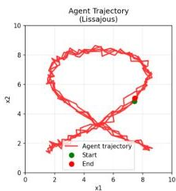
Agent Trajectory vs Phi Reconstruction - Different Kmax Values (Lissajous)

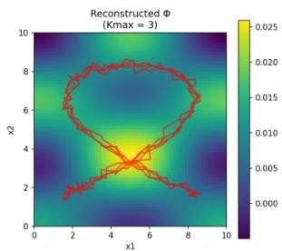
Figure 3.1: "C distribution reconstruction for different values of Kmax. The original trajectory (left) is seen with different resolution according to our choice of Kmax(right)"

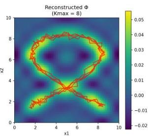

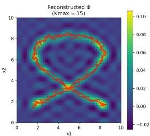

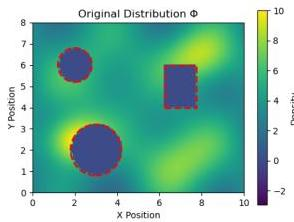
Figure 3.2: "Comparison of Fourier basis reconstruction quality for different Kmax values. Original distribution (left) contains multiple Gaussian peaks with obstacle regions (red boundaries) set to zero. Reconstructions show improved accuracy with higher Kmax values (5, 10, 15), as indicated by decreasing Mean Absolute Error (MAE)."

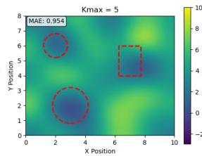
Fourier Basis Reconstruction: Effect of Kmax on Accuracy

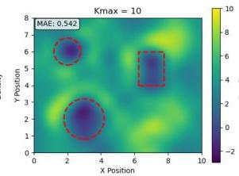

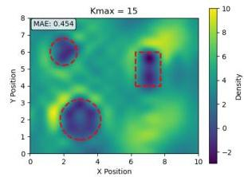

Chapter 3. Ergodic Theory - Control Methodology

## 3.2 Receding-Horizon Ergodic Exploration (RHEE)

The idea so far is that the above formulation could be used in a trajectory optimization scheme. While this approach gives optimal solutions its difficult to run in real time. So instead of finding controllers to optimally reduce ergodicity at each timestep, we find ones that sufficiently do so. The receding-horizon approach addresses the computational challenges of directly optimizing the ergodic metric by formulating the problem in terms of single control actions rather than full trajectories.

## 3.2.1 Mode Insertion Gradient

Rather than directly minimizing (3.8) with respect to $x(t)$ and $u(t)$, we consider the sensitivity of the ergodic metric with respect to an infinitesimal time of application $\lambda \in \mathbb{R}^{+} \to 0$ of the best possible action $u_{*}(t):\mathbb{R}^{+} \to \mathbb{R}^{m}$ that sufficiently reduces (3.8) at time $\tau \in \mathbb{R}^{+}$. Following the hybrid systems approach from Mavrommati et al. [17], we consider the sensitivity of the ergodic metric to infinitesimal control perturbations known as the mode insertion gradient:

**Proposition 3.1.** The first-order sensitivity of the ergodic metric to the application duration $\lambda$ of control $u^{*}(\tau)$ at time $\tau$ is given by:

$$
\left. \frac{\partial J_{\epsilon}}{\partial \lambda} \right|_{\tau} = \rho(\tau)^{T} \left[ f(x(\tau), u^{*}(\tau)) - f(x(\tau), u_{\text{def}}(\tau)) \right] \tag{3.9}
$$

where $\rho(t)$ satisfies the adjoint equation: Receding

$$
\dot{\rho} = - \frac{2Q}{T} \sum_{k \in \mathcal{K}} \Lambda_{k} \left(c_{k} - \phi_{k}\right) \frac{\partial F_{k}}{\partial x} - \frac{\partial f}{\partial x}^{T} \rho \tag{3.10}
$$

with terminal condition $\rho(t_0 + T) = 0$.

Note that if the ergodic dimensions are less than the number of states in our system, and since above we have $F_{k}(x_{\nu})$ rather than $F_{k}(x)$, the derivative lacks the appropriate dimensions for matrix multiplication. We need to append zeros as needed before the calculation.

## 3.2.2 Optimal Control Selection

Given the mode insertion gradient, we search for the control action $u_{*}(t)$ that most significantly reduces the objective (3.8). We formulate the above as the following unconstrained optimization problem:

$$
\min_{u^{*}} \int_{t_{0}}^{t_{0} + T} \left[ \frac{\partial J_{\epsilon}}{\partial \lambda} + \frac{1}{2} \| u^{*} - u_{\text{def}} \|_{R}^{2} \right] dt \tag{3.11}
$$

$R\in\mathbb{R}^{m\times m}$ is a positive definite matrix that weighs $u_{*}(t)$ The analytical solution to the above is:

$u^{*}(t)=-R^{-1}h(x(t))^{T}\rho(t)+u_{\text{def}}(t)$ (3.12)

The above is just a schedule of actions from which we can choose one. In other words, we now have to look for the time of application $\tau_{*}\in(t_{0},t_{0}+T)$ such that:

$\tau_{*}=\text{arg}\min_{\tau}\left.\frac{\partial J_{\epsilon}}{\partial\lambda}\right|_{\tau}$ (3.13)

Now all we have to do is determine a finite control action duration $\lambda$. Usually we search for a $\lambda\in(t_{i},t_{i}+t_{s})$ that satisfies the following condition:

$J_{\epsilon}[x(t,u_{*}(\tau_{*})|_{\lambda})]-J_{\epsilon}[x(t,u^{def})]=\Delta J_{\epsilon}<C_{\epsilon}<0$ (3.14)

where $C_{\epsilon}\in\mathbb{R}^{-}$ is the threshold defined in *[17]* by which we require to reduce ergodicity. Sufficient over optimal reduction. But since:

$\Delta J_{\epsilon}\approx\left.\frac{\partial J_{\epsilon}}{\partial\lambda}\right|_{\tau_{*}}\cdot\lambda<C_{\epsilon}$ (3.15)

We just need to find a $\lambda$ value to satisfy the above. To do so, we utilize a line search process as in *[8]*. In other words, we start with a relatively large value of $\lambda$ and progressively halve it until the above condition is met.

The resulting control can then be saturated freely to the control limits of our system (if existent). The final result added to the default control is the value $u_{*}(\tau_{*})$, kept constant over the time window $[\tau_{*},\tau_{*}+\lambda]$. In other words,

$u_{def}(t)=u_{*}(\tau_{*})\forall t\in[\tau,\tau+\lambda]\cap[t_{i},t_{i}+t_{s}]$ (3.16)

where $t_{s}$ is the sampling time.

#### 3.2.3 Open-loop Problem

In essence, the above algorithm known as ”Open-loop Problem” consists of the following parts being calculated every $t_{s}$ seconds:

- Simulate system forward in time $x(t)$ for $t\in[t_{i},t_{i}+t_{s}]$
- Simulate system backwards $\rho(t)$ using the adjoint equation (3.10)
- Compute action schedule $u_{*}(t)$ using (3.12)
- Choose application time $\tau_{*}$ though (3.13)
- Determine finite control duration $\lambda$ via line search using (3.15)

The resulting control for this iteration is then defined as the triplet: $(u_{*},\tau_{*},\lambda)$

Chapter 3. Ergodic Theory - Control Methodology

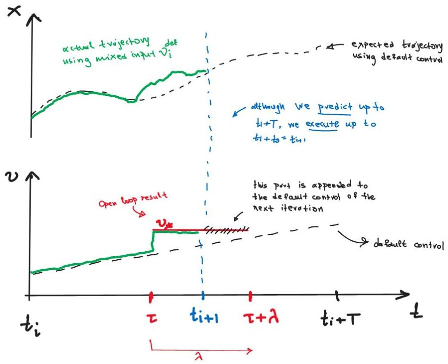
Figure 3.3: The sketch above illustrates the result of the open loop problem over a single time horizon step

Figure 3.3 illustrates with a sketch this result. Suppose we are at  $t = t_i$ . The open loop problem states that we first simulate the system using the nominal controller forward and backwards in time. Both the default control at the time and the expected trajectory  $x^{def} = x(t, u^{def})$  are shown as a dashed black line. The result of the calculation is the triplet  $(u_*, \tau, \lambda)$  which is shown with red. Moving forward  $\Delta t = t_s$  in time and applying this control, the actual trajectory will emerge as illustrated in green. One interesting note is that  $\tau + \lambda$  can be greater than  $t_i + t_s = t_{i+1}$ . This means that although we predict and possible calculate action values over the whole time horizon, we implement until the next time we are called to solve another open loop problem (for  $\Delta t = t_s$ : sampling time). If by any chance there is part of the control action scheduled for the next time step, its not forgotten but appended to the default control used for prediction all over again. Then the result of the next solution is appended to this and so on and so forth. A clearer and more concise mathematical definition of default control can be found in section 3.4.3.

3.3. Multi-Agent Problem Formulation

# 3.3 Multi-Agent Problem Formulation

Consider $N$ robotic agents with dynamics:

$$
\dot {x} = f (x, u) = g (x) + h (x) u = \left[ \begin{array}{c} g _ {1} \left(x _ {1}\right) \\ g _ {2} \left(x _ {2}\right) \\ \vdots \\ g _ {N} \left(x _ {N}\right) \end{array} \right] + \left[ \begin{array}{c c c} h _ {1} \left(x _ {1}\right) &amp; \dots &amp; 0 \\ \vdots &amp; \ddots &amp; \vdots \\ 0 &amp; \dots &amp; h _ {N} \left(x _ {N}\right) \end{array} \right] u \tag {3.17}
$$

where $x_{i} \in \mathbb{R}^{n}$ is the state of agent $i$, $u_{i} \in \mathbb{R}^{m}$ is its control input, $g_{i}$ represents the drift dynamics, and $h_{i}$ is the control effectiveness matrix. The multi-agent system's contribution to the time-averaged statistics $c_{k}$ can be written as:

$$
c _ {k} = \frac {1}{N} \sum_ {j = 1} ^ {N} \frac {1}{T + \Delta t _ {\epsilon}} \int_ {t _ {i} - \Delta t _ {\varepsilon}} ^ {t _ {i} + T} F _ {k} \left(x _ {j} (t)\right) d t = \frac {1}{T + \Delta t _ {\epsilon}} \int_ {t _ {i} - \Delta t _ {\varepsilon}} ^ {t _ {i} + T} \widetilde {F} _ {k} (x (t)) d t \tag {3.18}
$$

where $\widetilde{F}_k(x(t)) = \frac{1}{N}\sum_j F_k(x_j(t))$. This way the convolution equation for the adjoint variable $\rho (t)$ becomes:

$$
\dot {\rho} = - 2 \frac {q}{T + \Delta t _ {\epsilon}} \sum_ {k \in N ^ {v}} \Lambda \left(c _ {k} - \phi_ {k}\right) \frac {\partial \tilde {F} _ {k}}{\partial x} - \frac {\partial f}{\partial x} ^ {\top} \rho \tag {3.19}
$$

where

$$
\frac {\partial \tilde {F} _ {k}}{\partial x} = \frac {1}{N} \left[ \begin{array}{c} \frac {\partial F _ {k} \left(x _ {1}\right)}{\partial x _ {1}} \\ \vdots \\ \frac {\partial F _ {k} \left(x _ {N}\right)}{\partial x _ {N}} \end{array} \right] \quad \text{and} \quad \frac {\partial f}{\partial x} = \left[ \begin{array}{c c c c} \frac {\partial f _ {1}}{\partial x _ {1}} &amp; 0 &amp; \dots &amp; 0 \\ 0 &amp; \frac {\partial f _ {2}}{\partial x _ {2}} &amp; &amp; \vdots \\ \vdots &amp; &amp; \ddots &amp; \\ 0 &amp; \dots &amp; &amp; \frac {\partial f _ {N}}{\partial x _ {N}} \end{array} \right] \tag {3.20}
$$

Because each agent's dynamics are independent of each other, (3.19) can be written as:

$$
\dot {\rho} _ {j} = - \frac {2}{N} \frac {Q}{T + \Delta t _ {\epsilon}} \sum_ {k \in \mathbb {K} ^ {j}} \Lambda_ {k} \left(c _ {k} - \phi_ {k}\right) \frac {\partial F _ {k} \left(x _ {j}\right)}{\partial x _ {j}} - \frac {\partial f _ {j}}{\partial x _ {j}} ^ {\top} \rho_ {j}. \tag {3.21}
$$

This way, the ergodic control policy derived from (3.12) becomes:

$$
\left[ \begin{array}{c} u _ {\star , 1} (t) \\ \vdots \\ u _ {\star , N} (t) \end{array} \right] = - R ^ {- 1} \left[ \begin{array}{c c c} h _ {1} \left(x _ {1}\right) &amp; \dots &amp; 0 \\ \vdots &amp; \ddots &amp; \vdots \\ 0 &amp; \dots &amp; h _ {N} \left(x _ {N}\right) \end{array} \right] ^ {\top} \left[ \begin{array}{c} \rho_ {1} (t) \\ \vdots \\ \rho_ {N} (t) \end{array} \right] + \left[ \begin{array}{c} u _ {d e f, 1} (t) \\ \vdots \\ u _ {d e f, N} (t) \end{array} \right] \tag {3.22}
$$

where $R \in \mathbb{R}^{mN \times mN}$ and $mN$ is the size of the collective multi-agent system control input.

Chapter 3. Ergodic Theory - Control Methodology

Since $h(x)$ is block diagonal, (3.22) becomes:

$u_{\star,j}(t)=-R_{j}^{-1}h_{j}(x_{j})^{T}\rho_{j}(t)+u_{\text{def},j}(t)$ (3.23)

$\Rightarrow$ In other words, we have seen that the control policy (3.12) is distributable among each individual agent and independent of the other agent’s policy.

3.4. Useful Remarks

# 3.4 Useful Remarks

There are several crucial details that when applied to the above algorithm can alter its performance significantly.

#### 3.4.1 More on ck calculation

A parameter exists, the value of which substantially influences the trajectory the agent pursues, as well as the objectives and level of aggressiveness demonstrated during the search task. This parameter is referred to as the ergodic memory $\Delta t_{\epsilon}$ and can be found in the calculation of the agent’s spatial statistics (3.18).

Through $c_{k}$ coefficients, the ergodic cost metric in (3.8) relies on the full state trajectory from an initial time $t=t_{i}-\Delta t_{\epsilon}<t_{i}$ up to $t=t_{i}+T$, potentially impacting execution time and computational cost. Larger values of $\Delta t_{\epsilon}$ indicate that more of the agent’s history is taken into account in the calculation of the ”heat-map” statistics that will be compared to the target distribution. Figure 3.4 illustrates this in a clear and concise manner.

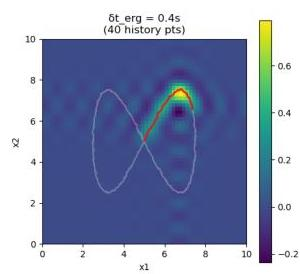
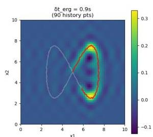
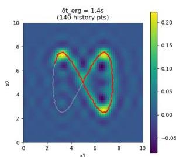
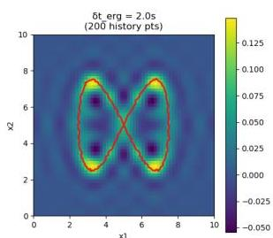
Figure 3.4: $\Phi$ calculation from $c_{k}$ for different $\Delta t_{\epsilon}$ parameters over the same trajectory of an agent. For the calculation above we assume $T=0$, so that the influence of the ergodic memory is clearer

The issue appears with larger and larger values of $\Delta t_{\epsilon}$, especially when $\Delta t_{\epsilon}=ti$, which means we need full history of our trajectory in space.

$c_{k}\stackrel{{\scriptstyle\Delta t_{\epsilon}=ti}}{{=}}\frac{1}{t_{i}+T}\int_{0}^{t_{i}+T}F_{k}(x(t))\,dt$ (3.24)

As the time goes by, our agent’s trajectory should all be taken into account for calculation of spatial statistics, no matter the duration of execution. To avoid integrating over an ever-expanding domain, we implement a method introduced in *[17]* to compute $c_{k}$ coefficients recursively that bypasses this limitation. To make things clearer we define $t_{erg}=t_{i}-\Delta t_{\epsilon}$, and so in order to calculate trajectory coefficients $c_{k}^{i}$ at time step $t_{i}$ we have:

$c_{k}^{i}=\frac{1}{t_{i}+T-t_{erg}}\int_{t_{erg}}^{t_{i}+T}F_{k}(x(t))\,dt$ (3.25)

Chapter 3. Ergodic Theory - Control Methodology

$$
c _ {k} ^ {i} = \underbrace {\frac {1}{t _ {i} + T - t _ {e r g}} \int_ {t _ {e r g}} ^ {t _ {i}} F _ {k} (x (t)) d t} _ {\bar {c} _ {k} ^ {(i)}} + \frac {1}{t _ {i} + T - t _ {e r g}} \int_ {t _ {i - 1}} ^ {t _ {i} + T} F _ {k} (x (t)) d t \tag {3.26}
$$

where recursively we get:

$$
\bar {c} _ {k} ^ {(i)} = \frac {t _ {i - 1} + T - t _ {e r g}}{t _ {i} + T - t _ {e r g}} \bar {c} _ {k} ^ {(i - 1)} + \frac {1}{t _ {i} + T - t _ {e r g}} \int_ {t _ {i - 1}} ^ {t _ {i} + T} F _ {k} (x (t)) d t \tag {3.27}
$$

$$
\boxed {\bar {c} _ {k} ^ {(i)} = \frac {t _ {i - 1} + T - t _ {e r g}}{t _ {i} + T - t _ {e r g}} \bar {c} _ {k} ^ {(i - 1)} + \frac {1}{t _ {i} + T - t _ {e r g}} \underbrace {\left(\int_ {t _ {i - 1}} ^ {t _ {i}} F _ {k} (x (t)) d t + \int_ {t _ {i}} ^ {t _ {i} + T} F _ {k} (x (t)) d t\right)} _ {\text {from buffer}} + \underbrace {\int_ {t _ {i}} ^ {t _ {i} + T} F _ {k} (x (t)) d t} _ {\text {from prediction}})} _ {\text {(3.28)}}
$$

$\forall i \geq 1, k \in \mathbb{K}$  with  $\bar{c}_k^{(0)} = 0$

This way, the amount of data that need to be stored in memory doesn't grow but remains constant as time progresses.

3.4. Useful Remarks

# 3.4.2 Consensus over Ck values - Agreement Protocol

In the decentralized ergodic control framework, individual agents must coordinate their exploration strategies to achieve optimal collective coverage of the spatial distribution $\phi(s)$. Rather than sharing complete trajectory information or requiring centralized coordination, our approach leverages consensus algorithms over the spectral coefficients $c_{k}$ that characterize each agent’s spatial statistics. This section establishes the theoretical foundation for this consensus mechanism and demonstrates how it differs from traditional agreement protocols while enabling fully decentralized ergodic exploration.

#### The Multi-Agent Ergodic Consensus Problem

Consider a network of $N$ robotic agents, each maintaining local estimates of their spatial statistics through Fourier coefficients $c_{k,i}$ where $i\in\{1,2,\ldots,N\}$ denotes the agent index and $k\in\mathbb{K}$ represents the spectral frequency index. The fundamental challenge is to enable each agent to incorporate collective exploration information without requiring centralized computation.

Unlike traditional consensus problems that seek to reach agreement on a single value *[18]*, the ergodic consensus problem aims to achieve coordinated coverage where agents collectively match the target distribution $\phi(s)$ while avoiding redundant exploration of the same regions.

#### Traditional vs. Ergodic Consensus Approaches

The classical agreement protocol for a vector of coefficients $\textbf{c}_{k}(t)=[c_{k,1}(t),c_{k,2}(t),\ldots,c_{k,N}(t)]^{T}$ follows:

$\dot{c}_{k,i}(t)=\sum_{j\in\mathcal{N}_{i}}(c_{k,j}(t)-c_{k,i}(t))$ (3.29)

This drives all agents to converge to the same coefficient value:

$\lim_{t\rightarrow\infty}c_{k,i}(t)=\frac{1}{N}\sum_{j=1}^{N}c_{k,j}(0)\quad\forall i$ (3.30)

However, this approach is inappropriate for ergodic exploration because:

- All agents would converge to identical spatial statistics
- This would result in agents following nearly identical trajectories
- The collective exploration would lose the benefit of multiple agents

The ergodic consensus approach, as described by Mavrommati et al. *[17]*, uses a fundamentally different strategy. Each agent $\zeta$ updates its trajectory coefficients to include collective information:

$c_{k,\zeta}^{i}=c_{k,\zeta}^{i}+\frac{1}{N-1}\sum_{j=1,j\neq\zeta}^{N}c_{k,j}^{i-1}$ (3.31)

where:

- $c_{k,\zeta}^{i}$ are the coefficients of agent $\zeta$’s trajectory at time step $t_{i}$
- $c_{k,j}^{i-1}$ are the coefficients from other agents at the previous time step
- The addition (rather than subtraction) preserves individual exploration while incorporating collective information

This expands to:

$c_{k,\zeta}^{i}=\frac{1}{t_{i}+T-t_{erg}}\int_{t_{erg}}^{t_{i}+T}F_{k}(x_{\zeta}(t))dt+\frac{1}{(N-1)(t_{i-1}+T-t_{erg})}\sum_{j=1,j\neq\zeta}^{N}\int_{t_{erg}}^{t_{i-1}+T}F_{k}(x_{j}(t))dt$ (3.32)

The ergodic consensus mechanism (3.31) ensures that:

1. Each agent maintains awareness of collective exploration history
2. Agents naturally avoid over-exploring regions covered by others
3. The combined spatial statistics of all agents converge to the target distribution
4. Individual agent trajectories remain distinct and complementary

#### Stability and Convergence Analysis

While traditional consensus convergence is well-established, the ergodic consensus mechanism requires different analysis:

###### Theorem 3.2 (Collective Ergodic Convergence).

Under the ergodic consensus mechanism (3.31), the collective spatial statistics of all agents converge to the target distribution:

$\lim_{t\rightarrow\infty}\frac{1}{N}\sum_{\zeta=1}^{N}c_{k,\zeta}(t)=\phi_{k}\quad\forall k\in\mathbb{K}$ (3.33)

provided the communication graph remains connected.

###### Proof.

Each agent $\zeta$ optimizes the collective ergodic cost:

$J_{collective}=Q\sum_{k\in\mathbb{K}}\Lambda_{k}\left(\frac{1}{N}\sum_{\zeta=1}^{N}c_{k,\zeta}-\phi_{k}\right)^{2}$ (3.34)

The ergodic consensus mechanism ensures that each agent has access to (delayed) information about collective coverage. As shown in *[17]*, the contractive constraint in the receding-horizon formulation guarantees that each agent’s actions decrease the collective cost, leading to convergence. ∎

3.4. Useful Remarks

# Communication Architecture

The ergodic consensus requires different communication patterns than traditional consensus:

|  Algorithm 1 Ergodic Consensus Communication Protocol  |   |
| --- | --- |
|  1: | Initialize: Agent ζ with initial ci(k,ζ)  |
|  2: | while system active do  |
|  3: | Local Computation: Calculate current coefficients clk,ζ from trajectory  |
|  4: | Broadcast: Send clk,ζ to all other agents  |
|  5: | for each other agent j ≠ ζ do  |
|  6: | Receive: Coefficients creceived from agent j  |
|  7: | end for  |
|  8: | Update: cconsensus← clk,ζ + 1/N-1 ∑j≠ζ creceived  |
|  9: | Apply Control: Use cconsensus in ergodic cost function  |
|  10: | Wait for next communication cycle  |
|  11: | end while  |

# Communication Complexity

The ergodic consensus mechanism has favorable scaling properties:

- Per-agent transmission:  $(K + 1)^v$  coefficients per cycle
- Per-agent reception:  $(N - 1)(K + 1)^v$  coefficients per cycle
- Total network traffic:  $N(K + 1)^v$  coefficients per cycle
- Computational complexity:  $O(1)$  per agent (independent of  $N$ )

This compares favorably to methods requiring full trajectory sharing, which would require  $O(NT)$  communication where  $T$  is the trajectory length.

# Practical Considerations

The ergodic consensus mechanism is thus inherently robust. Agents can proceed using local coefficients when communication fails, and any reception of coefficients with different  $K_{max}$  values is handled appropriately, as detailed in section 7. Instead of completely failing, the system degrades gracefully to individual exploration. Initially, agents start with zero coefficients and depend on local exploration during the first few iterations. However, as time goes on and agents explore more and more of the search domain, their coordination improves.

Chapter 3. Ergodic Theory - Control Methodology

# 3.4.3 Default Control - Nominal Control

There are two terms to which we refer to though this section. The first one is ”nominal” control while the second one is ”default” control. While at first glance they seem to be used interchangeably, they are not the same. To clear things up, lets take a look first at the definition of nominal control as stated by Mavromati et. al. in *[17]*.

###### Definition 3.3.

Nominal control $u^{nom}:\mathbb{R}\to U$, provides a nominal trajectory around which the algorithm provides feedback. When applying ergodic control as a standalone controller, $u^{nom}(\cdot)$ is either zero or constant. Alternatively, $u^{nom}(\cdot)$ may be an optimized feedforward or state-feedback controller.

This is the beauty of the multi-objective control capacity of the algorithm.
As stated in *[17]*:

&gt; The proposed algorithm can work in a *shared control environment* by *wrapping around* controllers that implement other objectives. This works by incorporating the non-information related control signal as the nominal control input $u^{nom}$ in the algorithm.

For example, in our 12-DoF Quadcopter model simulated in a later section the role of nominal input plays the LQR controller stabilizing the system around equilibrium and keeping it at a commanded height of 2 meters while the ergodic controller works on top. The result is a mixed signal sent to the 4 motors independently containing information for both attitude regulation and ergodic exploration in space.

On the other hand, default control $u^{def}$ is like the action mask that collects, remembers and commands the system at any one time. To be concise, our open loop problem defined in 3.2.3, returns the action triplet ($u_{A}$, $\tau_{A}$, $\lambda_{A}$). This is then turned into the optimal control output though (3.16) in the following manner:

###### Definition 3.4.

Default control $u_{i}^{def}:[t_{i},t_{i}+T]\to U$, is defined as:

\[ u_{i}^{\text{def}}(t)=\begin{cases}u_{i-1}^{*}(t) & t_{i}\leq t\leq t_{i}+T-t_{s}\\
u_{i}^{\text{nom}}(t) & t_{i}+T-t_{s}<t\leq t_{i}+T\end{cases} \] (3.35)

with $u_{0}^{def}(\cdot)\equiv u_{0}^{nom}(\cdot)$, $u^{i-1}_{*}:[t_{i-1},t_{i-1}+T]\to U$ the output of the open loop problem from the previous time step, and $t_{s}=t_{i}-t_{i-1}$ the sampling period.

Default control and reading from an action mask can be confusing but this single-action control methodology avoids iterations on difficult non linear solvers thus rendering the algorithm fast enough for real time execution even on limited hardware platforms.

3.5. Algorithm Implementation

# 3.5 Algorithm Implementation

|  Algorithm 2 Decentralized Ergodic Control  |   |
| --- | --- |
|  Require: Initial states {xi(0)}, target distribution φ, time horizon T  |   |
|  Ensure: Control sequences {ui(t)}  |   |
|  1: Initialize coefficients {c(0)k,i} and time t = 0  |   |
|  2: while t < tf do  |   |
|  3: for each agent i in parallel do  |   |
|  4: Simulate dynamics forward with udef,i over [t, t + T]  |   |
|  5: Compute local coefficients ck,i and update consensus ck,i  |   |
|  6: Solve adjoint equation (3.10) backward  |   |
|  7: Compute action triplet: action schedule u*(t) (3.12), application time τ* (3.13), and control duration λ (3.15)  |   |
|  8: Push control action triplet to action buffer  |   |
|  9: Apply actions from buffer for duration ts (sampling time)  |   |
|  10: end for  |   |
|  11: for each agent i in current network P do  |   |
|  12: Exchange coefficients with neighbors  |   |
|  13: end for  |   |
|  14: t← t + ts  |   |
|  15: end while  |   |

However, despite fast forwarding a bit, the actual algorithm used in my code-base looks more like the following:

Chapter 3. Ergodic Theory - Control Methodology

|  Algorithm 3 Decentralized Ergodic Control with Safety  |   |
| --- | --- |
|  Require: Initial states {xi(0)}, target distribution φ, time horizon T, sampling time Ts  |   |
|  Ensure: Safe control sequences {ui(t)}  |   |
|  1: Initialize coefficients {ci(0)}, past states buffer, action mask, and time t = 0  |   |
|  2: while t < tf and not shutdown do  |   |
|  3: if t mod Ts = 0 then  |   |
|  {Every sampling period}  |   |
|  4: for each agent i in parallel do  |   |
|  5: Forward Simulation: Simulate dynamics forward with udef,i over [t, t + T] using prediction_dt  |   |
|  6: Coefficient Calculation:  |   |
|  7: if use_inf_buffer then  |   |
|  8: Compute ck,i using recursive method with past states buffer  |   |
|  9: else  |   |
|  10: Compute ck,i using standard method with buffer  |   |
|  11: end if  |   |
|  12: Publish ck,i to ROS network  |   |
|  13: Calculate personal ergodic cost: Je,i = Q ∑k λk(ck,i - φk)2  |   |
|  14: Update consensus: ck,i ← ck,i + ck,-i {Add average of others}  |   |
|  15: Adjoint Backward: Solve adjoint equation backward to get ρ(t)  |   |
|  16: Optimal Control: Compute u*(t) = -R-1h(x)Tρ(t) + unominal(x, t)  |   |
|  17: Application Time: Find τ* = arg minτJt(τ, x, u*, ρ)  |   |
|  18: Control Duration: Set λ = Ts × default_lamda_perc  |   |
|  19: Extract control: us = u*(τ*)  |   |
|  20: Saturate: us ← clip(us, ulimits)  |   |
|  21: Push to Action Mask: Store (us, τ*, λ) in action buffer  |   |
|  22: Multi-target EKF Update: (if LOCALISE_TARGETS_FLAG)  |   |
|  23: Associate measurements and update target estimates  |   |
|  24: Update EID: (if UPDATE_EID_FLAG and periodic condition)  |   |
|  25: Update φ function based on target information density  |   |
|  26: end for  |   |
|  27: ROS Communication: Exchange ck coefficients with network neighbors  |   |
|  28: end if  |   |
|  29: for each agent i do  |   |
|  30: Action Selection: Read action umask from action buffer at time t  |   |
|  31: if umask available then  |   |
|  32: u ← umask  |   |
|  33: else  |   |
|  34: u ← unominal(xi, t)  |   |
|  35: end if  |   |
|  36: Safety Filter: Compute CBF safety control usafe (periodic)  |   |
|  37: Apply safety: u ← u + usafe  |   |
|  38: Clip to limits: u ← clip(u, ulimits)  |   |
|  39: Smooth control: u ← αu + (1 - α)uprev  |   |
|  40: Step Dynamics: xi(t + dt) ← step(xi(t), u, dt)  |   |
|  41: Update past states buffer with xi(t + dt)  |   |
|  42: Publish data to ROS topics (periodic)  |   |
|  43: end for  |   |
|  44: t ← t + dt  |   |
|  45: end while  |   |

# Chapter 4 Target Localization

### 4.1 Introduction

Target localisation is a fundamental problem in multi-agent robotic systems where autonomous agents must cooperatively estimate the positions and states of one or more targets within their operational environment. This chapter presents a comprehensive approach to multi-agent target localisation that integrates bearing-only sensing, Extended Kalman Filter (EKF) estimation, and information-theoretic exploration strategies.

The proposed system addresses several key challenges in target localisation: unknown number of targets, limited sensor range, measurement uncertainty, and the need for real-time performance. By combining probabilistic state estimation with information-driven exploration, the system achieves robust target localisation while maintaining computational efficiency suitable for multi-agent deployment.

### 4.2 Problem Formulation

Consider a multi-agent system with $N$ autonomous agents operating in a bounded workspace $\mathcal{X}\subset\mathbb{R}^{2}$. The agents are tasked with localising an unknown number of targets $M$ within the workspace using bearing-only measurements. Each agent $\zeta\in\{1,2,\ldots,N\}$ is equipped with a directional sensor capable of measuring bearing angles to detected targets within a limited sensing range.

Chapter 4. Target Localization

## 4.2.1 Target State Representation

Each target $j \in \{1, 2, \dots, M\}$ is characterized by its state vector:

$$
\boldsymbol {\alpha} _ {j} = \left[ \begin{array}{l} x _ {t, j} \\ y _ {t, j} \\ z _ {t, j} \end{array} \right] \tag {4.1}
$$

where $(x_{t,j},y_{t,j},z_{t,j})$ represents the 3D position of target $j$ in the global coordinate frame. For targets assumed to be on the ground plane, $z_{t,j} = 0$.

The target dynamics, if known apriori, can be modeled accordingly and so taken into account in the estimation process (prediction step of the Kalman Filter in this case). However, this is not actually needed for our system to function. A static target model can be used or in this case a random walk process like the following:

$$
\boldsymbol {\alpha} _ {j, k} = \boldsymbol {\alpha} _ {j, k - 1} + \boldsymbol {w} _ {j, k} \tag {4.2}
$$

where $\boldsymbol{w}_{j,k} \sim \mathcal{N}(\boldsymbol{0}, \mathbf{Q}_j)$ is process noise with covariance matrix $\mathbf{Q}_j$. In the case where the target moves, for as long as the movement is "slow" compared to the agents estimation speed, this model works just fine.

## 4.3 Measurement Model and Sensor Characteristics

### 4.3.1 Bearing-Only Measurement Model

Each agent is equipped with a sensor capable of measuring bearing angles to targets within its sensing range. In other words, bearing-only sensing measures only the direction (azimuth and/or elevation) from the sensor to a target — not the range — so each measurement constrains the target to lie along a ray (in 2D) or a line/cone (in 3D) emanating from the sensor. The measurement function $\mathbf{Y}:\mathbb{R}^M\times \mathbb{R}^n\to \mathbb{R}^\mu$ maps target and agent positions to bearing measurements:

$$
\mathbf {z} _ {k} = \mathbf {Y} \left(\boldsymbol {\alpha}, \mathbf {x} _ {\text {agent}}\right) + \boldsymbol {\delta} _ {k} \tag {4.3}
$$

where $\mathbf{z}_k = [\beta_k, \phi_k]^T$ contains the azimuth and elevation angle measurements, and $\boldsymbol{\delta}_k \sim \mathcal{N}(\mathbf{0}, \mathbf{R})$ is measurement noise. $M = 3$ is the number of target coordinates to estimate, $n = 3$ our agent's positional states in space (x, y and z coordinate) and $\mu$ the number of measurements the system outputs (in our case two: azimuth and elevation angles).

And so on, for a target located at $\alpha = [x_{\tau},y_{\tau},z_{\tau}]^{\top}$ and an agent located at $x_{q} = [x_{q},y_{q},z_{q}]^{\top}$, the measurement mapping also found in [17] is defined as:

4.3. Measurement Model and Sensor Characteristics

$$
\Upsilon (a, x _ {q}) = \left[ \begin{array}{l} \beta_ {k} \\ \phi_ {k} \end{array} \right] = \left[ \begin{array}{c} \arctan \left(\frac {x _ {q} - x _ {r}}{y _ {q} - y _ {r}}\right) \\ \arctan \left(\frac {z _ {q} - z _ {r}}{\sqrt {\left(x _ {q} - x _ {r}\right) ^ {2} + \left(y _ {q} - y _ {r}\right) ^ {2}}}\right) \end{array} \right], \tag {4.4}
$$

## 4.3.2 Measurement Jacobian

Linearisation of the measurement model abound the current parameter estimate $\hat{a}$ is required by the EKF and for computing the Fished Information Matrix in a later step. Having this in mind, the Jacobian matrix $\mathbf{H}$ of the measurement function with respect to the target state:

$$
\mathbf {H} (a, x) = \frac {\partial \mathbf {Y} (a , x)}{\partial \boldsymbol {\alpha}} = \left[ \begin{array}{l l l} \frac {\partial \beta}{\partial x _ {t}} &amp; \frac {\partial \beta}{\partial y _ {t}} &amp; \frac {\partial \beta}{\partial z _ {t}} \\ \frac {\partial \phi}{\partial x _ {t}} &amp; \frac {\partial \phi}{\partial y _ {t}} &amp; \frac {\partial \phi}{\partial z _ {t}} \end{array} \right] \tag {4.5}
$$

The partial derivatives are computed as:

For azimuth angle derivatives:

$$
\frac {\partial \beta}{\partial x _ {t}} = \frac {y _ {t} - y _ {q}}{\left(x _ {q} - x _ {t}\right) ^ {2} + \left(y _ {q} - y _ {t}\right) ^ {2}} \tag {4.6}
$$

$$
\frac {\partial \beta}{\partial y _ {t}} = \frac {x _ {q} - x _ {t}}{\left(x _ {q} - x _ {t}\right) ^ {2} + \left(y _ {q} - y _ {t}\right) ^ {2}} \tag {4.7}
$$

$$
\frac {\partial \beta}{\partial z _ {t}} = 0 \tag {4.8}
$$

For elevation angle derivatives:

$$
\frac {\partial \phi}{\partial x _ {t}} = \frac {\left(x _ {q} - x _ {t}\right) \left(z _ {q} - z _ {t}\right)}{\sqrt {\left(x _ {q} - x _ {t}\right) ^ {2} + \left(y _ {q} - y _ {t}\right) ^ {2}} \cdot \rho^ {2}} \tag {4.9}
$$

$$
\frac {\partial \phi}{\partial y _ {t}} = \frac {\left(y _ {q} - y _ {t}\right) \left(z _ {q} - z _ {t}\right)}{\sqrt {\left(x _ {q} - x _ {t}\right) ^ {2} + \left(y _ {q} - y _ {t}\right) ^ {2}} \cdot \rho^ {2}} \tag {4.10}
$$

$$
\frac {\partial \phi}{\partial z _ {t}} = - \frac {1}{\sqrt {\left(x _ {q} - x _ {t}\right) ^ {2} + \left(y _ {q} - y _ {t}\right) ^ {2}} \cdot (1 + \gamma)} \tag {4.11}
$$

where $\rho^2 = (x_q - x_t)^2 + (y_q - y_t)^2 + (z_q - z_t)^2$ and $\gamma = \frac{(z_q - z_t)^2}{(x_q - x_t)^2 + (y_q - y_t)^2}$.

A special case to consider is when the agent is directly above the target in either one of the 2 planar dimensions $x, y$. Those singular cases are handled by zeroing out the corresponding entries in the jacobian matrix.

## 4.3.3 Sensor Range Limitations

Each sensor has a limited detection range $r_{\mathrm{sensor}}$. A target at position $\alpha_{j}$ can only be detected by agent $\zeta$ at position $\mathbf{x}_{\zeta}$ if:

$$
\left\| \boldsymbol {\alpha} _ {j} - \mathbf {x} _ {\zeta} \right\| _ {2} \leq r _ {\text {sensor}} \tag {4.12}
$$

Chapter 4. Target Localization

It’s essential to understand that limited sensor range naturally creates “blind” zones: if the agent follows a greedy information-maximizing plan while the belief drifts away from the true target, the target can fall outside the sensor radius and no further measurements will be collected to correct the estimate. The receding-horizon ergodic strategy avoids this failure under a mild condition: whenever there is at least one pose within sensing range that the current expected-information map assigns nonzero value, the ergodic trajectory is guaranteed to eventually visit such a pose and regain measurements, allowing the belief to be updated. In practice, that mild condition can be enforced by tuning the estimator (slower convergence) or by seeding small nonzero information values across the workspace to encourage exploration. (See *[17]* for the formal statement and proof.)

### 4.4 Extended Kalman Filter for Target State Estimation

#### 4.4.1 Filter Initialization

For each detected target $j$, we adopt an Extended Kalman Filter to maintain a Gaussian belief $\mathcal{N}(\hat{\alpha},\Sigma)$ over the target, with $\hat{\boldsymbol{\alpha}}_{j,k|k}$ being the state estimate and $\textbf{P}_{j,k|k}$ the error covariance matrix. Initial estimates are typically derived from the first measurement using geometric relationships. The standard discrete-time EKF equations (prediction and update) are:

#### 4.4.2 Prediction Step

Given previous estimate $\hat{\alpha}_{k-1}$ covariance $P_{j,k-1}$ and process model $\alpha_{k}=F(\alpha_{k-1})+w_{k},\ w_{k}\sim\mathcal{N}(0,Q)$ (where F the state transition matrix), the predicted state and covariance are

$\hat{\alpha}_{k|k-1}$ $=F(\hat{\alpha}_{k-1}),$ (4.13)
$P_{k|k-1}$ $=F_{k}P_{k-1}F_{k}^{\top}+Q,$ (4.14)

where $F_{k}=\frac{\partial F}{\partial\alpha}$. Simplifying the above expressions assuming static targets $F_{k}=I$ and we get:

$\hat{\boldsymbol{\alpha}}_{k|k-1}$ $=\hat{\boldsymbol{\alpha}}_{k-1|k-1}$ (4.15)
$\textbf{P}_{k|k-1}$ $=\textbf{P}_{k-1|k-1}+\textbf{Q}$ (4.16)

(emitting j everywhere above for clarity since its clear that we are considering a single target’s EKF instance)

4.4. Extended Kalman Filter for Target State Estimation

## 4.4.3 Update Step

When a measurement $\mathbf{z}_k$ is available for target $j$, the update step refines the state estimate:

1. Predict measurement. Compute the expected measurement from the predicted state:
$$
\hat{z}_k = \Upsilon(\hat{\alpha}_{k|k-1}, x_k)
\tag{1}
$$

2. Compute measurement Jacobian. Linearise the measurement model about the predicted state:
$$
H_k = \left. \frac{\partial \Upsilon(\alpha, x_k)}{\partial \alpha} \right|_{\alpha = \hat{\alpha}_{k|k-1}}
\tag{2}
$$

3. Form innovation covariance. Combine predicted uncertainty and measurement noise:
$$
S_k = H_k P_{k|k-1} H_k^\top + R
\tag{3}
$$

4. Compute Kalman gain. Determine how much the measurement should correct the prediction:
$$
K_k = P_{k|k-1} H_k^\top S_k^{-1}
\tag{4}
$$

5. Compute and wrap innovation. Evaluate the raw innovation and wrap angular differences into $(-\pi, \pi]$ to avoid discontinuities (applies when measurements are bearings):
$$
y_k = z_k - \hat{z}_k
\tag{5a}
$$
$$
\tilde{y}_k = (y_k + \pi) \bmod 2\pi - \pi
\tag{5b}
$$

6. State update. Correct the predicted state with the (wrapped) innovation:
$$
\hat{\alpha}_k = \hat{\alpha}_{k|k-1} + K_k \tilde{y}_k
\tag{6}
$$

7. Covariance update. Update the state covariance to reflect the reduced uncertainty:
$$
P_k = \left(I - K_k H_k\right) P_{k|k-1}
\tag{7}
$$

## 4.4.4 Normalized Innovation Squared (NIS)

The quality of each measurement update is assessed using the Normalized Innovation Squared:
$$
\mathrm{NIS}_{j,k} = \tilde{\mathbf{y}}_{j,k}^{\mathrm{T}} \mathbf{S}_{j,k}^{-1} \tilde{\mathbf{y}}_{j,k}
\tag{4.17}
$$

High NIS values indicate poor measurement-to-prediction consistency, suggesting potential data association errors.

Chapter 4. Target Localization

### 4.5 Fisher Information Matrix and Expected Information Density

#### 4.5.1 Fisher Information Matrix

The Fisher Information Matrix (FIM) quantifies the amount of information that measurements provide about unknown parameters. For target localisation, the FIM evaluates how informative measurements from sensor pose $x\in\mathbb{R}^{3}$ would be for estimating target state $\alpha\in\mathbb{R}^{M}$.

$I(x,\alpha)\in\mathbb{R}^{M\times M},\qquad[I(x,\alpha)]_{ij}=\frac{\partial\Upsilon(\alpha,x)}{\partial\alpha_{i}}^{\top}R^{-1}\frac{\partial\Upsilon(\alpha,x)}{\partial\alpha_{j}}.$ (4.18)

For the bearing-only measurement model, this becomes:

$I(x,\alpha)=H^{\top}(x,\alpha)\,R^{-1}\,H(x,\alpha)$ (4.19)

This measures the information content of a measurement at pose $x$ about the parameters $\alpha$. Because $\alpha$ is uncertain (represented by a belief $p(\alpha)$), we define the *expected information matrix* by integrating the local FIM w.r.t. the belief:

$\Phi(x)=\mathbb{E}_{\alpha\sim p(\alpha)}\big{[}I(x,\alpha)\big{]}\ =\ \int I(x,\alpha)\,p(\alpha)\,d\alpha.$ (4.20)

where:

$\Phi_{i,j}(x)=\int_{\alpha}I_{i,j}(x,\alpha)\,p(\alpha)\,d\alpha$ (4.21)

For computational efficiency, this integral is approximated numerically by discretizing the parameter domain (target position space) and applying a quadrature rule (the implementation uses Gauss–Legendre quadrature). Our code in section 7 demonstrates a vectorized approach by which we evaluate the Jacobian $H(\alpha_{i},x)$ at all quadrature nodes, compute per-node FIMs $I(x,\alpha_{i})=H^{\top}R^{-1}H$, weight by quadrature weights and the belief $p(\alpha_{i})$, and sum to obtain $\Phi(x)$.

To obtain a scalar information density $\Phi(x)$ on the workspace we use the determinant (D-optimality) mapping:

$\text{EID}(x)\ =\ \text{det}\big{(}\Phi(x)\big{)}.$ (4.22)

This D-optimality criterion is invariant under reparameterization as stated in *[17]* and provides a measure of the overall information content available at each spatial location.

Then the Fourier coefficients $\phi_{k}$ of the resulting map are computed via numerical integration:

$\phi_{k}\ =\ \int_{X_{\nu}}\text{EID}(x)\,F_{k}(x)\,dx,$ (4.23)

4.6. Multi-Target Data Association

which is implemented using the same quadrature grid used for the EID computation. These coefficients $\phi_{k}$ are provided to the ergodic controller and compared against the trajectory coefficients $c_{k}$ in the ergodic metric (3.8). The controller then generates motions that reduce the ergodic cost, thereby causing the agents to spend more time in regions of high expected information.

### 4.6 Multi-Target Data Association

#### 4.6.1 Measurement-to-Target Association

With multiple targets present, incoming measurements must be correctly associated with existing target estimates. Our code-base employs Mahalanobis distance-based association *[15]*. For each measurement $\mathbf{z}_{k}$ and target estimate $j$, the Mahalanobis distance is defined as:

$d_{j,k}^{2}=\tilde{y}_{j,k}^{\top}S_{j,k}^{-1}\,\tilde{y}_{j,k}$ (4.24)

A measurement is associated with target $j$ if:

$d_{j,k}^{2}<\gamma_{\text{assoc}}$ (4.25)

where $\gamma_{\text{assoc}}$ is a predefined association threshold.

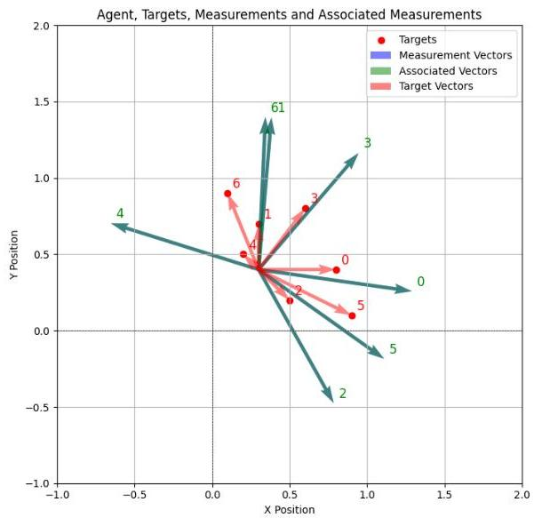
Figure 4.1: Example of associating measurements to specific target estimates. The agent is assumed to be in the origin and take measurements with a 360 deg view. With red we have targets estimated position in space, and with blue arrows the measurement take at a particular point in time. The green numbers correspond to the result of the association procedure.

Chapter 4. Target Localization

## 4.6.2 Assignment Algorithm

The system uses a greedy assignment algorithm that:

1. Computes all measurement-to-target distances
2. Iteratively assigns the closest valid measurement-target pair
3. Removes assigned measurements and targets from consideration
4. Repeats until no valid assignments remain

## 4.7 Target Management

### 4.7.1 Target Spawning

Unassociated measurements may indicate new targets. A new target estimate is spawned when:

1. A measurement cannot be associated with any existing target
2. The measurement is within sensor range
3. Sufficient time has elapsed since the last spawning event

The initial target state estimate is derived geometrically from the bearing measurement:

$$
\hat{x}_{t,\text{new}} = x_{q} + \frac{r_{\text{sensor}}}{2} \sin(\beta) \tag{4.26}
$$

$$
\hat{y}_{t,\text{new}} = y_{q} + \frac{r_{\text{sensor}}}{2} \cos(\beta) \tag{4.27}
$$

$$
\hat{z}_{t,\text{new}} = 0 \tag{4.28}
$$

### 4.7.2 Target Merging

Multiple target estimates may represent the same physical target. Targets are candidates for merging when their Bhattacharyya distance falls below a threshold.

The Bhattacharyya distance between two Gaussian distributions is [21]:

$$
d_{B} = \frac{1}{8} (\boldsymbol{\mu}_{1} - \boldsymbol{\mu}_{2})^{T} \boldsymbol{\Sigma}^{-1} (\boldsymbol{\mu}_{1} - \boldsymbol{\mu}_{2}) + \frac{1}{2} \ln \left( \frac{\det(\boldsymbol{\Sigma})}{\sqrt{\det(\boldsymbol{\Sigma}_{1}) \det(\boldsymbol{\Sigma}_{2})}} \right) \tag{4.29}
$$

where $\boldsymbol{\Sigma} = \frac{1}{2} (\boldsymbol{\Sigma}_1 + \boldsymbol{\Sigma}_2)$ is the average covariance matrix.

When targets are merged, their states are combined using:

$$
\boldsymbol{\mu}_{\text{merged}} = \frac{1}{2} (\boldsymbol{\mu}_{1} + \boldsymbol{\mu}_{2}) \tag{4.30}
$$

$$
\boldsymbol{\Sigma}_{\text{merged}} = \operatorname{LogEuclideanMean}(\boldsymbol{\Sigma}_{1}, \boldsymbol{\Sigma}_{2}) \tag{4.31}
$$

4.8. Integration with Ergodic Exploration

# 4.7.3 Target Deletion

Target estimates are removed when:

1. No measurements have been associated for a specified time period
2. The estimate uncertainty exceeds acceptable bounds
3. The estimated position moves outside the operational area

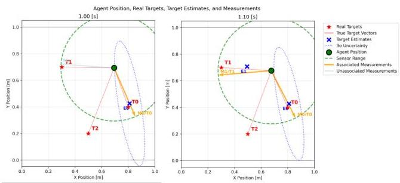
Figure 4.2: Snapshots from the real time execution of the above methodology. When a new target needs to be spawn, we "send" an initial estimate in the direction of measurement

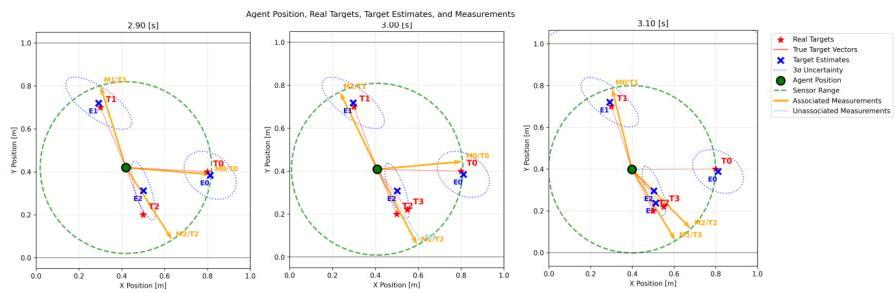
Figure 4.3: In the above scenario a new target appears really close to an already known one. The system understands the difference assigns the second measurement to a new estimate

# 4.8 Integration with Ergodic Exploration

# 4.8.1 Dynamic Information Density Update

The Expected Information Density  $\mathrm{EID}(x)$  is recomputed periodically from the current target estimates, producing a time-varying spatial distribution that steers agent motion toward regions expected to reduce uncertainty. Because the information map changes as the belief over target states evolves, the planning process must balance exploration of areas where the map is uncertain or currently low but potentially informative, and exploitation of regions with high expected information near already tracked targets. Practically, this balance is promoted by maintaining small, nonzero information values in unexplored regions (which prevents the planner from becoming overly myopic) and by updating the EID at a cadence that reflects the estimator convergence and the agents' maneuverability.

Chapter 4. Target Localization

# 4.8.2 Distributed φk Sharing and Consensus

Separately, the spectral representation of the EID provides an efficient vehicle for cooperative localisation: rather than exchanging full spatial maps, agents share the Fourier coefficients $\phi_{k}$ (see (4.23)) used to represent the EID. This mirrors the consensus procedure used for the trajectory coefficients $c_{k}$ in Section 3.4.2, but applied to the information map itself. By encoding target-belief information into the compact set $\{\phi_{k}\}$ and running a consensus protocol over those coefficients, agents achieve a lightweight, bandwidth-efficient agreement on where information lies in the workspace — even when individual agents have seen different subsets of targets. The result is coordinated behavior that naturally combines global discovery (through shared $\phi_{k}$ and maintained nonzero information in unexplored areas) with local refinement around already-detected targets.

### 4.9 Summary

This chapter presented a comprehensive approach to multi-agent target localisation that integrates bearing-only sensing, Extended Kalman filtering, and information-theoretic exploration. The methodology addresses key challenges including measurement uncertainty, data association, and cooperative exploration in multi-target scenarios. The Fisher Information Matrix provides a principled foundation for information-driven exploration, while the target management system handles the complexities of unknown target numbers and dynamic environments. The integration with ergodic exploration ensures efficient spatial coverage while maintaining focus on information-rich regions for accurate target localisation.

# Chapter 5 Model Dynamics

### 5.1 Introduction

In multi-agent target localization and ergodic exploration, the choice between model-based control and traditional path planning approaches fundamentally affects system performance, feasibility, and robustness. This chapter presents the mathematical foundations of the dynamics models employed in our multi-agent system, emphasizing the advantages of model-based control over conventional planning methodologies.

Unlike traditional path planning algorithms that generate waypoints or reference trajectories which may not be dynamically feasible, our approach employs model-based control where the ergodic exploration algorithm directly computes control inputs (e.g., motor commands) that respect the physical constraints and dynamics of each agent. This integration of high-level planning with low-level control ensures that all commanded actions are physically realizable and optimal with respect to the agent’s dynamic capabilities.

The key distinction lies in the fact that our methodology does not separate planning from control execution. Traditional approaches often generate geometric paths that are subsequently tracked by independent controllers, potentially leading to tracking errors, infeasibility, or sub-optimal performance. In contrast, our model-based framework ensures that the exploration strategy is intimately aware of each agent’s dynamic limitations and capabilities, resulting in trajectories that are both ergodically optimal and dynamically feasible.

### 5.2 Control-Affine Dynamics Framework

Our multi-agent system accommodates a broad class of nonlinear dynamical systems through the control-affine formulation. Each agent $\zeta$ in the network is governed by dynamics of the form:

$\dot{x}=f(x,u)=g(x)+h(x)\,u$ (5.1)

where:

Chapter 5. Model Dynamics

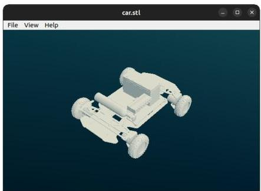

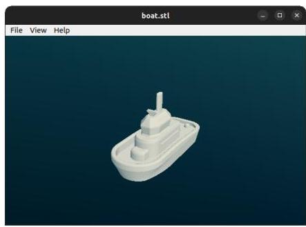

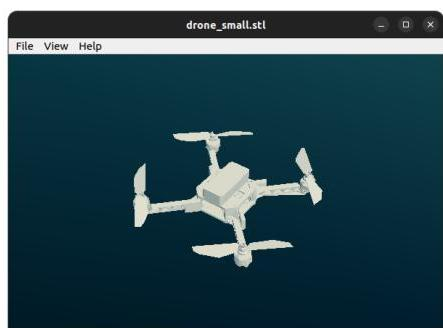
Figure 5.1: STL files used by our code-base for visualization during simulation. One candidate for each interesting dynamic model we used

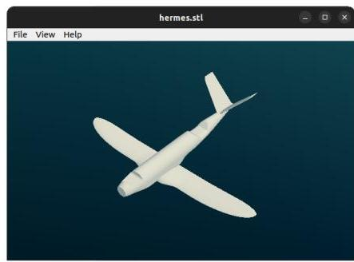

-  $x \in \mathbb{R}^n$  represents the state vector
-  $u \in \mathbb{R}^m$  denotes the control input vector
-  $g(x): \mathbb{R}^n \to \mathbb{R}^n$  captures the drift / unactuated dynamics
-  $h(x): \mathbb{R}^n \to \mathbb{R}^{n \times m}$  represents the control effectiveness matrix

This formulation encompasses a wide range of robotic systems, from simple kinematic models to complex nonlinear dynamics including quadrotors, marine vehicles, and fixed-wing aircraft. The ergodic control framework naturally handles the nonlinear structure without requiring linearisation or simplification, making it particularly suitable for heterogeneous multi-agent systems.

For each dynamics model, we compute the Jacobian matrices required for the ergodic control algorithm:

$$
A (x, u) = \left. \frac {\partial f}{\partial x} \right| _ {(x, u)} \tag {5.2}
$$

$$
B (x) = \left. \frac {\partial f}{\partial u} \right| _ {x} = h (x) \tag {5.3}
$$

These Jacobians are crucial for adjoint computation in ergodic control (3.10), allowing the algorithm to linearize dynamics around the current point.

5.3. Implemented Dynamic Models

# 5.3 Implemented Dynamic Models

In this section, we will try to describe the mathematical derivation and implementation details of the dynamics models used in our multi-agent framework. While some models are relatively simple, they serve as important proof-of-concept demonstrations that our approach can seamlessly handle systems of varying complexity within a unified framework without added complexity.

#### 5.3.1 Single Integrator

The single integrator model represents the simplest case of first-order dynamics, commonly used for kinematic point robots or as approximations for overdamped systems. It’s written in the form:

$\dot{x}=u,$

with state $x=[x_{1},x_{2}]^{\top}=[x,y]^{\top}$ and input $u=[u_{1},u_{2}]^{\top}$. In matrix form the model implemented in code uses

\[ \dot{x}=Ax+Bu,\qquad A=\begin{bmatrix}0&amp;0\\
0&amp;0\end{bmatrix},\quad B=\begin{bmatrix}1&amp;0\\
0&amp;1\end{bmatrix}. \]

While in control affine form $\dot{x}=f(x)=g(x)+h(x)u$ it is:

\[ g(x)=\begin{bmatrix}0\\
0\end{bmatrix}\qquad h(x)=\begin{bmatrix}1&amp;0\\
0&amp;1\end{bmatrix} \] (5.4)

With constant Jacobian matrices of the form:

$\frac{\partial f}{\partial x}=A=\begin{bmatrix}0&amp;0\\
0&amp;0\end{bmatrix}$ (5.5)
$\frac{\partial f}{\partial u}=B=\begin{bmatrix}1&amp;0\\
0&amp;1\end{bmatrix}$ (5.6)

While simple, this model provides valuable insights into the ergodic exploration behavior and serves as a baseline for comparison with more complex systems.

#### 5.3.2 Double Integrator

The double integrator extends the single integrator to include velocity states, representing second-order systems such as point masses or simplified models of vehicles operating in viscous environments.

Chapter 5. Model Dynamics

# Mathematical Formulation

The state vector  $\mathbf{x} = [x,y,\dot{x},\dot{y}]^T$  includes both position and velocity. The dynamics incorporate optional damping:

$$
\left[ \begin{array}{l} \dot {x} \\ \dot {y} \\ \ddot {x} \\ \ddot {y} \end{array} \right] = \left[ \begin{array}{c} \dot {x} \\ \dot {y} \\ - \frac {b}{m} \dot {x} + \frac {1}{m} u _ {1} \\ - \frac {b}{m} \dot {y} + \frac {1}{m} u _ {2} = \end{array} \right] = \underbrace {\left[ \begin{array}{l} \dot {x} \\ \dot {y} \\ - \frac {b}{m} \dot {x} \\ - \frac {b}{m} \dot {y} \end{array} \right]} _ {g (x)} + \underbrace {\left[ \begin{array}{l l} 0 &amp; 0 \\ 0 &amp; 0 \\ \frac {1}{m} &amp; 0 \\ 0 &amp; \frac {1}{m} \end{array} \right]} _ {h (x)} \left[ \begin{array}{l} u _ {1} \\ u _ {2} \end{array} \right] \tag {5.7}
$$

where  $m$  is the mass and  $b$  is the damping coefficient.

# 5.3.3 12-DoF Simple Quadcopter

The quadcopter model represents a significant increase in complexity, incorporating 12 degrees of freedom to capture the full rigid-body motion in three-dimensional space. The state vector includes position, orientation, and their respective rates:

$$
\mathbf {x} = [ x, y, z, \psi , \theta , \phi , \dot {x}, \dot {y}, \dot {z}, \dot {\psi}, \dot {\theta}, \dot {\phi} ] ^ {T} \tag {5.8}
$$

i.e. position, yaw/pitch/roll (Euler angles), linear velocities and angular rates. The controller directly commands the following input vector

$$
u = \left[ T, M _ {\psi}, M _ {\theta}, M _ {\phi} \right] ^ {\top},
$$

where  $T$  is total thrust (body  $z$ -direction) and the  $M$ 's are the yaw/pitch/roll moments. The dynamics are derived from Newton-Euler equations for a rigid body:

$$
m \ddot {x} = T (\sin \phi \sin \psi + \cos \phi \cos \psi \sin \theta), \tag {5.9}
$$

$$
m \ddot {y} = T (\cos \phi \sin \theta \sin \psi - \cos \psi \sin \phi), \tag {5.10}
$$

$$
m \ddot {z} = T \cos \theta \cos \phi - m g, \tag {5.11}
$$

and the rotational dynamics (with simple damping on angular rates) are

$$
\ddot {\psi} = M _ {\psi} - d \dot {\psi}, \quad \ddot {\theta} = M _ {\theta} - d \dot {\theta}, \quad \ddot {\phi} = M _ {\phi} - d \dot {\phi}, \tag {5.12}
$$

where  $m$  is mass,  $g$  gravity, and  $d$  a small angular damping coefficient. Calculating the associated Jacobian matrices from the above, we get:

5.3. Implemented Dynamic Models

$$
\frac {\partial f}{\partial x} = \left[ \begin{array}{l l l l} 0 _ {3 \times 3} &amp; 0 _ {3 \times 3} &amp; I _ {3} &amp; 0 _ {3 \times 3} \\ 0 _ {3 \times 3} &amp; 0 _ {3 \times 3} &amp; 0 _ {3 \times 3} &amp; I _ {3} \\ 0 _ {3 \times 3} &amp; J (x, u) &amp; 0 _ {3 \times 3} &amp; 0 _ {3 \times 3} \\ 0 _ {3 \times 3} &amp; 0 _ {3 \times 3} &amp; 0 _ {3 \times 3} &amp; - d I _ {3} \end{array} \right],
$$

where:

$$
J (x, u) = \frac {T}{m} \left[ \begin{array}{c c c} \cos \psi \sin \phi - \cos \phi \sin \theta \sin \psi &amp; \cos \theta \cos \phi \cos \psi &amp; - \cos \psi \sin \theta \sin \phi + \cos \phi \sin \psi \\ \cos \phi \cos \psi \sin \theta + \sin \phi \sin \psi &amp; \cos \theta \cos \phi \sin \psi &amp; - \cos \phi \cos \psi - \sin \theta \sin \phi \sin \psi \\ 0 &amp; - \cos \phi \sin \theta &amp; - \cos \theta \sin \phi \end{array} \right].
$$

$$
\frac {\partial f}{\partial u} = \left[ \begin{array}{c c c c} &amp; 0 _ {3 \times 4} &amp; &amp; \\ &amp; 0 _ {3 \times 4} &amp; &amp; \\ \frac {1}{m} \left[ \begin{array}{c c c c} \sin \phi \sin \psi + \cos \phi \cos \psi \sin \theta &amp; 0 &amp; 0 &amp; 0 \\ \cos \phi \sin \theta \sin \psi - \cos \psi \sin \phi &amp; 0 &amp; 0 &amp; 0 \\ \cos \theta \cos \phi &amp; 0 &amp; 0 &amp; 0 \end{array} \right] \\ \left[ \begin{array}{c c c c} 0 &amp; 1 &amp; 0 &amp; 0 \\ 0 &amp; 0 &amp; 1 &amp; 0 \\ 0 &amp; 0 &amp; 0 &amp; 1 \end{array} \right] &amp; \end{array} \right].
$$

Finally, something noteworthy is the relationship between motor commands and control inputs. The controller may compute desired actuator-level motor thrusts $m_{1},\ldots ,m_{4}$ or, equivalently, higher-level inputs $u = [T,M_{\psi},M_{\theta},M_{\phi}]$. The mapping between motor thrusts and the input vector is linear and implemented with a mixing matrix $M$:

$$
\left[ \begin{array}{l} T \\ M _ {\psi} \\ M _ {\theta} \\ M _ {\phi} \end{array} \right] = M \left[ \begin{array}{l} m _ {1} \\ m _ {2} \\ m _ {3} \\ m _ {4} \end{array} \right], \qquad M = \left[ \begin{array}{l l l l} 1 &amp; 1 &amp; 1 &amp; 1 \\ 1 &amp; - 1 &amp; 1 &amp; - 1 \\ 1 &amp; 1 &amp; - 1 &amp; - 1 \\ 1 &amp; - 1 &amp; - 1 &amp; 1 \end{array} \right].
$$

The code stores the inverse mixing matrix $M^{-1}$ (or a convenient scaled version) so that motor commands can be computed from desired inputs. Because motors have saturation and safety bounds, we compute input limits for $u$ that are implied by motor limits. Concretely, given bounds $[m_j^{\min}, m_j^{\max}]$ for each motor $j$, we compute conservative per-input bounds

$$
u _ {i} ^ {\min } = \sum_ {j} M _ {i j} m _ {j} ^ {(i, \min )}, \qquad u _ {i} ^ {\max } = \sum_ {j} M _ {i j} m _ {j} ^ {(i, \max )},
$$

choosing the motor endpoint that minimizes/maximizes contribution depending on the sign

Chapter 5. Model Dynamics

of the mixing coefficient. This guarantees that clipped  $u$ -commands correspond to achievable motor thrust vectors

# 5.3.4 Marine Vehicle

The simple boat model captures the essential nonlinear characteristics of marine surface vehicles, incorporating the coupling between surge velocity and yaw dynamics through rudder effectiveness.

The 5-state model includes position, heading, surge velocity, and yaw rate:

$$
\mathbf {x} = \left[ \begin{array}{l l l l} x &amp; y &amp; \psi &amp; v &amp; \omega \end{array} \right] ^ {\top}, \qquad \mathbf {u} = \left[ \begin{array}{l l} T &amp; \delta \end{array} \right] ^ {\top},
$$

The dynamics are inspired mainly by unicycle dynamics as discussed in Chapter 6 of [18], where by simply adding some drag coefficients we get:

$$
\dot {x} = v \cos \psi \tag {5.13}
$$

$$
\dot {y} = v \sin \psi \tag {5.14}
$$

$$
\dot {\psi} = \omega \tag {5.15}
$$

and accelerations,

$$
m \dot {v} = T - d _ {v} v | v | \tag {5.16}
$$

$$
I _ {z} \dot {\omega} = k _ {\delta} v \delta - d _ {\omega} \omega | \omega | \tag {5.17}
$$

where  $T$  is thrust,  $\delta$  is rudder angle,  $k_{\delta}$  is rudder effectiveness, and  $d_v, d_\omega$  are drag coefficients. Note the coupling between surge velocity  $v$  and rudder effectiveness ( $k_{\delta}v\delta$ ) which captures the physical reality that steering authority is dependent upon and increases with forward speed (no steering when  $v \approx 0$ ).

5.3. Implemented Dynamic Models

## 5.3.5 Ground Vehicle

The 6-state car-like model extends the marine vehicle approach to ground vehicles while including steering actuator dynamics and the relationship between longitudinal velocity and yaw generation:

$$
\mathbf {x} = \left[ \begin{array}{l l l l l} x &amp; y &amp; \psi &amp; u &amp; \delta &amp; \omega \end{array} \right] ^ {\top}, \qquad \mathbf {u} = \left[ \begin{array}{l l} F _ {d r i v e} &amp; \delta_ {c m d} \end{array} \right] ^ {\top},
$$

where $u$ is longitudinal velocity, $\delta$ steering actuator state, and $\omega$ yaw rate. For the equations of motion we have:

$$
\dot {x} = u \cos \psi \tag {5.18}
$$

$$
\dot {y} = u \sin \psi \tag {5.19}
$$

$$
\dot {\psi} = \omega \tag {5.20}
$$

$$
m \dot {u} = F _ {d r i v e} - b _ {v} u - d _ {v} u | u | \tag {5.21}
$$

$$
\dot {\delta} = - k _ {\delta} (\delta - \delta_ {c m d}) \tag {5.22}
$$

$$
I _ {z} \dot {\omega} = k _ {s t e e r} u \delta - d _ {r} \omega | \omega | \tag {5.23}
$$

The steering actuator dynamics ($\dot{\delta} = -k_{\delta}(\delta - \delta_{cmd})$) model the finite bandwidth of the steering system, while the yaw moment generation ($k_{steer}u\delta$) captures the velocity-dependent nature of vehicle steering.

## 5.3.6 Fixed-Wing Aircraft

The most complex model in our framework represents a 12-degree-of-freedom fixed-wing aircraft, incorporating full nonlinear aerodynamic effects and demonstrating the framework's capability to handle higher-fidelity models. Most of the following work is inspired by the following course book on flight dynamics [5].

Lets begin by defining the frames and conventions used throughout this derivation:

- Body frame: axes $(x_{b},y_{b},z_{b})$ with $x_{b}$ forward, $y_{b}$ right, $z_{b}$ down.
- Inertial frame: North-East-Down (NED) or generic inertial frame $(X,Y,Z)$. Gravity magnitude denoted $g &gt; 0$ acting in positive inertial $Z$ (down) direction in NED.
- Euler angles: $\phi$ (roll), $\theta$ (pitch), $\psi$ (yaw). We use the standard ZYX sequence for attitude parameterization.
- Velocities: $u, v, w$ are body-frame linear velocities; $p, q, r$ are body angular rates.

Chapter 5. Model Dynamics

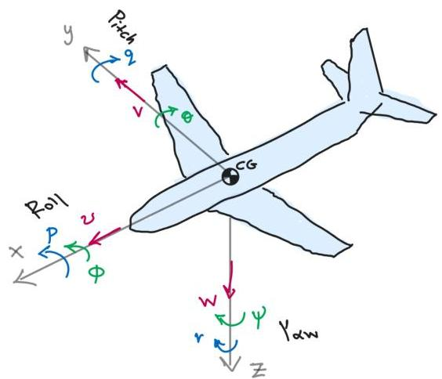
Figure 5.2: Sketch where the main axis and states of an aircraft are illustrated

The complete state vector includes position, orientation, and body-frame velocities:

$$
\mathbf {x} = \left[ \begin{array}{l l l l l l l l l l l l l} X &amp; Y &amp; Z &amp; \phi &amp; \theta &amp; \psi &amp; u &amp; v &amp; w &amp; p &amp; q &amp; r \end{array} \right] ^ {\top} \qquad \mathbf {u} = \left[ \begin{array}{l l l l l l l l l l l l} \delta_ {e} &amp; \delta_ {a} &amp; \delta_ {r} &amp; \text {throttle} \end{array} \right] ^ {\top}
$$

Where  $\delta_{e}$  is the elevator angle,  $\delta_{a}$  refers to ailerons,  $\delta_{r}$  to the rudder and "throttle" is a value ranging from 0 to 1 where 0 means no throttle at all and 1 mean full throttle. It is used later in mapping user command to engine power delivered. Position rates are computed through the rotation matrix transformation:

$$
\left[ \begin{array}{l} \dot {X} \\ \dot {Y} \\ \dot {Z} \end{array} \right] = \mathbf {R} (\phi , \theta , \psi) \left[ \begin{array}{l} u \\ v \\ w \end{array} \right] \tag {5.24}
$$

Euler angle rates are related to body rates through:

$$
\left[ \begin{array}{l} \dot {\phi} \\ \dot {\theta} \\ \dot {\psi} \end{array} \right] = \left[ \begin{array}{c c c} 1 &amp; \sin \phi \tan \theta &amp; \cos \phi \tan \theta \\ 0 &amp; \cos \phi &amp; - \sin \phi \\ 0 &amp; \sin \phi \sec \theta &amp; \cos \phi \sec \theta \end{array} \right] \left[ \begin{array}{l} p \\ q \\ r \end{array} \right] \tag {5.25}
$$

(The mapping is singular at  $\theta = \pm \pi /2$ ; normal flight avoids this region.)

Aerodynamic kinematics Airspeed, angle of attack and sideslip are defined by

$$
V = \sqrt {u ^ {2} + v ^ {2} + w ^ {2}}, \qquad \alpha = \mathrm {a t a n 2} (w, u), \qquad \beta = \mathrm {a s i n} \left(\frac {v}{V}\right).
$$

5.3. Implemented Dynamic Models

Aerodynamic forces and moments  Lift, drag and side force (in dimensional form) using reference area $S$ and density $\rho$:

$$
L = \frac {1}{2} \rho V ^ {2} S C _ {L} (\alpha , \delta_ {e}), \tag {5.26}
$$

$$
D = \frac {1}{2} \rho V ^ {2} S C _ {D} (\alpha), \tag {5.27}
$$

$$
Y = \frac {1}{2} \rho V ^ {2} S C _ {Y} (\beta , \delta_ {r}). \tag {5.28}
$$

Moments (roll $\ell$, pitch $m$, yaw $n$) with span $b$, chord $c$:

$$
\ell = \frac {1}{2} \rho V ^ {2} S b C _ {\ell} (p, r, \beta , \delta_ {a}), \tag {5.29}
$$

$$
m = \frac {1}{2} \rho V ^ {2} S c C _ {m} (\alpha , q, \delta_ {e}), \tag {5.30}
$$

$$
n = \frac {1}{2} \rho V ^ {2} S b C _ {n} (p, r, \beta , \delta_ {r}). \tag {5.31}
$$

Common linear parameterizations (small perturbation form) are:

$$
C _ {L} \approx C _ {L 0} + C _ {L \alpha} \alpha + C _ {L \delta_ {e}} \delta_ {e},
$$

$$
C _ {m} \approx C _ {m 0} + C _ {m \alpha} \alpha + C _ {m q} \frac {q c}{2 V} + C _ {m \delta_ {e}} \delta_ {e},
$$

$$
C _ {\ell} \approx C _ {\ell p} \frac {p b}{2 V} + C _ {\ell r} \frac {r b}{2 V} + C _ {\ell \delta_ {a}} \delta_ {a},
$$

$$
C _ {n} \approx C _ {n p} \frac {p b}{2 V} + C _ {n r} \frac {r b}{2 V} + C _ {n \delta_ {r}} \delta_ {r}.
$$

Drag is often modeled as $C_D \approx C_{D0} + kC_L^2$ (parasitic + induced terms).

Wind→body transform  If aerodynamic forces are computed in wind axes $(x_w, y_w, z_w)$ with $x_w$ aligned with the velocity vector, the transformation to body axes uses

$$
R _ {w \rightarrow b} (\alpha , \beta) = R _ {z} (\beta) R _ {y} (\alpha),
$$

and the body-frame aerodynamic force is

$$
\mathbf {F} _ {a e r o} ^ {b} = R _ {w \rightarrow b} (\alpha , \beta) \left[ \begin{array}{c} - D \\ Y \\ - L \end{array} \right].
$$

Propulsive forces  A simple propulsive model places thrust along the body $x$-axis:

$$
\mathbf {F} _ {p r o p} ^ {b} = \left[ \begin{array}{c} T _ {p r o p} \\ 0 \\ 0 \end{array} \right], \qquad T _ {p r o p} \approx T _ {\max } \cdot \text {throttle},
$$

Chapter 5. Model Dynamics

or a more detailed static map may be used. But for us at this point, this is enough.

Translational dynamics (body frame) Newton's second law in body axes, including Coriolis terms:

$$
m \left[ \begin{array}{l} \dot {u} \\ \dot {v} \\ \dot {w} \end{array} \right] + m \left[ \begin{array}{l} q w - r v \\ r u - p w \\ p v - q u \end{array} \right] = \mathbf {F} _ {a e r o} ^ {b} + \mathbf {F} _ {p r o p} ^ {b} + \mathbf {F} _ {g} ^ {b}, \tag {5.32}
$$

where gravity resolved into body axes is  $\mathbf{F}_g^b = mR_i^b (\phi ,\theta ,\psi)[0 0 g]^\top$  under the NED (down positive) convention.

Rotational dynamics (Euler) With inertia tensor  $I$  (allowing non-zero product  $I_{xz}$  for asymmetry),

$$
I \dot {\boldsymbol {\omega}} + \boldsymbol {\omega} \times (I \boldsymbol {\omega}) = \mathbf {M} _ {a e r o} ^ {b} + \mathbf {M} _ {p r o p} ^ {b}, \tag {5.33}
$$

which in component form yields the familiar roll/pitch/yaw ODEs including gyroscopic coupling terms. A special case is the body symmetrix about the xz-plane ( $I_{xz} = 0$ ) where:

$$
I _ {x} \dot {p} + \left(I _ {z} - I _ {y}\right) q r = L, \tag {5.34}
$$

$$
I _ {y} \dot {q} + \left(I _ {x} - I _ {z}\right) p r = M, \tag {5.35}
$$

$$
I _ {z} \dot {r} + \left(I _ {y} - I _ {x}\right) p q = N. \tag {5.36}
$$

Complete state equations Combining kinematics (5.24), (5.25) with translational (5.32) and rotational (5.33) equations produces the full 12 first-order nonlinear ODEs:

$$
\dot {\mathbf {x}} = f (\mathbf {x}, \mathbf {u}).
$$

Trim computation A trim point  $(\mathbf{x}_{trim},\mathbf{u}_{trim})$  for steady flight at prescribed airspeed  $V_{trim}$  solves a small set of nonlinear algebraic equations enforcing  $\dot{\mathbf{x}} = 0$  in an appropriate steady frame (often  $v = p = r = 0$  for symmetric level flight). Typical unknowns are cruise pitch attitude  $\theta_0$ , elevator  $\delta_{e0}$  angle, and throttle. These equations are solved numerically (Newton or constrained root-finding) to find the nominal commands for cruising. We have coded this process in the python code-base as described in Chapter 7.

Linearisation about trim Linearising about trim gives:

$$
\delta \dot {\mathbf {x}} = A \delta \mathbf {x} + B \delta \mathbf {u},
$$

where  $A = \partial f / \partial \mathbf{x}$ ,  $B = \partial f / \partial \mathbf{u}$  evaluated at  $(\mathbf{x}_{trim},\mathbf{u}_{trim})$ . The longitudinal (short-period, phugoid) and lateral-directional (Dutch-roll, roll, spiral) modal structure arises from this lin

5.4. Numerical Integration Methods

earisation and is checked for any instability thoroughly.

##### Remarks

For model-based ergodic control the full nonlinear model is used for trajectory prediction (RK4 recommended) and the linearised $A,B$ matrices are used for local controllers and sensitivity computations. Inclusion of realistic aerodynamic polars and propulsive maps is important for transferability to hardware but it was not deemed necessary at the moment.

### 5.4 Numerical Integration Methods

The choice of numerical integration method significantly affects simulation accuracy and computational efficiency. Our framework implements multiple integration schemes to accommodate different model complexities and accuracy requirements.

#### 5.4.1 Forward Euler Integration

For simple models and real-time applications, forward Euler integration provides computational efficiency:

$\mathbf{x}_{k+1}=\mathbf{x}_{k}+\Delta t\cdot f(\mathbf{x}_{k},\mathbf{u}_{k})$ (5.37)

This method is used for the single integrator, double integrator, and marine vehicle models where the dynamics are relatively well-conditioned.

#### 5.4.2 Runge-Kutta 4th Order Integration

For higher-fidelity models such as the quadcopter and fixed-wing aircraft, fourth-order Runge-Kutta (RK4) integration ensures numerical accuracy:

$\mathbf{k}_{1}=f(\mathbf{x}_{k},\mathbf{u}_{k})$ (5.38)
$\mathbf{k}_{2}=f(\mathbf{x}_{k}+\frac{\Delta t}{2}\mathbf{k}_{1},\mathbf{u}_{k})$ (5.39)
$\mathbf{k}_{3}=f(\mathbf{x}_{k}+\frac{\Delta t}{2}\mathbf{k}_{2},\mathbf{u}_{k})$ (5.40)
$\mathbf{k}_{4}=f(\mathbf{x}_{k}+\Delta t\mathbf{k}_{3},\mathbf{u}_{k})$ (5.41)
$\mathbf{x}_{k+1}=\mathbf{x}_{k}+\frac{\Delta t}{6}(\mathbf{k}_{1}+2\mathbf{k}_{2}+2\mathbf{k}_{3}+\mathbf{k}_{4})$ (5.42)

The RK4 method provides $O(\Delta t^{4})$ local truncation error, making it suitable for systems where high accuracy is essential for stability and performance.

Chapter 5. Model Dynamics

# 5.5 Control constraints and actuator limits

All models include bounds on the control inputs to ensure physical realism:

$\mathbf{u}_{\min}\leq\mathbf{u}\leq\mathbf{u}_{\max}.$

Examples:

- Quadcopter motor thrusts $m_{i}\in[m_{\min},m_{\max}]$ and hence bounds on $T,M$.
- Fixed wing: control surfaces $\delta_{e},\delta_{a},\delta_{r}\in[-\delta_{\max},\delta_{\max}]$, throttle $\in[0,1]$.
- Boat: $|\delta|\leq\delta_{\max}$, thrust within physical limits.

Clipping is conservative and performed in actuator space where possible so that commanded high-level inputs remain achievable.

### 5.6 Extensibility and Future Models

The modular design of our dynamics framework facilitates straightforward extension to additional vehicle types and applications. Though abstract base class DynamicsBase in our python codebase, we provide a consistent interface requiring implementation of:

- $f(\mathbf{x},\mathbf{u})$: The dynamics function
- $f_{x}(\mathbf{x},\mathbf{u})$: State Jacobian
- $f_{u}(\mathbf{x})$: Input Jacobian
- Numerical integration method
- State and input constraint handling

for the user to be able to easily incorporate new models—such as underwater vehicles, robotic manipulators, or multi-rotor configurations—without modifying the core ergodic exploration algorithm or safety filter functionality. More information about our code-base structure is found in section 7.

Future extensions might include:

- Differential-drive and skid-steer robots for cluttered SAR sites
- Omnidirectional bases for precise indoor manoeuvres
- Legged robots for rough terrain or soft soil
- Underwater and surface vehicles for aquatic tasks
- Multi-rotor and tilt-rotor UAVs for flexible flight
- Fixed-wing UAVs for large-area crop or search coverage
- Hybrid aerial–ground platforms for versatile mobility
- Mobile manipulators for debris handling or crop sampling

5.7. Computational Considerations

- Swarm micro-UAVs for dense inspection or mapping
- Amphibious robots for mixed land-water environments

### 5.7 Computational Considerations

Although model-based control requires additional online computation for forward integration and sensitivity analysis compared to kinematic planning methods, this cost can be justified. Since the algorithm produces actuator-level commands, the result is a dynamically feasible trajectory that both enforces actuation constraints and simplifies the integration of safety mechanisms down the line. In practice, the overhead can be mitigated with surrogate models, adaptive prediction horizons, and efficient real-time solvers all of which are easy to implement but require additional experimentation to validate their actual credibility.

### 5.8 Conclusion

This chapter has presented the mathematical foundations of the dynamics models used in our multi-agent ergodic exploration framework, demonstrating the versatility and scalability of the model-based control approach through a progression from simple integrator models to complex 12-DOF aircraft dynamics. At the same time we highlighted the use of model-based control to produce actuator-level commands that respect true plant dynamics, central to ergodically optimal, feasible, and safe exploration behaviors.

Chapter 5. Model Dynamics

# Chapter 6

# Obstacle Avoidance

The implementation of obstacle avoidance in multi-agent robotic systems presents a fundamental challenge that must balance safety requirements with exploration effectiveness. In ergodic exploration for target localisation, obstacles introduce constraints that can significantly affect agents' ability to maintain the desired spatial distribution while navigating safely through complex environments.

The problem is particularly challenging because the primary control objective is to match a desired spatial distribution $\phi(x)$, which may inherently conflict with safety constraints imposed by obstacles. This chapter examines three progressive approaches to obstacle avoidance, each offering increased sophistication and effectiveness.

## 6.1 Distributional Modification Approach

The most straightforward approach involves modifying the target probability density function $\phi(x)$ to explicitly exclude obstacle regions. This method operates on the principle that if the desired distribution assigns zero probability to obstacle regions, the ergodic controller will naturally avoid spending time in these areas.

### 6.1.1 Mathematical Formulation

The modified distribution function $\phi_{obs}(x)$ zeros out the original distribution within obstacle regions:

$$
\phi_{obs}(x) = \begin{cases}
\phi(x) &amp; \text{if } x \notin \mathcal{O} \\
0 &amp; \text{if } x \in \mathcal{O}
\end{cases} \tag{6.1}
$$

where $\mathcal{O}$ represents the union of all obstacle regions in the workspace. An example of that can be found in Figure 3.2.

51

Chapter 6. Obstacle Avoidance

# 6.1.2 Advantages and Limitations

This approach is attractive because it is theoretically sound—naturally integrating with the ergodic control framework—computationally efficient with minimal overhead, and simple to implement since it only requires modifying the target distribution.
However, it has some key practical limitations. Zeroing the distribution in obstacle regions does not guarantee collision avoidance: the ergodic controller can still produce trajectories that pass through obstacles, especially when those passages are the shortest route between high-importance areas. Agents can behave counterintuitively by quickly darting through obstacles to minimize time spent there rather than taking longer, safer detours, because the ergodic cost measures time-averaged statistics. As a result, the method is noticeably less effective in environments with dense obstacles or narrow passages.

### 6.2 Artificial Potential Fields for Reactive Collision Avoidance

To address the limitations of distributional modification, the second approach implements artificial potential fields (APF) as a reactive collision avoidance mechanism. This method introduces repulsive forces that actively push agents away from obstacles while maintaining compatibility with ergodic exploration objectives.

#### 6.2.1 Mathematical Framework

The approach models obstacles as sources of repulsive potential energy $U(x)$, generating forces $F_{rep}(x)=-\nabla U(x)$. The total control input combines ergodic exploration with obstacle avoidance:

$u_{total}=u_{erg}+u_{obs}$ (6.2)

#### 6.2.2 Circular Obstacles

For circular obstacles with center $x_{obs}$ and radius $r$, the distance to the obstacle surface is:

$d(x)=\|x-x_{obs}\|-r$ (6.3)

The repulsive potential field follows:

\[ U_{circle}(x)=\begin{cases}\frac{k_{obs}}{d(x)^{2}}&\text{if }d(x)\leq\rho_{0}\\
0&\text{if }d(x)&gt;\rho_{0}\end{cases} \] (6.4)

6.2. Artificial Potential Fields for Reactive Collision Avoidance

where  $k_{obs}$  is the potential strength and  $\rho_0$  defines the influence radius.

The corresponding repulsive force is:

$$
F _ {r e p} (x) = \left\{ \begin{array}{l l} \frac {2 k _ {o b s}}{d (x) ^ {3}} \frac {x - x _ {o b s}}{\| x - x _ {o b s} \|} &amp; \text {if} d (x) \leq \rho_ {0} \\ 0 &amp; \text {if} d (x) &gt; \rho_ {0} \end{array} \right. \tag {6.5}
$$

## 6.2.3 Rectangular Obstacles

For rectangular obstacles defined by center  $x_{obs} = [x_c, y_c]^T$ , width  $w$ , and height  $h$ , repulsive forces are applied separately in  $x$  and  $y$  directions:

$$
F _ {x} (x) = \left\{ \begin{array}{l l} - \frac {k _ {o b s}}{d _ {x} ^ {2}} \cdot \operatorname {s i g n} \left(x - x _ {c}\right) &amp; \text {if within influence zone} \\ 0 &amp; \text {otherwise} \end{array} \right. \tag {6.6}
$$

$$
F _ {y} (x) = \left\{ \begin{array}{l l} - \frac {k _ {o b s}}{d _ {y} ^ {2}} \cdot \operatorname {s i g n} \left(y - y _ {c}\right) &amp; \text {if within influence zone} \\ 0 &amp; \text {otherwise} \end{array} \right. \tag {6.7}
$$

## 6.2.4 Wall Obstacles

Wall obstacles are treated as infinite planes with forces normal to the surface. For a wall defined by point  $p_{wall}$  and normal vector  $\hat{n}$ :

$$
d _ {w a l l} (x) = \left(x - p _ {w a l l}\right) \cdot \hat {n} \tag {6.8}
$$

$$
F _ {w a l l} (x) = \left\{ \begin{array}{l l} \frac {k _ {o b s}}{d _ {w a l l} (x) ^ {2}} \hat {n} &amp; \text {if} d _ {w a l l} (x) \leq \rho_ {0} \text {and} d _ {w a l l} (x) &gt; 0 \\ 0 &amp; \text {otherwise} \end{array} \right. \tag {6.9}
$$

## 6.2.5 Implementation for Different Dynamics

The system supports multiple agent dynamics through appropriate force-to-control transformations:

**Single/Double Integrators:** Repulsive forces directly translate to control inputs after scaling.

**Quadrotor Systems:** Forces transform into desired velocity commands with modified LQR gains for aggressive obstacle avoidance:

$$
v _ {\text {d e s i r e d}, x} + = F _ {\text {r e p}, x} \tag {6.10}
$$

$$
v _ {\text {d e s i r e d}, y} + = F _ {\text {r e p}, y} \tag {6.11}
$$

Chapter 6. Obstacle Avoidance

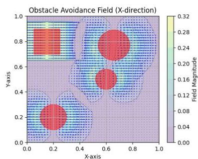

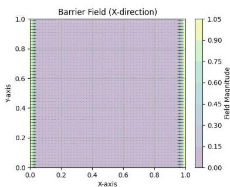

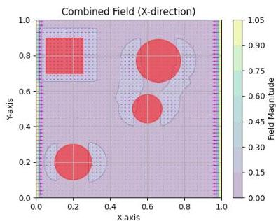

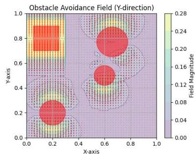
Figure 6.1: Visualization of a potential field. As we can see the forces from each obstacle are additive and have the ability to cancel out in some dimensions when one is near another

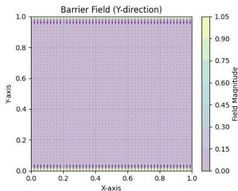

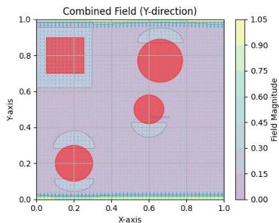

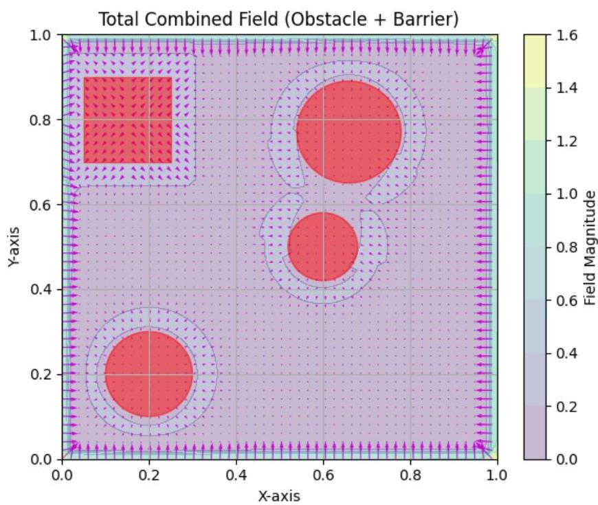
Figure 6.2: Vector plot of an example of a full potential field taking the contribution from walls also into account

6.3. Control Barrier Functions for Safety-Critical Control
55

The system switches between normal operation gains ($K_{LQR,default}$) and obstacle avoidance gains ($K_{LQR,obs}$) based on active avoidance forces.

## 6.2.6 Parameter Design

The relationship between minimum force $f_{min}$ and influence distance $\epsilon$ provides a design framework:

$$
\epsilon = \sqrt{\frac{k_{obs}}{f_{min}}} - r_{obstacle} \tag{6.12}
$$

This allows designers to specify either minimum desired force or influence distance, with automatic computation of the complementary parameter.

## 6.2.7 Performance Characteristics

**Advantages:**
- Explicit collision avoidance through active repulsive forces
- Continuous force fields ensure smooth control transitions
- Computational efficiency with easy integration
- Parameter framework for balancing exploration and safety

**Limitations:**
- Potential for local minima in complex environments
- Reactive nature without long-term trajectory consideration
- Possible oscillatory behavior near obstacle boundaries (see Figures 8.7 and 8.8)
- Competing objectives may degrade exploration efficiency

## 6.3 Control Barrier Functions for Safety-Critical Control

The third and most sophisticated approach employs Control Barrier Functions (CBFs) to provide formal safety guarantees while maintaining compatibility with ergodic exploration objectives. CBFs represent a significant advancement over reactive methods by incorporating velocity and acceleration information into safety constraints, offering provable collision avoidance guarantees. The only challenge to be addressed is that they are usually applied as an additional inequality constraint to the calculation of the minimizer of the optimal control formulation. This is usually performed as part of the optimal trajectory calculation in an MPC trajectory optimization scenario. Due to the nature of our RHEE algorithm approach this seemed difficult for a couple reasons explained later. To solve this, we naturally define a second optimal control formulation on top of the RHEE solution used as a safety filter to

Chapter 6. Obstacle Avoidance

the output of our controller. The beauty of this approach is that its blind to what's below it. In other words it can easily be used in a framework where the agent is controlled by hand taking user commands to move, and the safety filter is there to filter them out so that obstacle avoidance is guaranteed.

## 6.3.1 Theoretical Foundation

Control barrier functions provide a systematic framework for ensuring system safety through constraint satisfaction. For a nonlinear system of the form:

$$
\dot{x} = F(x, u) = f(x) + g(x)u \tag{6.13}
$$

where $x \in \mathbb{R}^n$ is the state, $u \in \mathbb{R}^m$ is the control input, and $f(x), g(x)$ are assumed Lipschitz continuous.

A function $h: \mathbb{R}^n \to \mathbb{R}$ is a control barrier function if it defines a safe set $S = \{x \in \mathbb{R}^n : h(x) \geq 0\}$ and satisfies the fundamental CBF condition. The physical meaning of this condition is crucial for understanding its application.

**Important**: Note the change of notation here relative to the one used earlier in Chapter 5, where $\dot{x} = f(x,u) = g(x) + h(x)u$. Since $h(x)$ is a common notation for the control barrier function, we decided to keep it this way through the following derivations.

## 6.3.2 Physical Interpretation of CBF Condition

The barrier function $h(x)$ defines a safe set where $h(x) \geq 0$ represents safe states, $h(x) = 0$ represents the boundary of safety, and $h(x) < 0$ represents unsafe regions. The time derivative $\dot{h}(x)$ indicates how the safety measure changes as the system evolves.

The fundamental CBF inequality:

$$
\dot{h}(x) \geq -\alpha(h(x)) \tag{6.14}
$$

where $\alpha$ is a class-$\mathcal{K}$ function$^1$ (typically $\alpha(h) = ah$ with $a > 0$), has profound physical meaning:

When $h(x) > 0$ (inside the safe set), $-\alpha(h) < 0$, so $\dot{h}$ is allowed to be negative but bounded below by $-\alpha(h)$. This means the safety measure can decrease, **but not too rapidly**, ensuring the system does not rapidly approach the unsafe region.

When $h(x) = 0$ (on the safety boundary), $-\alpha(0) = 0$, which means $\dot{h} \geq 0$. The system is prevented from entering the unsafe region $h < 0$.

This inequality resembles an exponential stability condition for $h$, since it bounds the decay rate of $h$ by the linear rate $\alpha(h)$. It enforces **forward invariance of the safe set**, meaning:

$^1$A class $\mathcal{K}$ function is a continuous, strictly increasing function $\alpha : [0, \infty) \to [0, \infty)$ with $\alpha(0) = 0$.

6.3. Control Barrier Functions for Safety-Critical Control
57

"if the system starts safe, it stays safe".

## 6.3.3 Barrier Function Construction from Artificial Potential Fields

Eventually, we have to choose a function $h(x)$ to play this role. This is the most challenging part since usually there is no clear way to devise one. Here, the construction of the barrier function $h(x)$ for the CBF approach draws direct inspiration from artificial potential field theory, establishing a fundamental connection between these two obstacle avoidance paradigms. This relationship, formalized by Singletary et al. [24], demonstrates how repulsive potential functions (or even attractive / both) can be transformed into valid control barrier functions while preserving their essential safety properties.

## Distance Function Calculation for Different Obstacle Types

The construction of barrier functions requires the definition of a distance function $\rho(x)$ that measures the proximity to obstacles. This function, along with its gradient $\nabla \rho(x)$, forms the foundation for computing repulsive potentials. The specific formulation of $\rho(x)$ depends on the geometric shape of each obstacle in the workspace.

For a circular obstacle centered at position $x_{obst}$ with safety radius $r_0$, the distance function is:

$$
\rho (x) = \| x - x _ {o b s t} \| - r _ {0} \tag {6.15}
$$

with corresponding gradient:

$$
\nabla \rho (x) = \frac {x - x _ {\text {o b s t}}}{\| x - x _ {\text {o b s t}} \|} \tag {6.16}
$$

where the gradient points radially outward from the obstacle center, providing the direction of steepest increase in distance.

For a rectangular obstacle centered at $x_{obst}$ with half-width and half-height vector $\mathbf{W} = [w/2, h/2]^T$, the distance function utilizes the concept of excess coordinates:

$$
\rho (x) = \left\{ \begin{array}{l l} \max  (\mathbf {E}) & \text {if } \max  (\mathbf {E}) \geq 0 \\ - \min  (- \mathbf {E}) & \text {if } \max  (\mathbf {E}) < 0 \end{array} \right. \tag {6.17}
$$

where $\mathbf{E} = |x - x_{obst}| - \mathbf{W}$ represents the excess distance in each coordinate. The gradient is computed as:

$$
\nabla \rho (x) = \left\{ \begin{array}{l l} [ \operatorname {s i g n} \left(x _ {1} - x _ {\text {o b s t}, 1}\right), 0 ] ^ {T} & \text {if } E _ {1} \geq E _ {2} \text { and outside} \\ [ 0, \operatorname {s i g n} \left(x _ {2} - x _ {\text {o b s t}, 2}\right) ] ^ {T} & \text {if } E _ {2} > E _ {1} \text { and outside} \\ [ \operatorname {s i g n} \left(x _ {1} - x _ {\text {o b s t}, 1}\right), 0 ] ^ {T} & \text {if } G _ {1} \leq G _ {2} \text { and inside} \\ [ 0, \operatorname {s i g n} \left(x _ {2} - x _ {\text {o b s t}, 2}\right) ] ^ {T} & \text {if } G _ {2} < G _ {1} \text { and inside} \end{array} \right. \tag {6.18}
$$

Chapter 6. Obstacle Avoidance

where $\mathbf{G} = -\mathbf{E}$ and the gradient points toward the nearest face of the rectangle.

For a wall obstacle defined by a point $x_{\text{wall}}$ and unit normal vector $\mathbf{n}$ pointing toward the safe side, the distance function is simply:

$$
\rho(x) = (x - x_{\text{wall}}) \cdot \mathbf{n} \tag{6.19}
$$

with constant gradient:

$$
\nabla \rho(x) = \mathbf{n} \tag{6.20}
$$

These distance functions ensure that $\rho(x) > 0$ when the agent is in safe regions, $\rho(x) = 0$ on obstacle boundaries, and $\rho(x) < 0$ when the agent is inside or beyond unsafe regions. The gradients provide the necessary directional information for computing repulsive forces and barrier function derivatives required for control synthesis.

## Repulsive Potential Function Definition

Following the artificial potential field framework, obstacles generate repulsive potentials $U_{rep}(x)$ that satisfy specific mathematical properties. For a given obstacle located at position $x_{obst}$ with minimum safety distance $D_{obst} \geq 0$, the repulsive potential is defined as a continuously differentiable, positive semi-definite function $U_{rep}: \mathbb{R}^n \to \mathbb{R}$ with the following characteristics:

- Positive semi-definite: $U_{rep}(x) \geq 0$ for all $x$
- Strictly increasing: $\nabla U_{rep}(x) \neq 0$ when $\| x - x_{obst} \| \geq D_{obst}$
- Boundary condition: $\lim_{x \to x_{obst} + D_{obst}} U_{rep}(x) = \infty$

A common formulation for the repulsive potential, as used in the original artificial potential field methodology, is:

$$
U_{rep}(x) = \begin{cases}
\infty & \text{if } \rho(x) \leq 0 \\
\frac{1}{2} K_{rep} \left(\frac{1}{\rho(x)} - \frac{1}{\rho_0}\right)^2 & \text{if } 0 < \rho(x) \leq \rho_0 \\
0 & \text{if } \rho(x) > \rho_0
\end{cases} \tag{6.21}
$$

where $K_{rep} > 0$ is the repulsive gain and $\rho_0 > 0$ defines the region of influence for the particular obstacle in mind.

The gradient of the repulsive potential function is:

$$
\nabla U_{rep}(x) = \begin{cases}
\mathbf{0} & \text{if } \rho(x) \leq 0 \text{ or } \rho(x) > \rho_0 \\
- K_{rep} \left(\frac{1}{\rho(x)} - \frac{1}{\rho_0}\right) \frac{1}{\rho(x)^2} \nabla \rho(x) & \text{if } 0 < \rho(x) \leq \rho_0
\end{cases} \tag{6.22}
$$

6.3. Control Barrier Functions for Safety-Critical Control
59

## Transformation to Barrier Function

The key insight from [24], is that repulsive potential functions can be directly transformed into valid control barrier functions through a specific mathematical transformation. Given a repulsive potential $U_{rep}(x)$ satisfying the above properties, the corresponding barrier function is constructed as:

$$
h(x) = \frac{1}{1 + U_{rep}(x)} - \delta \tag{6.23}
$$

where $\delta &gt; 0$ is a small positive constant that determines the conservatism of the safety constraint.

This transformation has several important properties:

**Safe Set Definition**: The safe set is defined as $\mathcal{S} = \{x \in \mathbb{R}^n : h(x) \geq 0\}$, which corresponds to regions where:

$$
\frac{1}{1 + U_{rep}(x)} \geq \delta \Rightarrow U_{rep}(x) \leq \frac{1}{\delta} - 1 \tag{6.24}
$$

**Boundary Behavior**: As the system approaches obstacles, $U_{rep}(x) \to \infty$, it causes $h(x) \to -\delta$, indicating unsafe regions.

**Parameter Influence**: The parameter $\delta$ controls the size of the safe set, with smaller values of $\delta$ allowing the system to operate closer to obstacles while larger values provide more conservative safety margins.

The gradient formulation is the following:

$$
\nabla h(x) = - \frac{\nabla U(x)}{(1 + U(x))^2} \tag{6.25}
$$

Whenever we have more than one obstacles in our workspace, we utilize the additive nature of the potentials as such:

$$
U(x) = \sum_{p \in \mathbb{O}} \left(U_{att}^p(x) + U_{rep}^p(x)\right) \tag{6.26}
$$

and so, we get:

$$
\nabla U(x) = \sum_{p \in \mathbb{O}} \left(\nabla U_{att}^p(x) + \nabla U_{rep}^p(x)\right) \tag{6.27}
$$

where $\mathbb{O}$ is the set known obstacles by our agent. Although we do not utilize attractive potentials in any way in our current version of the algorithm, they are simply included here for completeness. Commonly its another way to set target positions in space.

To summarize, this connection to artificial potential fields provides intuitive understanding of the barrier function behavior: regions with high repulsive potential (near obstacles) correspond to low barrier function values ($h(x) \to 0$ or $-\delta$) (unsafe regions), while areas with low repulsive potential (far from obstacles) correspond to high barrier function values ($h(x) \to 1$

Chapter 6. Obstacle Avoidance

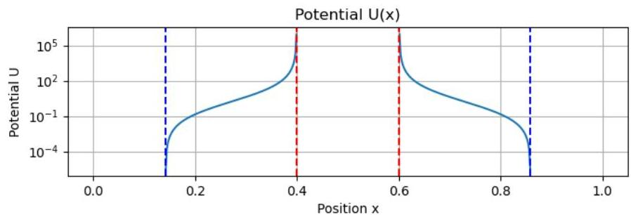

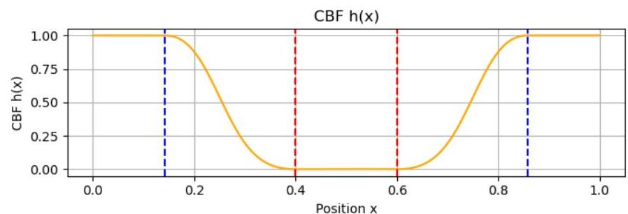

Figure 6.3: Repulsive potential $U(x)$ (top) and corresponding barrier function $h(x) = \frac{1}{1 + U(x)} - \delta$ (bottom) plotted against distance $x$. The transformation shows how peaks in the potential function near obstacles (red dashed lines) map to zero or negative values in the barrier function, while safe regions outside the influence radius (blue dashed lines) yield high barrier values, clearly delineating the safe set boundary.

or $1 - \delta$) (safe regions). This direct relationship facilitates parameter tuning and system design by leveraging the extensive knowledge base established for artificial potential field methods.

## 6.3.4 Relative Degree Analysis and Derivation

The effectiveness of CBFs depends critically on the relative degree of the barrier function with respect to the control input. The **relative degree** determines how many times the barrier function must be differentiated before the control input explicitly appears. This is needed since one differentiated form takes the place of the linear inequality constraint we need to form.

## Relative Degree 1 Case

For relative degree 1 systems, the control input $u$ appears directly in the first derivative of $h(x)$. Using the chain rule:

$$
\dot{h}(x) = \nabla h(x)^T \dot{x} = \nabla h(x)^T (f(x) + g(x)u) \tag{6.28}
$$

This can be written as:

$$
\dot{h}(x) = L_f h(x) + L_g h(x)u \tag{6.29}
$$

where $L_f h(x) = \nabla h(x)^T f(x)$ and $L_g h(x) = \nabla h(x)^T g(x)$ are Lie derivatives.

6.3. Control Barrier Functions for Safety-Critical Control
61

The CBF constraint becomes:

$$
L _ {f} h (x) + L _ {g} h (x) u \geq - \alpha (h (x)) \tag {6.30}
$$

This constraint is affine in $u$, allowing for efficient quadratic programming solutions.

## Relative Degree 2 Case - Complete Derivation

Many practical systems, particularly those involving position control with acceleration inputs, exhibit relative degree 2 behavior. In this case, the control input does not appear explicitly in $\dot{h}(x)$, requiring differentiation to the second derivative.

For the first derivative:

$$
\dot {h} (x) = \nabla h (x) ^ {T} \dot {x} = \nabla h (x) ^ {T} F (x, u) \tag {6.31}
$$

$$
\dot {h} (x) = \nabla h (x) ^ {T} (f (x) + g (x) u) = \nabla h (x) ^ {T} f (x) = L _ {f} h (x) \tag {6.32}
$$

Note that $u$ does not appear here since $\nabla h(x)^T g(x) = 0$. The control input influence arises in the second derivative through the dynamics $\dot{x} = f(x) + g(x)u$.

For the second derivative, applying the chain rule:

$$
\ddot {h} (x) = \frac {d}{d t} (\dot {h} (x, u)) = \frac {d}{d t} (\nabla h (x) ^ {T} f (x)) \tag {6.33}
$$

Expanding by chain rule:

$$
\ddot {h} (x) = \frac {\partial}{\partial x} (\nabla h (x) ^ {T} f (x)) ^ {T} \dot {x} = \frac {\partial}{\partial x} (\nabla h (x) ^ {T} f (x)) ^ {T} (f (x) + g (x) u) \tag {6.34}
$$

$$
\ddot {h} (x) = F (x, u) ^ {T} \nabla_ {x} ^ {2} h (x) F (x, u) + \nabla h (x) ^ {T} \frac {\partial F (x , u)}{\partial x} F (x, u) \tag {6.35}
$$

or to make things easier to read, we can avoid the (x, u) notation:

$$
\boxed {\ddot {h} = F ^ {T} \left(\nabla^ {2} h\right) F + \nabla h ^ {T} \frac {\partial F}{\partial x} F} \tag {6.36}
$$

where remember from (6.13) that $\dot{x} = F(x,u)$ are the general dynamics. Let us now define the vector:

$$
a (x) = \frac {\partial}{\partial x} \left(\nabla h (x) ^ {T} f (x)\right) ^ {T} f (x) \tag {6.37}
$$

and

$$
b (x) = \frac {\partial}{\partial x} \left(\nabla h (x) ^ {T} f (x)\right) ^ {T} g (x) \tag {6.38}
$$

both evaluated at $x$, where $\frac{\partial}{\partial x}$ acts component-wise as the Jacobian $^2$.

Chapter 6. Obstacle Avoidance

Then:

$$
\ddot {h} (x) = a (x) + b (x) u \tag {6.39}
$$

More explicitly, this can be written using Lie derivatives:

$$
\ddot {h} (x) = L _ {f} ^ {2} h (x) + L _ {g} L _ {f} h (x) u \tag {6.40}
$$

where:

$$
L _ {f} ^ {2} h (x) = \nabla \left(L _ {f} h (x)\right) ^ {T} f (x) \tag {6.41}
$$

$$
L _ {g} L _ {f} h (x) = \nabla \left(L _ {f} h (x)\right) ^ {T} g (x) \tag {6.42}
$$

## 6.3.5 Extended CBF Condition for Relative Degree 2

The higher-order CBF condition for relative degree 2 systems is:

$$
\ddot {h} (x) \geq - \alpha_ {1} \dot {h} (x) - \alpha_ {2} h (x) \tag {6.43}
$$

where  $\alpha_{1},\alpha_{2} &gt; 0$  are tuning parameters chosen to impose an exponential-type stability condition on the set defined by  $h(x)\geq 0$ .

Substituting expressions for  $\ddot{h} (x)$  and  $\dot{h} (x)$ , this inequality becomes:

$$
\boxed {L _ {f} ^ {2} h (x) + L _ {g} L _ {f} h (x) u \geq - \alpha_ {1} L _ {f} h (x) - \alpha_ {2} h (x)} \tag {6.44}
$$

or simpler:

$$
\boxed {a (x) + b (x) u + a _ {1} \dot {h} (x) + a _ {2} h (x) \geq 0} \tag {6.45}
$$

This inequality is affine in  $u$ , allowing the use of quadratic programming frameworks.

## 6.3.6 Quadratic Programming Formulation and Explicit Solution

The safe control input is computed by solving the optimization problem:

$$
u ^ {*} = \arg \min  _ {u \in \mathbb {R} ^ {n}} \| u - u _ {d e s} \| ^ {2} \tag {6.46}
$$

$$
\text {s . t . :} \quad a (x) + b (x) u + a _ {1} \dot {h} (x) + a _ {2} h (x) \geq 0 \tag {6.47}
$$

where  $u_{des}$  is the nominal ergodic control input, output of the RHEE algorithm in Chapter 3.

6.3. Control Barrier Functions for Safety-Critical Control
63

## KKT Conditions and Explicit Solution Derivation

To derive the explicit solution, we formulate the KKT conditions of this quadratic program. The objective is quadratic and convex, and the inequality constraint is affine (linear in $u$). Define the Lagrangian:

$$
L(u, \lambda) = \frac{1}{2} \| u - u_{des} \|^2 - \lambda \left( a(x) + b(x)u + a_1\dot{h}(x) + a_2h(x) \right) \tag{6.48}
$$

where $\lambda \geq 0$ is the dual variable (Lagrange multiplier).

The stationarity condition requires:

$$
\nabla_u L = u - u_{des} - \lambda b(x)^T = 0 \tag{6.49}
$$

This gives:

$$
u = u_{des} + \lambda b(x)^T \tag{6.50}
$$

Define the constraint violation function:

$$
\Psi(x, u_{des}) := a(x) + b(x)u_{des} + a_1\dot{h}(x) + a_2h(x) \tag{6.51}
$$

From complementary slackness and feasibility conditions:

If $\Psi \geq 0$, the nominal input already satisfies the constraint, set $\lambda = 0$ and $u^* = u_{des}$.

If $\Psi < 0$, the constraint is violated and we need the minimum $\lambda > 0$ such that the inequality holds with equality:

$$
\Psi + \lambda \| b(x) \|^2 = 0 \Rightarrow \lambda = -\frac{\Psi}{\| b(x) \|^2} \tag{6.52}
$$

The explicit safe control solution is:

$$
u_{safe} = u_{des} - \frac{b(x)^T}{\| b(x) \|^2} \Psi(x, u_{des}) \tag{6.53}
$$

Or to put it clearly:

$$
u_{\text{safe}} = \begin{cases} u_{des} - \frac{b(x)^T}{\| b(x) \|^2} \Psi(x, u_{des}), & \text{if } \Psi < 0, \\ 0, & \text{if } \Psi \geq 0, \end{cases} \tag{6.54}
$$

This formulation ensures that the safety constraint is satisfied with minimal modification to the desired control input.

Chapter 6. Obstacle Avoidance

# 6.3.7 Parameter Selection and Stability

The CBF approach requires careful selection of parameters $\alpha_{1}$ and $\alpha_{2}$:

- $\alpha_{1}$ controls the damping behavior near the safety boundary
- $\alpha_{2}$ determines the convergence rate to the safe set
- Higher values provide more conservative behavior but may interfere with exploration objectives

For exponential convergence to the safe set without oscillations, the parameters should satisfy:

$\alpha_{1}^{2}\geq 4\alpha_{2}$ (6.55)

This condition ensures that the characteristic polynomial of the linearized system near the boundary $\left(\ddot{h}+a_{1}\dot{h}+a_{2}h=0\rightarrow\lambda^{2}+a_{1}\lambda+a_{2}=0\right)$ has real roots, preventing oscillatory behavior.

#### 6.3.8 Performance Advantages

CBFs offer several distinct advantages over potential field methods in multi-agent target localisation systems. Most fundamentally, CBFs provide provable safety guarantees through the forward invariance property of safe sets, ensuring that agents starting within safe regions remain safe throughout their operation. This contrasts with reactive methods that offer no formal guarantees. The approach incorporates velocity and acceleration awareness, allowing for improved safety margins by considering not just current position but also the dynamic trajectory towards obstacles. Unlike potential field methods that can suffer from local minima where competing forces cancel out, CBFs employ an optimization-based approach that avoids such problematic configurations entirely. The behavior near obstacle boundaries is highly predictable and tunable through the parameters $\alpha_{1}$ and $\alpha_{2}$, providing system designers with clear control over the trade-off between safety conservatism and exploration performance. Perhaps most importantly for practical implementation, CBFs integrate seamlessly with existing controllers through a safety filtering architecture, requiring minimal modification to established ergodic exploration frameworks.

### 6.4 Comparative Analysis and Performance Evaluation

The three approaches represent an evolution in obstacle avoidance sophistication, each addressing limitations of the previous methods while introducing new capabilities and complexities. Implementation results demonstrate the progression in effectiveness:

- Distributional approach: Suitable for preliminary safety biasing in open environments

6.5. Conclusions
65

- APF approach: Effective for moderate obstacle densities but prone to oscillations
- CBF approach: Robust performance across varied environments with formal safety guarantees

The CBF implementation successfully handled complex multi-obstacle scenarios that caused failure modes in both distributional modification and APF approaches, particularly in narrow passage navigation and dynamic obstacle avoidance situations.

## 6.5 Conclusions

This chapter presented a comprehensive examination of three progressive approaches to obstacle avoidance in multi-agent target localisation systems. The evolution from distributional modification through artificial potential fields to control barrier functions reflects the broader development of safety-critical autonomous systems.

The distributional modification approach provides a foundational understanding of how obstacle constraints can be incorporated into ergodic exploration frameworks. While computationally efficient and theoretically sound within the ergodic control paradigm, its practical limitations in providing collision avoidance guarantees highlight the need for more sophisticated approaches.

Artificial potential fields (APFs) address many practical shortcomings by providing active collision avoidance through repulsive forces. The method offers improved safety performance while maintaining computational efficiency and ease of implementation. However, issues with local minima and oscillatory behavior limit its effectiveness in complex environments.

Control barrier functions (CBFs) represent the state-of-the-art in safety-critical control, providing formal safety guarantees while maintaining compatibility with primary exploration objectives. The detailed mathematical derivation presented shows how the relative degree 2 formulation addresses the specific requirements of position-controlled multi-agent systems. The explicit solution derivation through KKT conditions demonstrates the minimal intervention property, ensuring both safety and exploration effectiveness.

The comparative analysis demonstrates that the choice of obstacle avoidance method should be guided by specific application requirements:

- Simple environments with sparse obstacles: Distributional modification may suffice
- Moderate obstacle densities with real-time constraints: Artificial potential fields provide good balance
- Safety-critical applications or complex environments: Control barrier functions are essential

Future work could focus mainly on integrating higher relative degree CBF conditions mainly because models like the Quadcopter or the Fixed Wing Aircraft need it. Some parts of the input (elevator, aileron angles etc) are not visible linearly by differentiating twice, so

Chapter 6. Obstacle Avoidance

the controller doesn't see the inputs available and doesn't know how to distribute control commands among all control actions appropriately to effectively navigate among obstacles. In other words, if the input doesn't immediately affect acceleration (like moving the wheels or a moving surface in a UAV instead of directly applying a force to a system's axis) relative degree 2 CBF conditions are simply not enough.

67

# Chapter 7

# System Implementation with Python

This chapter presents the implementation of the ergodic control algorithms developed in the preceding chapters. Rather than creating a simple algorithm that mechanically implements equations, the development focused on building a complete system—a workflow designed from the ground up to be both modular for future modifications and robust for real-world applicability. Our library realizes this vision through a sophisticated architecture that integrates ergodic control with multi-agent coordination, safety systems, and information-driven exploration.

The core motivation throughout this development was to create a library that users can integrate into their projects with ease. Ergodic control represents a promising model-based control structure with infinite possibilities and variations that have yet to be explored at scale. Although the final outcome is still far from perfect, this work takes a step in that direction by providing a foundation for practical implementation and future research.

GitHub Repo: https://github.com/AlexiosVavvas/Diplomatiki

# 7.1 System Architecture

The library architecture centers on four core modules implementing the fundamental algorithms, supported by five auxiliary modules providing specialized functionality. The design emphasizes modularity, where each component has clearly defined responsibilities and interfaces.

# 7.1.1 Core Modules

Agent Controller (agent.py). The central Agent class inherits from ROS2 Node to enable distributed operation. It manages multi-agent coordination through spectral coefficient communication, implements CBF-based safety filtering, and handles multi-target EKF estimation with dynamic target management.

Ergodic Controller (ergodic_controllers.py). Realizes the decentralized ergodic control through receding-horizon MPC. Uses adjoint-based optimization for gradient computation.

Chapter 7. System Implementation with Python

tion and implements spectral coefficient averaging for multi-agent coordination.

Fourier Basis (basis.py). Implements 2D cosine basis functions with analytical normalization coefficients. Features sophisticated numerical integration using Gauss-Legendre quadrature for coefficient computation and maintains caching systems for performance optimization.

Dynamics Framework (model_dynamics.py). Provides abstract base class for vehicle models with implementations spanning single/double integrators, marine vessels, ground vehicles, quadrotors, and fixed-wing aircraft. Each model includes analytical Jacobians and appropriate integration schemes.

# 7.1.2 Support Modules

Safety System (obstacles.py). Implements dual-layer safety through traditional APF and advanced CBF filtering. Supports multiple geometric obstacle types with dynamic management and virtual obstacle handling for "multi-inter-agent" collision avoidance.

Information Theory (eid.py). Provides multi-target EKF with bearing-only measurements, data association using Mahalanobis distance, and Fisher Information Matrix computation for information-driven exploration. Also provides a class application both for measurement model management and sensory input customization.

Visualization (vis.py). Comprehensive plotting and animation capabilities including various distributions comparison, multi-agent trajectory rendering, and 3D visualization for complex vehicle models.

# 7.1.3 Visualization

However, the only way to make all the intricate interconnections apparent is through a sketch diagram showcasing the whole algorithmic structure at glance. Figure 7.1 demonstrates those connections clearly. Central to all is the "agent_node.py" file orchestrating everything surrounding a single agent and his interface with the rest of the world. After the agent's instance initialization and world reconstruction from YAML files, the simulation begins. First comes the prediction and next action calculation from the ergodic controller module, followed by target localisation, probability density function reconstruction and eventually the update of the action mask. At a faster pace comes the actual physics simulation by choosing the appropriate control action taking CBF's recommendation for obstacle avoidance in mind and integrating the possibly full-form, high-fidelity, non-linear equations of our model in time. This process assists the various modules discussed earlier ranging from sensor-measurements management, ergodic calculation handling and so on.

7.1. System Architecture

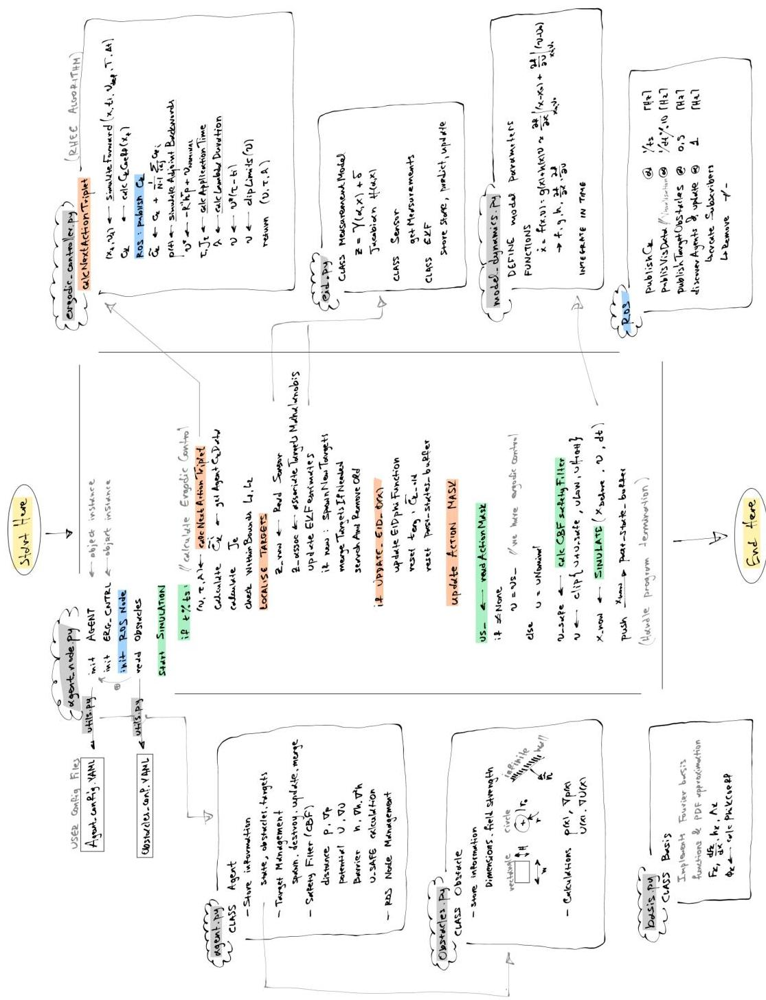
Figure 7.1: Diagram of the whole code-base workflow. In the center is the "agent_node.py" file generating and communicating instances of objects like the dynamic model of the agent though the custom library "my_erg_lib".

Chapter 7. System Implementation with Python

# 7.2 Key Implementation Features

#### 7.2.1 Configuration Management

The actual implementation includes a sophisticated YAML-based configuration system that eliminates hardcoded parameters. Agent configurations support seven vehicle types (SingleIntegrator through FixedWing12DOFTrainer) with complete parameter specification including dynamics, control, safety, and target parameters.

##### YAML configuration defining the DoubleIntegrator agent

```
# Double Integrator Agent Configuration
# Agent type and model parameters
agent:
model_type: "DoubleIntegrator"

# Dynamics model parameters
dynamics:
dt: 0.0012
damping: 2

# Control parameters
control:
ulim: 50 # Control force limit
u_limits_init: [[-50, 50], [-50, 50]]
u_limits: [[-50, 50], [-50, 50]]
time_to_apply_ulimits: 0 # [s] after which to switch u_limits
u_nominal: null

# Ergodic controller parameters
Q: 8
R: [[0.001, 0.0], [0.0, 0.001]]
prediction_dt_multiplier: 5 # PREDICTION_DT = dt * multiplier
relax_factor: 0.95

# Timing parameters
ts: 0.03 # Sampling time
t_h: 0.5 # Horizon time
delta_t_erg: 3.0 # Ergodic time window

# Optimization parameters
inf_buf_flag: true # Whether to use infinite states buffer
bar_weight: 0
update_eid_freq: 2640 # How often to update EID phi function (110*2*3*4)

# Safety parameters (CBF)
cbf_skip_iter: 8 # How often to apply CBF safety filter
delta_safe: 0.1
alpha_hdot: 100
alpha_h: 20
kappa_wall: 0.5
rho_wall: 1.5
kappa_obs: 1
rho_obs: 0.45
kappa_obs_virtual: 1 # Parameters for avoiding other agents
rho_obs_virtual: 0.65

# System parameters
system:
imax: ".inf"
publish_data_freq: 30 # How often to publish data to ROS topic

# Agent communication and range parameters (optional - can be overridden by command line)
antenna_radius: ".inf" # Infinite range by default
kmax: 4 # Maximum Fourier modes for reconstruction
antenna_range_flag: false # Whether antenna range is limited
talk_alike_flag: false # Whether to communicate only with similar models
same_l_bounds_flag: true # Whether to communicate only with agents having same L bounds

# Target and EKF configuration
targets:
# Ground truth target positions [z, y, z]
real_positions:
- [2.0, 2.0, 0.0]
- [4.0, 8.0, 0.0]
- [8.0, 6.0, 0.0]

# EKF parameters for target estimation
ekf:
# Initial estimate covariance (3z3 diagonal values)
sigma_init_diag: [0.5, 0.5, 0.5]

# Sensor noise covariance (2z2 diagonal values)
R_diag: [0.1, 0.1]

# Process noise covariance (3z3 diagonal values)
Q_diag: [0.0001, 0.0001, 0.0001]

# Sensor parameters
sensor_range: 3.0
sensor_R_diag: [0.1, 0.1] # Sensor noise covariance

# System flags
flags:
localise_targets: true
update_eid: false
save_images: false
```

The `setupAgentConfig()` function handles configuration loading with command-line overrides and validation. Dynamic parameter updates through ROS2 enable runtime reconfiguration of antenna radius, communication flags, and safety parameters without system restart. On the other hand, obstacles are introduced into our simulation environment on demand via the same YAML configuration file approach. Each has the ability to load obstacle positions on start up and carry on with those. Although still the algorithm copes well with real time modifications of the ”known” obstacle list, future versions could incorporate apart from target estimates, new obstacle position estimates from corresponding sensors on-the-fly. An example of such configuration file is the following:

Chapter 7. System Implementation with Python

# YAML configuration defining a simple obstacle set

Obstacle Configuration File
This file defines obstacles for the ergodic exploration system
Each obstacle must have: pos, dimensions, obs_type, kappa, rho0, obs_name

obstacles:

Circle obstacles - dimensions is a single value for radius
kappa and rho0 are optional - will use defaults from model if not specified

- pos: [1.5, 1.5]
dimensions: 0.6
obs_type: 'circle'
obs_name: "Circle Obstacle 1"
kappa: 1.0 # Optional - uses KAPPA_OBS default if not specified
rho0: 0.15 # Optional - uses RHO_OBS default if not specified

- pos: [5.0, 1.5]
dimensions: 0.6
obs_type: 'circle'
obs_name: "Circle Obstacle 2"

- pos: [8.5, 1.5]
dimensions: 0.6
obs_type: 'circle'
obs_name: "Circle Obstacle 3"

- pos: [1.5, 5.0]
dimensions: 0.6
obs_type: 'circle'
obs_name: "Circle Obstacle 4"

Rectangle obstacles - dimensions is [width, height]
- pos: [7.0, 3.0]
dimensions: [2.0, 1.5]
obs_type: 'rectangle'
obs_name: "Rectangle Obstacle 1"

- pos: [3.0, 7.0]
dimensions: [1.0, 2.0]
obs_type: 'rectangle'
obs_name: "Rectangle Obstacle 2" # Uses defaults

Large rectangle obstacle like in your example
- pos: [5.0, 5.0]
dimensions: [10.0, 10.0]
obs_type: 'rectangle'
obs_name: "Large Rectangle Obstacle"

Fixed walls (explicit positions and dimensions)
Example: Custom wall in the middle of the domain
- obs_type: 'wall'
pos: [5.0, 3.0] # Explicit position [x, y]
dimensions: [3.0, 4.0] # Normal vector [nz, ny] - magnitude 5.0 (visual length)
kappa: 0.5
rho0: 1.5
obs_name: "Custom Wall 2"

- obs_type: 'wall'
pos: [2.0, 7.0] # Explicit position [x, y]

7.2. Key Implementation Features

```txt
dimensions: [3.0, 4.0] # Normal vector [nz, ny] - magnitude 5.0 (visual length)
kappa: 0.5
rho0: 1.5
obs_name: "Custom Wall 2"
#
# Note: dimensions is the normal vector whose magnitude = visual wall length
# Wall is mathematically infinite for collision detection
# If you need something finite, use a rectangle obstacle instead
```

# 7.2.2 Safety Control Computation

As we've seen in 6.3, the safety control system implements a Control Barrier Function (CBF) approach to ensure obstacle avoidance through control input modification. Given the current state  $x$ , nominal control  $u_{\mathrm{def}}$ , and tuning parameters  $\alpha_{1}, \alpha_{2}$ , the algorithm computes a safety correction  $u_{\mathrm{safe}}$ .

Quick recap: The method begins by evaluating the barrier function  $h(x, \delta)$  and its derivatives:

$$
\dot {h} = \nabla h ^ {T} f (x, u _ {\text {d e f}}) \tag {7.1}
$$

$$
\ddot {h} = f ^ {T} H _ {h} f + \nabla h ^ {T} f _ {x} f \tag {7.2}
$$

where  $f(x, u)$  represents the system dynamics,  $f_{x}$  is the Jacobian, and  $H_{h}$  is the Hessian of the barrier function.

The safety constraint is formulated as:

$$
\Psi = \ddot {h} + 2 \alpha_ {1} \dot {h} + \alpha_ {2} h \tag {7.3}
$$

with the control effectiveness term:

$$
\beta = \left(f ^ {T} H _ {h} + \nabla h ^ {T} f _ {x}\right) g \tag {7.4}
$$

where  $g(x)$  is the control input matrix.

Control Logic If  $\Psi \geq 0$ , the system is safe and no control modification is required ( $u_{\mathrm{safe}} = 0$ ). Otherwise, when  $\Psi < 0$  and  $\| \beta \| > 10^{-6}$ , a safety control is computed. For vehicle-specific implementations, the method applies weighted least squares with prioritization matrices or the form  $W = \mathrm{diag}(1, w_{priority})$  where  $w_{priority}$  could be a value greater than one, representing the prioritization of steering control over thrust. In other words, when implementing CBF safety control on vehicles with thrust limitations (boats, cars), a critical challenge arises: the closed-form solution may command unrealistic reverse thrust. This occurs particularly in scenarios involving head-on collisions or tight corners, where the safety algorithm's immediate response is to reduce thrust to zero and potentially continue in reverse.

Chapter 7. System Implementation with Python

The weighted safety control is computed as:

$$
u _ {\text {s a f e}} = - W \frac {W \beta^ {T}}{\| W \beta^ {T} \| ^ {2}} \Psi \tag {7.5}
$$

To prevent unrealistic reverse thrust, our implementation enforces:

$$
u _ {t h r} ^ {c m d} = u _ {\mathrm {d e f}} [ 0 ] + u _ {\mathrm {s a f e}} [ 0 ] \leq u _ {m a x} ^ {r e v} \tag {7.6}
$$

When this constraint is violated, excess thrust  $(\Delta u_{thr}^{excess} = u_{max}^{rev} - u_{thr}^{cmd})$  is redistributed to steering/rudder control using a sign determination method based on the cross product between velocity vector and barrier gradient:

$$
\operatorname {s i g n} _ {\text {s t e e r}} = \operatorname {s i g n} (v \times \nabla h) \tag {7.7}
$$

The redistributed steering command becomes:

$$
u _ {s t e e r} = - \operatorname {s i g n} (v \times \nabla h) \cdot \Delta u _ {t h r} ^ {e x c e s s} \cdot w _ {p r i o r i t y} \tag {7.8}
$$

However, this heuristic approach does not guarantee optimal actuator usage, particularly when the control effectiveness  $\| \beta \|$  is small. All it does is realize the direction of "flow" away of the obstacles and steer the agent towards it. Yet there are better ways to approach this that naturally incorporate this behavior into the systems output. One of them is addressed below even though it was not incorporated into our final solution.

Formal QP Formulation with Input Constraints The theoretically sound approach includes actuator constraints directly in the safety filter formulation (6.47). Instead of the unconstrained minimization, we solve:

$$
\begin{array}{l} u ^ {*} = \arg \min  _ {u \in \mathbb {R} ^ {m}} \| u - u _ {d e s} \| _ {W} ^ {2} \\ \text {s . t . :} \quad \Psi (x, u) \geq 0 \tag {7.9} \\ u _ {m i n} \leq u \leq u _ {m a x} \\ \end{array}
$$

By doing so we are sure that the system always produces a valid solution within actuator bounds, automatically balancing control effort between available actuators.

## 7.2.3 Distributed Multi-Computer Implementation with Husarnet

A critical aspect of real-world multi-agent systems is that agents typically do not operate from a single centralized computer. Instead, each agent runs on its own computational platform while maintaining network connectivity for coordination. Our implementation addresses this

7.2. Key Implementation Features

realistic deployment scenario through ROS2 Humble's distributed architecture, enabled by Husarnet networking.

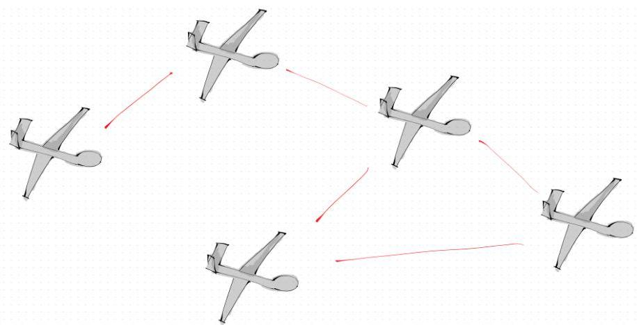
Figure 7.2: Distributed multi-agent UAV network with wireless communication links enabled by Husarnet infrastructure.

# Husarnet Network Infrastructure

Husarnet provides a peer-to-peer VPN solution specifically designed for robotics applications, creating a seamless network overlay between distributed computing resources. The system enables zero-configuration networking with automatic peer discovery, eliminating manual IP configuration. Husarnet's NAT traversal capabilities allow direct connections between computers behind different firewalls and routers, while maintaining low latency through peer-to-peer connections. The network creates a virtual subnet where each computer appears as a local network peer, enabling ROS2's DDS/RTPS communication to function transparently across different physical locations.

# ROS2 Distributed Architecture

The system leverages ROS2's inherent support for distributed computing, with Husarnet providing the underlying network infrastructure. Each agent operates as an independent node that can run on separate physical machines connected through the Husarnet VPN. This design mirrors real-world scenarios where each robot has its own onboard computer and agents maintain network connectivity through wireless communication. Our node-based architecture implements true parallel execution where each node  $N_{i}$  can reside on any computer in the Husarnet network, enabling flexible deployment configurations.

The implementation was successfully tested across heterogeneous computing environments, with agents operating seamlessly between Ubuntu 22.04 native installations and Windows WSL2 environments. Agents communicate through ROS2 topics using only the custom message type CkCoefficients for Fourier spectral information sharing. This multi-computer

Chapter 7. System Implementation with Python

configuration enables realistic assessment of communication overhead as agent count increases, revealing potential bottlenecks before physical deployment. The same Husarnet infrastructure used for development can be directly deployed on actual robotic platforms, providing a seamless transition from simulation to real-world implementation.

# 7.3 Implementation Complexities and Behind-the-Scenes Details

This section highlights sophisticated implementation details that required significant development effort but are often invisible to end users. These "behind-the-scenes" complexities demonstrate the depth of engineering work required to transform theoretical algorithms into robust, production-ready software.

# Advanced Data Structures and Memory Management

Custom FIFO Buffer System. The ReplayBufferFIFO class implements sophisticated memory management with configurable capacity, dynamic expansion, and element validation. The system supports both finite and infinite buffer modes for ergodic history management, automatically handling memory bounds while maintaining constant-time access to historical states.

Action Masking and Time Windows. The ActionMask class provides complex time-based action sequencing using dual FIFO buffers for actions and time intervals. It supports overlapping action windows, priority-based action selection from most recent to oldest, and floating-point time comparison with numerical tolerance handling.

Coefficient Caching Systems. The Basis class maintains three caching systems: hk_cache for normalization coefficients, phi_coeff_cache for target distribution coefficients, and LamdaK_cache for frequency weighting. These simple Python dictionaries store expensive computations using (k1, k2) tuples as keys, with basic "check if exists, otherwise compute and store" logic to avoid redundant calculations.

# Numerical Integration and Computational Optimizations

Gauss-Legendre Quadrature Integration. The coefficient computation employs adaptive Gauss-Legendre quadrature with configurable point counts (default 22 points) for numerical integration. The system dynamically selects between 'gauss' and 'nquad' methods based on accuracy requirements and computational constraints.

Vectorized Operations. Critical performance bottlenecks were identified through cProfile analysis and optimized using vectorized NumPy operations. Profiling was done to find culprits performance-wise and spot functions that take more time than they should. "cProfile"

7.3. Implementation Complexities and Behind-the-Scenes Details

and "pstats" were used yielding results like the following:

```txt
Profiling main()
32360166 function calls (32291039 primitive calls) in 63.379 seconds
Ordered by: cumulative time
List reduced from 5167 to 90 due to restriction
~<agent.py|basis.py|model_dynamics.py|ergodic Controllers.py|barrier.py|replay_buffer.py|obstacles.py>
```

|  ncalls | tottime | percall | cumtime | percall filename:lineno(function)  |
| --- | --- | --- | --- | --- |
|  5000 | 0.301 | 0.000 | 23.895 | 0.005 c:\Users\alesi\Documents\Diplomatik\wy_erg_lib\agent.py:607(calcUsefe)  |
|  190000 | 1.559 | 0.000 | 17.929 | 0.000 c:\Users\alesi\Documents\Diplomatik\wy_erg_lib\agent.py:518(calcPotentialU)  |
|  185000 | 0.141 | 0.000 | 17.562 | 0.000 c:\Users\alesi\Documents\Diplomatik\wy_erg_lib\agent.py:538(calcH)  |
|  5000 | 0.341 | 0.000 | 17.308 | 0.003 c:\Users\alesi\Documents\Diplomatik\wy_erg_lib\agent.py:563(calcHessianH)  |
|  2470000 | 3.203 | 0.000 | 16.370 | 0.000 c:\Users\alesi\Documents\Diplomatik\wy_erg_lib\obstacles.py:226(U)  |
|  200 | 0.163 | 0.001 | 14.461 | 0.072  |
|  → c:\Users\alesi\Documents\Diplomatik\wy_erg_lib\ergodic Controllers.py:120(calcNextActionTriplet)  |   |   |   |   |
|  1755000 | 3.075 | 0.000 | 11.400 | 0.000 c:\Users\alesi\Documents\Diplomatik\wy_erg_lib\obstacles.py:47(_rhoFunc)  |
|  200 | 7.082 | 0.035 | 11.345 | 0.057  |
|  → c:\Users\alesi\Documents\Diplomatik\wy_erg_lib\ergodic Controllers.py:73(simulateAdjointBackward)  |   |   |   |   |
|  415000 | 3.196 | 0.000 | 3.323 | 0.000 c:\Users\alesi\Documents\Diplomatik\wy_erg_lib\basis.py:53(dFk_dx)  |
|  780000 | 1.995 | 0.000 | 2.143 | 0.000 c:\Users\alesi\Documents\Diplomatik\wy_erg_lib\obstacles.py:121(_rhoFunc)  |
|  33600 | 0.038 | 0.000 | 1.843 | 0.000 c:\Users\alesi\Documents\Diplomatik\wy_erg_lib\ergodic Controllers.py:66(uDef)  |
|  5000 | 0.054 | 0.000 | 1.646 | 0.000 c:\Users\alesi\Documents\Diplomatik\wy_erg_lib\agent.py:547(calcHDradient)  |
|  38600 | 0.899 | 0.000 | 1.515 | 0.000 c:\Users\alesi\Documents\Diplomatik\wy_erg_lib\replay_buffer.py:83(readAction)  |
|  482525 | 0.290 | 0.000 | 1.498 | 0.000 c:\Users\alesi\Documents\Diplomatik\wy_erg_lib\basis.py:114(calcPhiXCoeff)  |
|  14600 | 0.062 | 0.000 | 1.378 | 0.000 c:\Users\alesi\Documents\Diplomatik\wy_erg_lib\agent.py:76(phi_x_obs)  |

Recursive Coefficient Computation. Implementation of the recursive  $\bar{c}_k$  calculation for infinite ergodic memory buffers required careful numerical handling to avoid accumulated floating-point errors and ensure numerical stability over extended operation periods.

# Multi-Platform Communication Architecture

Cross-Platform Networking. Seamless operation across Ubuntu 22.04 native and Windows WSL2 environments required careful handling of network interface detection, IP address resolution, and ROS2 DDS configuration differences between platforms ( $\neg \neg$ ).

Dynamic Parameter System. Runtime parameter updates through ROS2 parameter callbacks for a limited set of communication parameters (antenna radius, communication flags). The system supports command-line argument overrides and YAML configuration loading with basic parameter declaration and callback handling for live configuration changes.

# Target Management and Data Association

Mahalanobis Distance-Based Association. Implementation of data association algorithms using Mahalanobis distance calculations between predicted and actual measurements. The system computes innovation covariance matrices and uses the statistical distance for measurement-to-target assignment with configurable association thresholds.

Log-Euclidean Covariance Merging. When merging overlapping target estimates, the system employs Log-Euclidean mean computation for covariance matrices. This involves computing matrix logarithms of individual covariance matrices, averaging them, and applying matrix exponential to the result, preserving positive definite properties during target consolidation.

Chapter 7. System Implementation with Python

Bhattacharyya Distance Computation. Target merging decisions utilize Bhattacharyya distance calculations with careful handling of matrix determinant computation and numerical conditioning for nearly singular matrices.

# Safety System Implementation Details

Hessian Computation via Finite Differences. CBF implementation requires Hessian matrices of barrier functions, computed using central finite difference schemes with numerical conditioning checks to ensure accuracy while avoiding floating-point precision issues.

# Configuration System and Error Handling

Multi-Level Configuration Validation. The YAML configuration system implements comprehensive validation with type checking, range validation, cross-parameter consistency checks, and detailed error reporting.

Error Handling and Robustness. The system includes basic error handling for numerical issues such as singular matrix exceptions during Bhattacharyya distance computations, with fallback to infinite distance values. ROS2 logging provides system status updates including agent connectivity changes and target management activities.

Model-Specific Parameter Extraction. Dynamic parameter extraction and validation for different vehicle types with automatic parameter mapping, unit conversion, and compatibility checking between configuration files and model requirements.

These implementation details represent hundreds of hours of development work addressing edge cases, numerical stability, cross-platform compatibility, and performance optimization. While invisible to end users, they form the foundation that enables the sophisticated theoretical algorithms to operate reliably in practical deployments.

# 7.4 Conclusions

This chapter has translated ergodic control from theory into a practical, modular system that runs across real networks and hardware. By focusing on computational efficiency, safety filtering, and distributed ROS2 nodes over Husarnet, we have built a foundation that is both robust and extensible. The sophisticated implementation details presented demonstrate that creating production-ready autonomous systems requires extensive engineering work beyond algorithmic development. While improvements remain to be made, this implementation demonstrates that ergodic control can move beyond simulations and serve as a reliable starting point for future research and real-world applications.

# Chapter 8

# Results and Discussion

This chapter presents some experimental results derived from the development of the ergodic control algorithm across seven different scenarios. Each scenario demonstrates specific aspects of the algorithm's performance showcasing both strengths and weaknesses.

# 8.1 Environment 1: Single Agent, No Obstacles

The first environment represents the simplest scenario of all configurations tested. It features a single double integrator agent exploring a bounded  $10 \times 10$  domain with the primary objective of achieving uniform ergodic coverage while simultaneously localizing targets encountered during the exploration process. This fundamental setup serves as a baseline case that demonstrates the core principles of ergodic exploration before introducing additional complexity in subsequent environments.

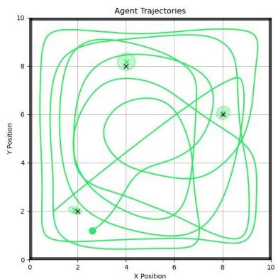
Figure 8.1: 2D trajectory for single double integrator in an obstacle-free environment

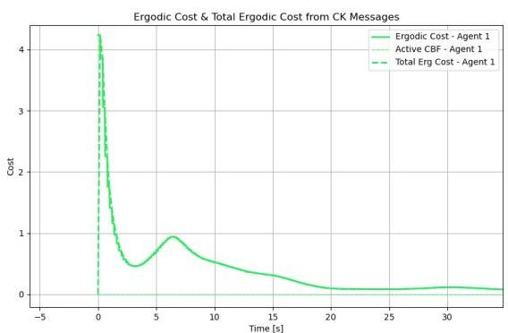
Figure 8.2: Ergodic metric as a function of time

As we can see from Figure 8.1, starting from an initial position at the edge of the domain, the agent exhibits a tendency to move rapidly toward the opposite side by passing through the center. This strategy allows its trajectory spatial statistics to quickly capture the low-frequency information of the desired uniform target distribution with a single pass. Much like someone searching for lost keys in a room, the agent first quickly traverses the entire domain to cover as much area as possible before focusing on detailed exploration. This

Chapter 8. Results and Discussion

behavior emerges naturally from filtering high-frequency contributions with  $\Lambda_{k}$  as explained in Chapter 3. Notably, the ergodic metric is reduced by a substantial  $97\%$  within 20 seconds of exploration, suggesting that this duration is sufficient for covering an area of this size.

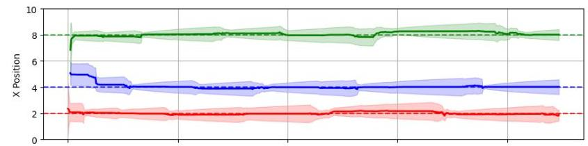
Agent 1 - Target Position Estimates with 3σ Confidence Bands

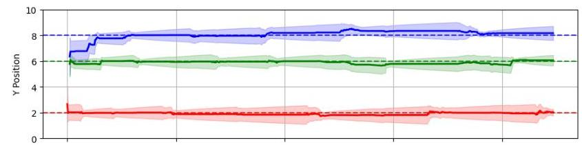

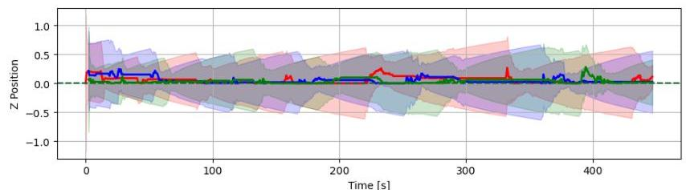
Figure 8.3: EKF target localization position estimates for case study 1. With lines are the current target position estimate in space surrounded by the  $3\sigma$  confidence band. Process covariance is non negative and that's why, especially when outside sensor radius, confidence bands have the tendency to expand. The parts they suddenly collapse is when the target is once again in range and new measurements are available for updating the old prediction

Meanwhile, during the search process, an unknown number of targets is localized through the Extended Kalman filter, as evident in the position estimate diagram shown in Figure 8.3. It is particularly interesting to observe the system in action, managing multiple measurements simultaneously and tracking the estimates with ease (although Figure 8.3 suggests our agent may be somewhat overconfident in its localization ability, narrowing down the confidence bands too quickly at the beginning. However, this is merely a tuning characteristic of the system that can be easily adjusted).

Regarding the resulting control action magnitude, Figure 8.4 demonstrates that when the system initiates exploration, the control actions exhibit large magnitudes due to the proportional relationship between the control signal and the difference between the agent's current spatial statistics and the target distribution. Initially, this difference is substantial, leading to correspondingly large control inputs. As time progresses, the required control actions become progressively smaller (given an infinite ergodic memory buffer), eventually resulting in the agent coming to rest upon completion of the exploration task.

Additionally, throughout the entire development of this project, a critical quantity that quanti

8.1. Environment 1: Single Agent, No Obstacles

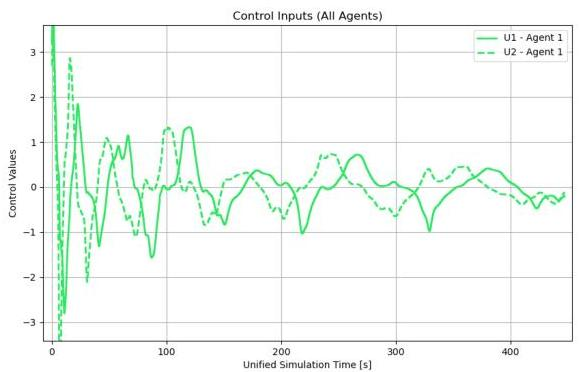
Figure 8.4: Control inputs U1, U2, as a function of time

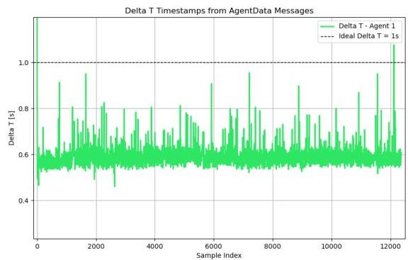
Figure 8.5: Computation speed ratio  $(\Delta t_{erg\_loop} / T_s)$ . Values less than one indicate real time performance capabilities since it took less time than needed to perform the necessary calculations.

fies the real-world readiness of this computational framework is the ratio between calculation time and sampling time. When this ratio is significantly less than unity, it indicates that the system completes its calculations well within the available time window, allowing for proper execution before the next control cycle is required. Figure 8.5 clearly demonstrates this favorable computational performance.

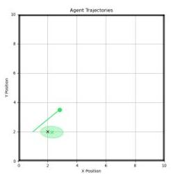

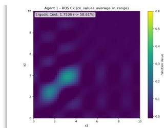

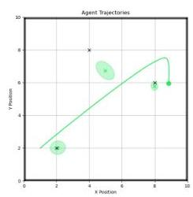

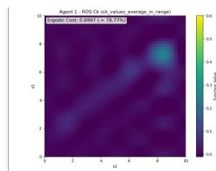

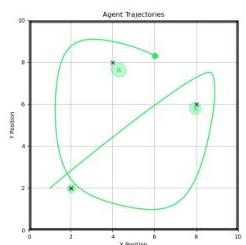
(a)

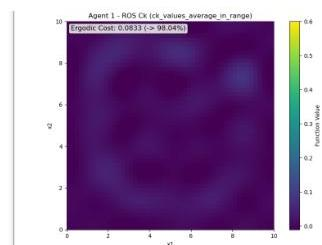
(c)

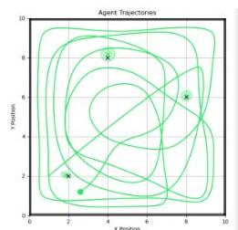
Figure 8.6: Evolution of the exploration in time. On the right side of each subplot we see the reconstructed distribution from current  $c_k$  spatial statistics in memory. This is what's being compared with the target distribution  $\Phi(s)$  though its own Fourier coefficients  $\phi_k$

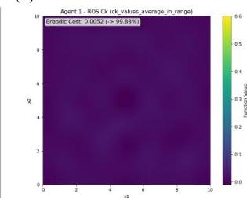
(b)
(d)

What is particularly interesting to note here is that at any given time, the agent's spatial statistics must satisfy the constraint that their integral over the entire domain equals to one. This essentially means that the agent possesses a fixed amount of "exploration energy" to distribute throughout its mission. Initially, this entire energy is concentrated at the agent's starting location, creating a strong driving force that pushes the agent toward unexplored areas of the domain. As time progresses, this energy becomes distributed across the explored regions,

Chapter 8. Results and Discussion

resulting in progressively weaker control actions and reduced agent movement.

In essence, when referring to "energy," I am referring to the integral of the distribution resulting from the Fourier reconstruction of the agents trajectory in space (from the well known  $c_k$ 's), where the difference between this distribution  $C(s)$  and the target distribution  $\Phi(s)$  generates the driving force that propels the agent to explore the environment.

8.2. Environment 2: Single Agent / Multi-Agent with Obstacles

# 8.2 Environment 2: Single Agent / Multi-Agent with Obstacles

The second scenario takes the exploration challenge one step further by introducing obstacles into the mix. This aspect of the project required a substantial amount of development time, as beginning with artificial potential fields (APF) revealed that numerous parameters need to be calibrated precisely for the system to remain stable and avoid divergent behavior. Introducing control barrier functions (CBF) to the framework solved this issue to a significant extent, making the solution model-dependent by design rather than relying on user's choice and intuition. Figures 8.7 and 8.8 demonstrate this exact phenomenon.

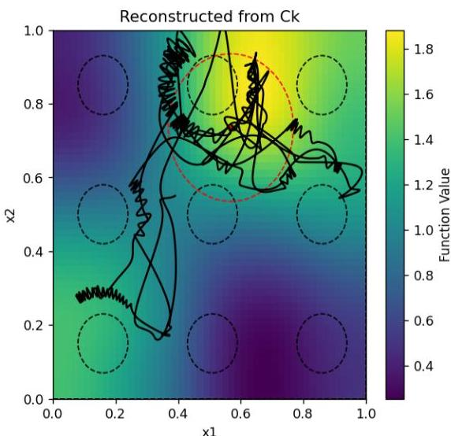
Figure 8.7: Example of systems behavior using somehow tuned APFs

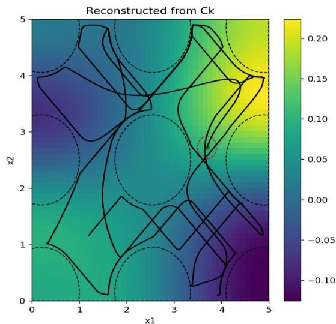
Figure 8.8: Same systems behavior using CBF formulation

What we observe with the APF approach is a constant hesitation in movement, with the agent oscillating back and forth between its intended exploration goal and the unexpected repulsive forces from the potential field in that region. Even when the agent is positioned far from obstacles, the system experiences their influence through the potential field (this is a tunable characteristic, but when the influence radius is too small, the agent suddenly and unexpectedly encounters obstacles and collides with them). However, using the CBF formulation, the agent is free to explore the space as if obstacles were not present. Only when necessary, and with mathematically minimal intervention from the safety filter, does the system keep the agent away from potential collisions, resulting in significantly smoother trajectories as demonstrated in the figures below.

To ensure the agent avoids regions not intended for exploration, we first zero out the initial uniform target distribution in areas occupied by obstacles. This modified distribution is then reconstructed via the appropriate Fourier basis and passed to the agent, as illustrated in Figure 8.9.

Chapter 8. Results and Discussion

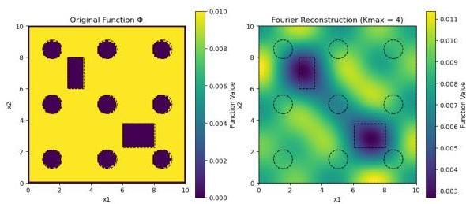
Figure 8.9: Target PDF  $\Phi(s)$  vs the Fourier reconstructed one


Figure 8.10: H-value potential field evaluated at each point in the domain

Figure 8.10, on the other hand, depicts how obstacles are perceived by the CBF safety filter through a static evaluation of the control barrier function  $H$  across the entire domain. Here, we observe the tunable influence radii of each obstacle and, more importantly, the accessible regions identified by the controller. In other words, even if two obstacles are physically separated, the controller may detect no viable passage between them due to the risk of collision in that area.


Figure 8.11: Single agent exploration


Figure 8.12: Three-agent coordinated exploration


Figure 8.13: Ergodic cost (single drone w/ obstacles)


Figure 8.14: Ergodic cost evolution (Solid lines indicate individual ergodic costs, dashed is their combined ones)

8.2. Environment 2: Single Agent / Multi-Agent with Obstacles

Figure 8.13 shows the ergodic cost as a function of time for the single-agent scenario navigating around obstacles. As expected, the ergodic cost does not decrease monotonically, since the safety filter occasionally intervenes to prevent collisions. The dashed lines in the plot indicate active Control Barrier Function (CBF) flags; when these flags are raised, the controller applies minimal corrective actions to keep the agent safe. For roughly half of the mission, the agent explores without interference, demonstrating that obstacle avoidance only activates when necessary.

When the CBF flag is active, the ergodic cost often stalls or increases slightly, reflecting the fact that the ergodic controller does not account for obstacles during optimization. This separation between the ergodic objective and the safety layer can lead to conflicting control directives: the ergodic controller may attempt to move toward regions of high information gain, while the safety filter repels the agent from obstacles. Addressing this conflict by integrating obstacle awareness directly into the ergodic optimization is an important direction for future work.

In the multi-agent extension, agents naturally cooperate through spectral coefficient exchange. Each agent operates autonomously yet contributes to collective coverage, as illustrated in Figure 8.12. Figure 8.14 compares individual and combined ergodic metrics, showing that while no single agent covers the domain fully, their combined performance surpasses that of any individual. This emergent task allocation arises without explicit coordination protocols, as agents avoid redundant coverage and distribute their efforts across the domain.


(a)


(c)


Figure 8.15: Evolution of the exploration in time. On the right side of each subplot we see the reconstructed distribution from current  $c_k$  spatial statistics in memory. This is what's being compared with the target distribution  $\Phi(s)$  though its own Fourier coefficients  $\phi_k$


(b)
(d)

Chapter 8. Results and Discussion

# 8.3 Environment 3: Tight Space Navigation

This experiment highlights the impact of finite versus infinite ergodic memory buffer sizes. In simple terms, ergodic memory denotes the duration of the agent's trajectory history that is incorporated into the computation of the spectral coefficients  $c_k$  used for both the ergodic metric and the control actions. It is typically measured in seconds: one second of ergodic memory means only the agent's trajectory from the most recent second is considered.


Figure 8.16: Target PDF  $\Phi(s)$  vs the Fourier reconstructed one


Figure 8.17: H-value potential field evaluated at each point in the domain


Figure 8.18: Trajectory though C-Shaped section


Figure 8.19: Trajectory though C-Shaped section (focused)

Figure 8.22 illustrates the effect of a finite memory duration. Choosing this parameter correctly is crucial. If the ergodic memory is too short, the agent becomes "paralyzed," as no matter how it moves, it cannot reduce the ergodic cost. Conversely, if the memory is too long, the agent may avoid revisiting already-covered areas so strongly that, once the domain is covered, it slows down significantly and loses its incentive to explore. Depending on the mission requirements, one may select a short memory, a long memory, or an intermediate duration along the spectrum of choices.

As illustrated in Figures 8.20 and 8.21, the agent first explores the region to the best of its ability, then enters a waiting phase. During this pause, the limited memory buffer converges

8.4. Environment 4: Complex Maze


Figure 8.20: Ergodic cost as a function of time


Figure 8.21: Ergodic cost as a function of time (focused + control flag)

on the agent's current position, causing the ergodic metric to degrade and triggering renewed exploration. This cycle of exploration and temporary stagnation repeats indefinitely.


Figure 8.22: Evolution of trajectories for Case 3, Section C. The finite horizon is the one promoting constant exploratory behavior since it can never achieve global coverage.

# 8.4 Environment 4: Complex Maze

In this experiment, the algorithm is evaluated in a complex, maze-like environment with numerous closely spaced obstacles.


Figure 8.23: Target PDF  $\Phi(s)$  vs the Fourier reconstructed one


Figure 8.24: H-value potential field evaluated at each point in the domain

The agent begins in the top-right corner and swiftly moves toward the center, then traverses left, right, and downward before returning to the center for more detailed exploration. By

Chapter 8. Results and Discussion

employing a moderate ergodic memory buffer (approximately 20 seconds of past trajectory), the agent maintains continuous exploration without losing momentum, enabling it to navigate through narrow passages as needed. The temporal evolution of the ergodic metric closely mirrors that observed in Figure 8.20, demonstrating consistent performance even in highly constrained environments.


(a)


(b)


(c)


(d)
Figure 8.25: Overview of single- and multi-agent exploration in a tight environment

Figure 8.26 again reveals an intriguing workload distribution among the agents. During the initial phase, the purple agent predominantly explores the left half of the domain, the green agent covers the right half, and the yellow agent focuses on the central region. Once these areas are sufficiently explored, the agents seamlessly switch roles despite the absence of any explicit assignment rule, demonstrating emergent task allocation driven purely by the ergodic control and coefficient exchange mechanism.

Most scenarios presented in this paper were also visualized using RViz (ROS Visualization) like seen in Figure 8.27, a software tool designed to render ROS messages such as poses, trajectories, and sensor data (e.g., LiDAR) in real time. RViz is both fast and lightweight, providing an intuitive understanding of robot motion during mission execution. Although the figures in this thesis often appear as 2D top-down views, many of the dynamic models—such as quadrotors and fixed-wing aircraft—operate in three dimensions. Consequently, having a clear 3D visualization of the state trajectories is invaluable for verifying and interpreting system behavior.

8.4. Environment 4: Complex Maze


Figure 8.26: Trajectory evolution for Case 4 in the maze with three agents and their corresponding spatial statistics. We can see several patterns all emerging naturally while trying to achieve collaborative coverage over the domain.


Figure 8.27: RVIZ 3D visualization of the multi-agent ENV 4 scenario. Three drones exploring the domain and localising static targets. Red cubes are the ground truth positions of the targets and colored X marks are the corresponding agent's current position estimate.

Chapter 8. Results and Discussion

# 8.5 Environment 5: Heterogeneous Multi-Agent

This experiment demonstrates the algorithm's ability to coordinate multiple heterogeneous vehicles across the search domain. Since agents communicate only their past trajectory spatial statistics—independent of the vehicle type—a ground vehicle, a surface vessel, and an aerial drone can collaboratively cover the same area, each contributing its unique capabilities. In this scenario, the domain is divided into three regions: the left section is patrolled by two UGVs, the right "lake" region is covered by two USVs, and above both, two UAVs (quadcopters) fly overhead while localizing targets. This setup highlights the flexibility of the ergodic coordination framework in integrating diverse dynamic models within a unified coverage strategy.


Figure 8.28: Heterogeneous multi-agent coordination. With green - purple colored lines on the left are the cars, blue - yellow solid lines on the right are the boats and with dashed purple and green the drones flying over them


(a) Reconstructed distribution (boat)


(b) Potential field (boat)


(c) Reconstructed distribution (drone)


(d) Potential field (drone)
Figure 8.29: Visualization of reconstructed target distributions from the originals and artificial potential fields for boats and drones in Case 5.

8.5. Environment 5: Heterogeneous Multi-Agent


Figure 8.30: RVIZ 3D visualization of the combined dynamics scenario (view 1)


Figure 8.31: RVIZ 3D visualization of the combined dynamics scenario (view 2)

Chapter 8. Results and Discussion

# 8.6 Environment 6: EID Updates

The system employs a single agent with a time-varying target distribution that updates based on Expected Information Density (EID). It adapts to evolving information as target probability distributions change. When a target remains unseen for a period and its uncertainty grows, it becomes a higher priority for exploration. Figure 8.32 illustrates the temporal progression of the system's evolution through 14 snapshots.


Figure 8.32: Exploration with regular EID updates (every 10 seconds)

8.7. Environment 7: Fixed-Wing Aircraft

# 8.7 Environment 7: Fixed-Wing Aircraft

In this final section, we examine ergodic exploration using a high-fidelity, nonlinear 12-DoF fixed-wing aircraft model within a bounded domain. The results demonstrate stable maneuvering flight while achieving the mission objectives, with all control inputs respecting their prescribed limits.


Figure 8.33: Evolution of the airplane sequence at different times. Each panel shows a snapshot at the indicated time in seconds. Left is the 3D pose of the aircraft, in the center the top-down view of the path and at the right the reconstructed distribution from the agents spatial statistics

RQT is a visualization and debugging tool within the ROS framework typically used for monitoring node execution. One of its key features is real-time plotting of data transmit-

Chapter 8. Results and Discussion


Figure 8.34: Simulation data plots (RQT Visualization Environment)

ted through ROS topics. Figure 8.34 displays several critical parameters including altitude, velocity, motor commands, and control surface deflections during fixed-wing flight.

The first plot (blue curve) shows the ratio between computational time and sampling period, indicating how long it takes to compute one ergodic control cycle relative to the available time window. This ratio reaches approximately 40, which is prohibitively high for real-world applications. The primary cause is the use of finite difference approximations for Jacobian calculations rather than analytical derivatives. This computational approach was adopted due to the complexity of deriving analytical solutions for the highly nonlinear aircraft model within the project timeline. Consequently, this demonstration serves as a proof-of-concept rather than a flight-ready system.

Additionally, the ergodic control commands exhibit significant oscillations. Both motor thrust (red) and control surface deflection commands (orange, green, purple) display extreme variability. This behavior may stem from several factors: oversized control surfaces providing excessive authority, numerical instabilities in the control computation, or suboptimal tuning of ergodic parameters such as the Q gain matrix or Q/R weighting ratio. Further investigation could potentially resolve these stability issues.

Particularly noteworthy is the aircraft's behavior without explicit obstacle avoidance. Due to the fixed-wing model's relative degree exceeding 2 between control inputs and accelerations, traditional CBF formulations cannot reliably function (preliminary tests showed CBF could only utilize thrust commands, as they directly affect acceleration). Despite completely disabling obstacle avoidance—even for the domain boundaries—the aircraft never exits the operational area. When approaching corners, rather than attempting to leave the domain, the controller naturally steers the aircraft toward ergodicity reduction. This emergent boundary-

8.8. Further Improvements to Be Made


Figure 8.35: Airplane's complete mission trajectory in top-down view


Figure 8.36: Ergodic cost as a function of time

respecting behavior arises purely from the ergodic objective rather than any external constraint.

Regarding altitude control, no explicit regulation is implemented, yet the entire mission occurs between 10-60 meters (starting from 10 meters). While 50 meters of altitude variation may seem substantial, it is reasonable for an aircraft flying at  $30\mathrm{m / s}$  ( $&gt;100\mathrm{km / h}$ ). Altitude regulation could be incorporated through an auxiliary controller working alongside the ergodic framework, such as an LQR stabilizer or PID height controller. Nevertheless, the ability of the ergodic controller to execute aggressive maneuvers—including high-speed 90-degree banking turns—while maintaining flight stability is truly remarkable.

# 8.8 Further Improvements to Be Made

The results presented in this chapter demonstrate the effectiveness of the decentralized ergodic control framework across diverse scenarios. However, several opportunities exist to enhance the system's capabilities and practical applicability.

Three-Dimensional Exploration and Obstacle Avoidance The current implementation operates primarily in two-dimensional spatial domains. Extending the framework to full three-dimensional exploration would significantly expand its applicability to aerial and underwater robotics. This extension requires modification of the Fourier basis functions to accommodate additional spatial dimensions while maintaining computational efficiency. Additionally, implementing three-dimensional obstacles with appropriate CBF formulations would enable safe navigation in complex volumetric environments.

Higher Relative Degree CBF Implementation As demonstrated in Environment 7 with the fixed-wing aircraft, systems with relative degree greater than 2 present challenges for the current CBF formulation. Many practical systems, including quadrotors with attitude control and fixed-wing aircraft with control surface inputs, exhibit higher relative degree characteristics. Developing higher-order CBF conditions would improve safety guarantees

Chapter 8. Results and Discussion

for these more complex dynamic models.

Advanced Sensor Models and Target Localization The current bearing-only sensor model, while effective, represents a simplified measurement approach. Implementing more sophisticated sensor models, including RF beacon localization, LiDAR-based measurements, and visual-inertial sensing, would improve target localization accuracy. Additionally, incorporating sensor occlusion effects from obstacles would provide more realistic measurement modeling.

Adaptive Parameter Tuning Several system parameters, including ergodic memory duration $\Delta t_{erg}$ and CBF safety margins $\alpha_{1}$ and $\alpha_{2}$, currently require manual tuning. Developing adaptive algorithms that adjust these parameters based on mission progress and environmental conditions would improve autonomous operation capabilities.

Communication and Networking Enhancements While the current ROS2 implementation successfully demonstrates multi-agent coordination, several networking improvements could enhance practical deployment. Implementing team-based communication protocols would enable selective information sharing among agent subgroups. Additionally, developing communication failure detection and recovery mechanisms would improve system robustness.

Computational Performance Optimization The fixed-wing aircraft results revealed computational bottlenecks, particularly in Jacobian calculations using finite difference methods. Implementing analytical Jacobian computations and exploring alternative numerical optimization approaches could significantly improve real-time performance for complex dynamic models.

### 8.9 Conclusion

This thesis has demonstrated the successful integration of ergodic control theory with practical multi-agent systems for autonomous exploration and target localization. The theoretical foundations presented early in this work provided the mathematical framework necessary for understanding how spatial statistics can drive coverage behavior, while the subsequent implementation validated these concepts across diverse operational scenarios.

The control algorithm developed exhibits several remarkable properties. First, the emergent coordination between multiple agents occurs purely through spectral coefficient exchange, without explicit task assignment or communication protocols. This decentralized approach naturally leads to efficient workload distribution and adaptive role switching as exploration progresses. Second, the integration of Control Barrier Functions successfully addresses safety constraints while maintaining ergodic performance, demonstrating how modern control theory can reconcile conflicting objectives.

Perhaps most significantly, the framework’s versatility was confirmed through successful deployment on heterogeneous vehicle platforms ranging from simple integrator dynamics to complex 12-DoF fixed-wing aircraft. The ability of the ergodic controller to manage high

8.9. Conclusion
97

fidelity nonlinear models while respecting actuator constraints suggests genuine potential for real-world applications.

However, this work also revealed important limitations that warrant future investigation. The computational burden associated with finite difference Jacobian calculations currently prevents real-time deployment, highlighting the need for analytical derivatives or more efficient numerical approaches. Additionally, the separation between ergodic optimization and obstacle avoidance can lead to suboptimal trajectories, suggesting that future formulations should integrate safety constraints directly into the ergodic objective.

The adaptive target distribution mechanism driven by Expected Information Density represents a significant step toward intelligent exploration that responds to evolving environmental understanding. This capability, combined with the system's inherent scalability and heterogeneity support, positions ergodic control as a promising foundation for autonomous exploration systems.

Overall, this thesis establishes ergodic control as a viable and powerful approach for multiagent exploration, while identifying clear pathways for future development toward practical autonomous systems.

Chapter 8. Results and Discussion

# References

[1] I. Abraham and T. D. Murphey, “Decentralized ergodic control: Distribution-driven sensing and exploration for multiagent systems,” *IEEE Robotics and Automation Letters*, vol. 3(no. 4, pp. 2987–2994, 2018).

[2] V. J. Aidala, “Kalman filter behavior in bearings-only tracking applications,” *IEEE Transactions on Aerospace and Electronic Systems*, no. 1, pp. 29–39, 1979.

[3] A. D. Ames, S. Coogan, M. Egerstedt, G. Notomista, K. Sreenath, and P. Tabuada, “Control barrier functions: Theory and applications,” in *2019 18th European control conference (ECC)*, IEEE, 2019, pp. 3420–3431.

[4] A. R. Ansari and T. D. Murphey, “Sequential action control: Closed-form optimal control for nonlinear and nonsmooth systems,” *IEEE Transactions on Robotics*, vol. 32(no. 5, pp. 1196–1214, 2016).

[5] I. Antoniadis, *Flight Dynamics and Control*. Kallipos, Open Academic Editions, 2015, Undergraduate textbook, Greek language, ISBN: 978-960-603-139-7. DOI: 10.57713/kallipos-827. [Online]. Available: https://repository.kallipos.gr/handle/11419/1753.

[6] Y. Bar-Shalom and X. R. Li, “Multitarget-multisensor tracking: Principles and techniques,” 2004.

[7] D. P. Bertsekas and J. N. Tsitsiklis, *Parallel and distributed computation: numerical methods*. Prentice hall Englewood Cliffs, NJ, 1989, vol. 23.

[8] T. Caldwell and T. Murphey, “Projection-based iterative mode scheduling for switched systems,” *Nonlinear Analysis: Hybrid Systems*, vol. 21, pp. 59–83, Aug. 2016, ISSN: 1751-570X. DOI: 10.1016/j.nahs.2015.11.002. [Online]. Available: http://dx.doi.org/10.1016/j.nahs.2015.11.002.

[9] J. Cortes, S. Martinez, T. Karatas, and F. Bullo, “Coverage control for mobile sensing networks,” *IEEE Transactions on robotics and Automation*, vol. 20(no. 2, pp. 243–255, 2004.

[10] B. R. Frieden, *Science from Fisher information: a unification*. Cambridge University Press, 2004.

[11] S. J. Julier and J. K. Uhlmann, “New extension of the kalman filter to nonlinear systems,” in *AeroSense'97*, International Society for Optics and Photonics, 1997, pp. 182–193.

99

References

[12] Y. Kantaros, M. Thanou, and A. Tzes, “Distributed coverage control for concave areas by a heterogeneous robot-swarm with visibility sensing constraints,” Automatica, vol. 53, pp. 195–207, 2015.

[13] O. Khatib, “Real-time obstacle avoidance for manipulators and mobile robots,” The international journal of robotics research, vol. 5(no. 1, pp. 90–98, 1986.

[14] S. G. Lee, Y. Diaz-Mercado, and M. Egerstedt, “Multirobot control using time-varying density functions,” IEEE Transactions on Robotics, vol. 31(no. 2, pp. 489–493, 2015.

[15] P. C. Mahalanobis, “On the generalized distance in statistics,” Sankhyā: The Indian Journal of Statistics, Series A (2008-), vol. 80, pp. S1–S7, 2018, ISSN: 0976836X, 09768378. [Online]. Available: https://www.jstor.org/stable/48723335.

[16] G. Mathew and I. Mezić, “Metrics for ergodicity and design of ergodic dynamics for multi-agent systems,” Physica D: Nonlinear Phenomena, vol. 240(no. 4, pp. 432–442, 2011.

[17] A. Mavrommati, E. Tzorakoleftherakis, I. Abraham, and T. D. Murphey, “Real-time area coverage and target localization using receding-horizon ergodic exploration,” IEEE Transactions on Robotics, vol. 34(no. 1, pp. 62–80, 2018.

[18] M. Mesbahi and M. Egerstedt, Graph Theoretic Methods in Multiagent Networks (Princeton series in applied mathematics). Princeton (N.J.): Princeton University Press, 2010, ISBN: 978-0-691-14061-2.

[19] L. M. Miller, Y. Silverman, M. A. MacIver, and T. D. Murphey, “Ergodic exploration of distributed information,” IEEE Transactions on Robotics, vol. 32(no. 1, pp. 36–52, 2016.

[20] R. Olfati-Saber and R. M. Murray, “Consensus problems in networks of agents with switching topology and time-delays,” IEEE Transactions on automatic control, vol. 49(no. 9, pp. 1520–1533, 2004.

[21] “On a measure of divergence between two statistical populations defined by their probability distribution,” Bulletin of the Calcutta Mathematical Society, vol. 35, pp. 99–110, 1943.

[22] Open Robotics, Ros 2 humble hawksbill documentation, Accessed: September 2025, 2023. [Online]. Available: https://docs.ros.org/en/humble/.

[23] M. Quigley et al., “Ros: An open-source robot operating system,” in ICRA workshop on open source software, vol. 3, 2009, p. 5.

[24] A. Singletary, K. Klingebiel, J. Bourne, A. Browning, P. Tokumaru, and A. Ames, Comparative analysis of control barrier functions and artificial potential fields for obstacle avoidance, 2020. arXiv: 2010.09819 [cs.R0]. [Online]. Available: https://arxiv.org/abs/2010.09819.

References

- [25] P. Wieland and F. Allgöwer, “Constructive safety using control barrier functions,” vol. 40(no. 12, pp. 462–467, 2007.
- [26] X. Xu, P. Tabuada, J. W. Grizzle, and A. D. Ames, “Robustness of control barrier functions for safety critical control,” IFAC-PapersOnLine, vol. 48(no. 27, pp. 54–61, 2015.


