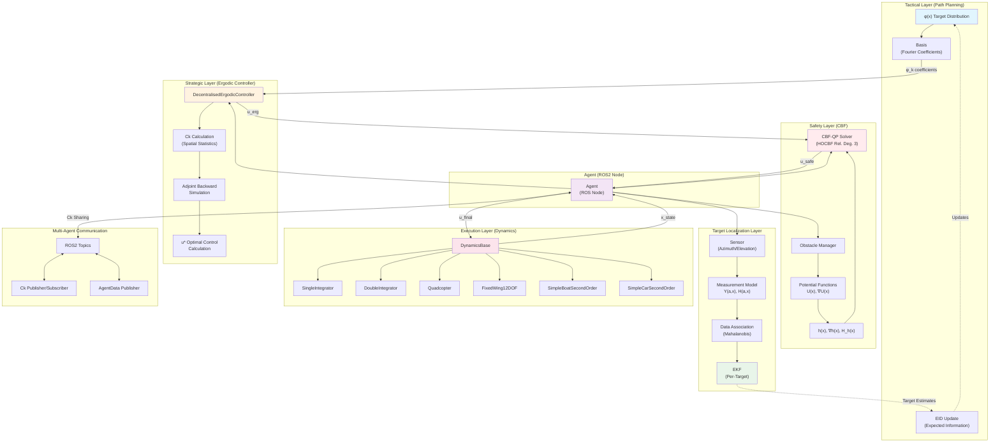
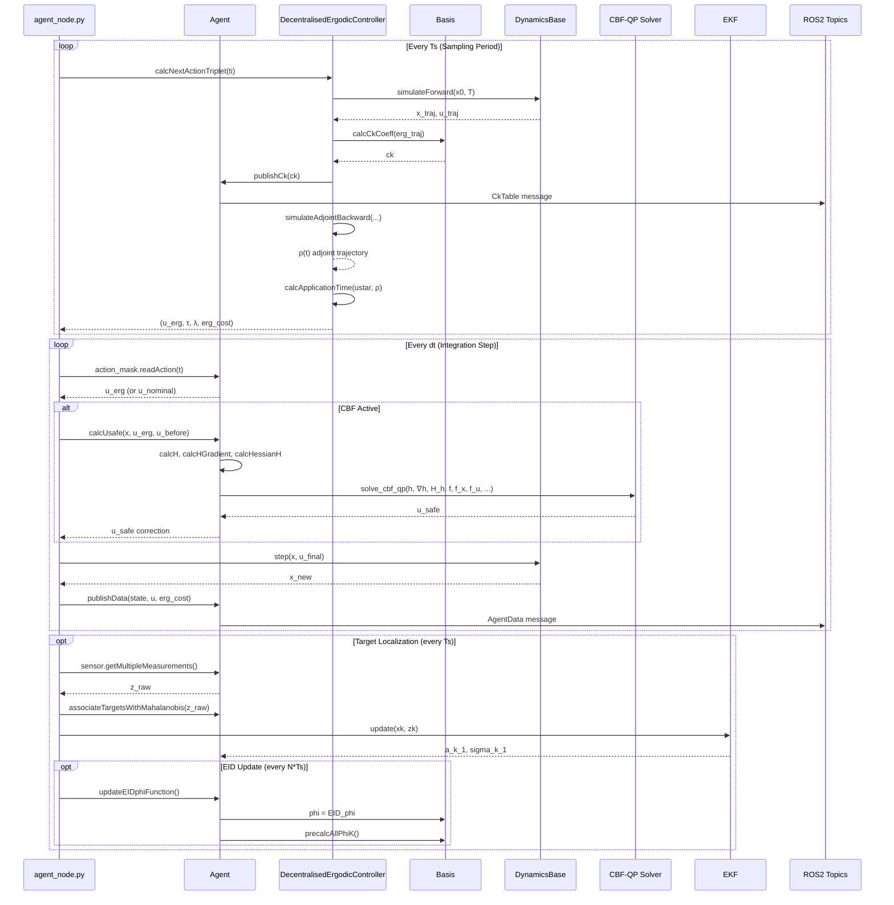

# Ergodic Exploration System Architecture

This document provides a high-level overview of the system architecture for the **Decentralized Ergodic Exploration** project with **CBF-based obstacle avoidance** and **target localization** capabilities.

## System Overview

The system implements an ergodic exploration framework for autonomous agents (UAVs, boats, cars) that:
1. **Ergodically explores** a bounded domain based on a target distribution φ(x)
2. **Avoids obstacles** using Control Barrier Functions (CBF-QP)
3. **Localizes targets** using Extended Kalman Filters (EKF) with Expected Information Distribution (EID)
4. Supports **multi-agent decentralized coordination** via ROS2 topic sharing

---

## High-Level Architecture Diagram



---

## Detailed Class Diagram

```mermaid
classDiagram
    direction TB

    %% ===== AGENT (Central Coordinator) =====
    class Agent {
        <<ROS2 Node>>
        +agent_id: int
        +model: DynamicsBase
        +basis: Basis
        +erg_c: DecentralisedErgodicController
        +obstacle_list: List~Obstacle~
        +ekfs: List~EKF~
        +sensor: Sensor
        +target_estimates: List~ndarray~
        +L1_BOUNDS, L2_BOUNDS: Tuple
        +Kmax: int
        --
        +calcUsafe(x, udef, u_before, ...) ndarray
        +calcH(x, delta) float
        +calcHGradient(x) ndarray
        +calcHessianH(x) ndarray
        +calcPotentialU(x) float
        +updateEIDphiFunction()
        +spawnNewTargetEstimate()
        +associateTargetsWithMahalanobis()
        +mergeTargetsIfNeeded()
        +publishCk(), publishData()
        +modifedPhiForObstacles(phi)
    }

    %% ===== DYNAMICS MODELS =====
    class DynamicsBase {
        <<Abstract>>
        +dt: float
        +num_of_states: int
        +num_of_inputs: int
        +state: ndarray
        +coord_convention: str
        --
        +f(x, u)* ndarray
        +f_x(x, u)* ndarray
        +f_u(x, u)* ndarray
        +g(x, u_ref) ndarray
        +h(x, u_ref) ndarray
        +step(x, u, dt) ndarray
        +simulateForward(x0, ti, udef, T)
        +reset(state)
        +position(x) ndarray
        +ergodic_state: ndarray
    }

    class SingleIntegrator {
        +type: "SingleIntegrator"
        +A, B: ndarray
        +f(x, u) ndarray
    }

    class DoubleIntegrator {
        +type: "DoubleIntegrator"
        +mass, damping: float
        +A, B: ndarray
        +f(x, u) ndarray
    }

    class Quadcopter {
        +type: "Quadcopter"
        +z_target: float
        +k_lqr: ndarray
        +M, M_inv: ndarray
        +motor_limits: ndarray
        --
        +f(x, u) ndarray
        +calcLQRcontrol(x, t) ndarray
    }

    class FixedWing12DOFTrainer {
        +type: "FixedWing12DOFTrainer"
        +x_trim, u_trim: ndarray
        +A, B: ndarray
        +params: dict
        --
        +f(x, u) ndarray
        +computeTrim(V_trim) Tuple
        +linearizeAtTrimPoint(x, u)
    }

    class SimpleBoatSecondOrder {
        +type: "SimpleBoatSecondOrder"
        +m, Iz: float
        +d_v, d_w: float
    }

    class SimpleCarSecondOrder {
        +type: "SimpleCarSecondOrder"
        +m, L: float
        +k_steer: float
    }

    DynamicsBase <|-- SingleIntegrator
    DynamicsBase <|-- DoubleIntegrator
    DynamicsBase <|-- Quadcopter
    DynamicsBase <|-- FixedWing12DOFTrainer
    DynamicsBase <|-- SimpleBoatSecondOrder
    DynamicsBase <|-- SimpleCarSecondOrder

    %% ===== ERGODIC CONTROLLER =====
    class DecentralisedErgodicController {
        +agent: Agent
        +T: float
        +Ts: float
        +deltaT_erg: float
        +R, Rinv: ndarray
        +Q: float
        +uLimits: ndarray
        +uNominal: NominalFunction
        +action_mask: ActionMask
        +past_states_buffer: ReplayBufferFIFO
        +ck_aver_others: ndarray
        +total_erg_cost: float
        --
        +calcNextActionTriplet(ti) Tuple~us, tau, lambda~
        +simulateAdjointBackward(x_traj, u_traj, ...) ndarray
        +calcApplicationTime(ustar, rho, ...) Tuple
        +calcLambdaDuration() float
        +calcErgodicCost(ck) float
        +uDef(x, t) ndarray
    }

    class NominalFunction {
        +func: Callable
        +limits: ndarray
        --
        +__call__(x, t) ndarray
    }

    class ActionMask {
        +T, ts: float
        +ACTION_SIZE: int
        --
        +pushAction(ti, tau, lamda, action)
        +readAction(t_now) ndarray
    }

    class ReplayBufferFIFO {
        +capacity: int
        +buffer: deque
        --
        +push(element)
        +get() ndarray
        +reset(last_perc_to_keep)
    }

    %% ===== BASIS FUNCTIONS =====
    class Basis {
        +L1_min, L1_max: float
        +L2_min, L2_max: float
        +Kmax: int
        +phi: Callable
        +ck: ndarray
        +hk_cache: dict
        +phi_coeff_cache: dict
        +LamdaK_cache: dict
        --
        +Fk(xv, k1, k2, hk) float
        +dFk_dx(xv, k1, k2, hk) ndarray
        +calcHk(k1, k2) float
        +calcPhikCoeff(k1, k2) float
        +calcCkCoeff(erg_traj, ...) ndarray
        +calcCkCoeffRecursive(...)
        +precalcAllHk(), precalcAllPhiK()
    }

    %% ===== OBSTACLE AVOIDANCE =====
    class Obstacle {
        +type: str
        +pos: ndarray
        +kappa, rho0: float
        +r, r0: float
        +rhoFunc: Callable
        +gradRhoFunc: Callable
        --
        +U(x) float
        +UandGradU(x) Tuple
        +withinReach(x) bool
        +distanceToTheWall(x) float
    }

    class CBF_QP_Solver {
        <<Module Functions>>
        +solve_cbf_qp(h, grad_h, hess_h, f, f_x, f_u, u_ref, ...) Tuple
        +solve_cbf_qp_old(h, grad_h, ...) Tuple
    }

    %% ===== TARGET LOCALIZATION =====
    class Sensor {
        +sensor_range: float
        +R: ndarray
        +measurement_model: MeasurementModel
        --
        +getMeasurement(target_pos, agent_pos) ndarray
        +getMultipleMeasurements(targets, agent_pos) List
    }

    class MeasurementModel {
        +mu: int
        +M: int
        --
        +Y(a, x) ndarray
        +H(a, x) ndarray
    }

    class EKF {
        +id: int
        +a_k_1: ndarray
        +sigma_k_1: ndarray
        +R, Q: ndarray
        +a_limits: ndarray
        +measurement_model: MeasurementModel
        +last_time_updated: float
        --
        +predict() Tuple
        +update(xk, zk, ...)
        +p(a, upper_lim) float
    }

    %% ===== RELATIONSHIPS =====
    Agent "1" *-- "1" DynamicsBase : model
    Agent "1" *-- "1" Basis : basis
    Agent "1" *-- "1" DecentralisedErgodicController : erg_c
    Agent "1" *-- "*" Obstacle : obstacle_list
    Agent "1" *-- "1" Sensor : sensor
    Agent "1" *-- "*" EKF : ekfs

    DecentralisedErgodicController "1" --> "1" Agent : agent
    DecentralisedErgodicController "1" *-- "1" NominalFunction : uNominal
    DecentralisedErgodicController "1" *-- "1" ActionMask : action_mask
    DecentralisedErgodicController "1" *-- "1" ReplayBufferFIFO : past_states_buffer

    Sensor "1" *-- "1" MeasurementModel
    EKF "1" *-- "1" MeasurementModel

    Agent ..> CBF_QP_Solver : uses
    Agent ..> Obstacle : queries h(x)
```



---

## Data Flow: Control Loop



---

## Key Module Interactions

### 1. **Model ↔ Ergodic Controller**
- The `DecentralisedErgodicController` uses `model.simulateForward()` to predict future trajectories
- Uses `model.f_x()` and `model.h()` (f_u) in adjoint simulation and u* calculation
- Respects model-specific `num_of_inputs` and `num_of_states`

### 2. **Ergodicity ↔ Basis (φ Distribution)**
- `Basis` stores the target distribution φ(x) and computes Fourier coefficients φ_k
- `calcCkCoeff()` computes spatial statistics C_k from agent trajectory
- Ergodic cost = Σ Λ_k (C_k - φ_k)² measures coverage quality
- The controller minimizes this cost via optimal control

### 3. **CBF ↔ Obstacles**
- `Obstacle` defines potential fields U(x) for circles, spheres, rectangles, walls
- `Agent.calcH()` computes barrier function: h(x) = 1/(1+U) - δ
- `Agent.calcHGradient()` and `calcHessianH()` provide derivatives
- `solve_cbf_qp()` solves HOCBF-QP with relative degree 3 for Fixed-Wing

### 4. **Target Localization ↔ EID Update**
- `Sensor` provides simulated measurements (azimuth, elevation angles)
- `EKF` instances track each target with Gaussian belief
- `updateEIDphiFunction()` computes Expected Information matrix from Fisher Information
- Updates φ(x) to guide ergodic exploration toward informative regions

### 5. **Multi-Agent Coordination**
- Agents share C_k tables via ROS2 topics
- `ck_aver_others` averages neighbors' C_k contributions
- `antenna_range_flag` limits communication to nearby agents
- `talk_alike_flag` filters by model type compatibility

---

## Configuration Flow

```
agent_configs/*.yaml
       │
       ▼
  setupAgentConfig()
       │
       ├── dynamics_config → DynamicsBase subclass
       ├── control_config  → ErgodicController params (Ts, T, Q, R, CBF alphas)
       ├── targets_config  → EKF params, real target positions
       ├── phi_config      → gaussian_bumps or uniform
       └── obstacles.yaml  → Obstacle definitions
```

---

## File Structure Summary

```
src/ergodic_exploration/
├── my_erg_lib/                    # Core library
│   ├── agent.py                   # Agent class (ROS2 node)
│   ├── model_dynamics.py          # All dynamics models
│   ├── ergodic_controllers.py     # Decentralized ergodic control
│   ├── basis.py                   # Fourier basis functions
│   ├── cbf_qp_solver.py           # HOCBF-QP safety filter
│   ├── obstacles.py               # Potential field obstacles
│   ├── eid.py                     # Sensor, MeasurementModel, EKF
│   ├── replay_buffer.py           # FIFO buffer, ActionMask
│   ├── vis.py                     # Visualization utilities
│   └── Utilities.py               # YAML loading, helpers
│
├── ergodic_exploration/           # ROS2 nodes
│   ├── agent_node.py              # Main entry point
│   ├── fg_visualizer_node.py      # FlightGear visualization
│   └── tf_visualizer_airplane.py  # TF broadcasting
│
├── agent_configs/                 # YAML configurations
│   └── *.yaml
│
└── launch/                        # ROS2 launch files
```
